# Ianvs Terminal 特性配置用户旅程与交互审计

审计日期：2026-07-19  
审计对象：当前运行中的 Ianvs Terminal macOS 应用  
审计方式：逐步操作真实界面、保存并复核截图，同时对 Flutter 配置模型与界面实现做只读核对。

整改复核日期：2026-07-19  
整改复核方式：实现修复、静态分析、完整 Flutter 测试套件、macOS Debug 构建，并在 800×600 真实窗口中重新走查关键旅程。

## 整改复核结论（当前）

初始审计中的 P0、P1 阻塞项已经全部关闭。配置体验已从“命令面板、长弹窗和 JSON 文件中的分散能力”收口为一个可由 macOS 原生菜单、`⌘,`、标题栏和命令面板共同到达的 Settings 中心；Profile 仍保留适合复杂编辑的 Save/Cancel 模型。

当前复核未发现阻塞用户完成配置旅程的正确性、可达性或布局问题。总体健康度由初始的 **7/10** 提升为 **9/10**；剩余项属于增强能力，不影响现有配置任务完成。

### 整改完成矩阵

| 旅程 | 初始问题 | 当前结果 | 状态 |
|---|---|---|---|
| 1. 发现配置入口 | 原生 Settings 禁用、入口含混 | App 菜单 `Settings…` 与 `⌘,` 可用；标题栏独立设置与命令面板图标；命令面板保留 `Settings…` | 已关闭 |
| 2. 默认 Profile 与预设 | 重复入口、保存状态不清 | 统一进入 Settings；移除命令面板重复预设动作；无真实变化时 Save disabled | 已关闭 |
| 3. 全局外观与安全 | 长滚动、协议术语优先 | 固定跳转导航拆分 General、Appearance、Security 等分区；安全标题改用用户语言，协议降为说明；Security 从剪贴板权限开始 | 已关闭 |
| 4. Profiles 管理 | 打开/编辑差异弱，缺少管理动作 | 每行显式 Open、Edit、更多菜单；支持 Duplicate、确认 Delete；New 旁提供 Import | 已关闭 |
| 5. Profile General | 基础可用 | 保留简洁表单、分区搜索、修改标记与新会话生效说明 | 已验证 |
| 6. Profile Startup | 字段密度高 | 保持结构化参数、环境变量与完整校验；系统文件选择和 Test launch 归入后续增强 | 可用 |
| 7. Profile Terminal | 基础可用 | Emulation、Scrollback 与边界校验保持清晰 | 已验证 |
| 8. Profile Appearance | 长页面无上下文、Hue 无语义 | 增加实时终端预览；Hue 具备 Slider 语义、数值、方向键与 Shift 步进；统一字号基线 | 已关闭 |
| 9. Selection & Mouse | Switch 不可见、Keys 命名误导 | Switch 可见；分区改名 Selection & Mouse；全局 Keyboard 独立进入 Settings | 已关闭 |
| 10. Automation | 依赖 DSL、缺测试、危险密码示例 | 增加 Trigger/Switching 结构化构建器、输出测试器、空值禁用态；移除密码示例并明确禁止保存秘密 | 已关闭 |
| 11. Advanced / Shell integration | 能力影响说明不足 | Advanced 中提供 Shell integration 开关与影响说明；安装诊断归入后续增强 | 可用 |
| 12. 保存与放弃 | 改回原值仍提示放弃 | dirty、Save enabled 与关闭保护统一由真实差异派生；回到原值即 clean | 已关闭 |
| 13. Dynamic Profiles | 功能不可达、覆盖不可控 | Profiles 与命令面板均可达；Preview 显示新增/替换/警告；支持逐项选择、全选/清空，空选择禁止 Import | 已关闭 |
| 14. 通知与活动监控 | 即时开关与配置页分散 | Settings 增加 Notifications 总开关及 command finished、bell、activity 子项；命令面板保留快捷开关 | 已关闭 |
| JSON-only 配置 | Keyboard、Paste、Workspace、Hotkey 等无 UI | Settings 已覆盖 Keyboard 冲突检测与录制、Paste & Clipboard、Workspace restore、Notifications、全局复制、Shell integration、Hotkey Window | 已关闭 |

### 当前配置架构

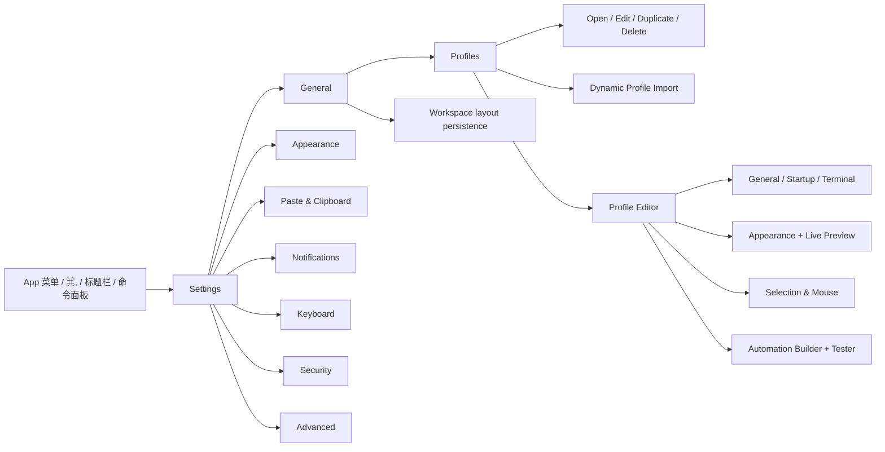
```mermaid
flowchart LR
    A["App 菜单 / ⌘, / 标题栏 / 命令面板"] --> B["Settings"]
    B --> B1["General"]
    B --> B2["Appearance"]
    B --> B3["Paste & Clipboard"]
    B --> B4["Notifications"]
    B --> B5["Keyboard"]
    B --> B6["Security"]
    B --> B7["Advanced"]
    B1 --> C["Profiles"]
    C --> C1["Open / Edit / Duplicate / Delete"]
    C --> C2["Dynamic Profile Import"]
    C --> C3["Profile Editor"]
    C3 --> C4["General / Startup / Terminal"]
    C3 --> C5["Appearance + Live Preview"]
    C3 --> C6["Selection & Mouse"]
    C3 --> C7["Automation Builder + Tester"]
    B1 --> D["Workspace layout persistence"]
```

### 验证证据

- `dart analyze .`：通过，0 issues。
- `flutter test`：1,131 项通过，1 项按项目既有条件跳过，0 failures。
- `flutter build macos --debug`：通过。
- 真实 macOS 800×600 复核：原生 Settings、固定设置导航、安全策略、命令面板、Profiles 管理、Profile 侧栏、Automation 构建器禁用态、Dynamic Profiles 选择与 Import 禁用态均通过。
- 对工作区恢复、动态导入替换计数、规则构建与测试、Hue 键盘语义、原生菜单桥接、真实 dirty 状态均有回归测试覆盖。

### 后续增强（非阻塞）

- Profile Startup 增加系统 Shell/目录选择器与 `Test launch`。
- Shell integration 增加 Hook 安装状态检测和一键诊断。
- Profile/Theme 增加文件级 Import/Export；敏感自动回复可进一步接入 Keychain。
- 继续做 VoiceOver、Increase Contrast、Reduce Motion、Reduce Transparency 的专项人工验收。

---

> 以下内容保留为整改前的审计基线和截图证据；其中描述的缺陷状态以“整改复核结论（当前）”为准。

## 初始审计结论（整改前）

当前配置能力已经很完整，Profile 编辑器的分区、搜索、修改标记、分区重置、危险操作确认也形成了不错的基础。但配置体验还不是一个完整的 macOS“设置系统”，而是分散在命令面板、长滚动弹窗、底部 Sheet、Profile 编辑器和 JSON 配置文件中。

最优先的三个问题：

1. **macOS 标准“设置…”入口被禁用，`⌘,` 无响应。** 用户必须先知道右上角调节图标或命令面板，配置的首要入口不符合 Mac 习惯。
2. **动态 Profile 功能不可达。** 应用已有导入界面和动作路由，但在命令面板搜索 `dynamic` 没有结果，也没有在 Profiles 列表提供 Import 入口。
3. **改回原值后仍会提示放弃修改。** UI 已取消“已修改”标记，但点 Cancel 仍出现“Discard changes?”，削弱用户对修改状态的信任。

总体健康度：**可用，但配置架构需要一次收口；交互完成度约 7/10，Mac 原生性约 5/10。**

## 初始配置架构（整改前）

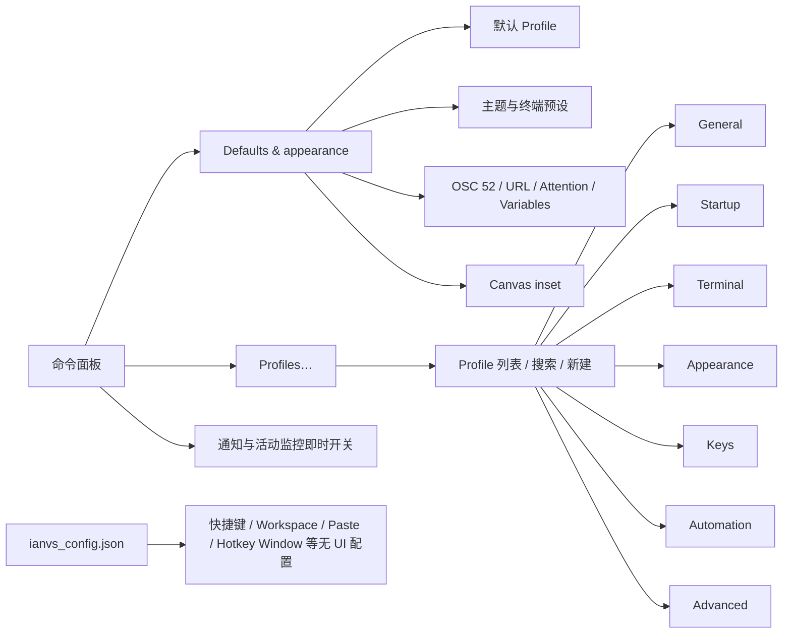
```mermaid
flowchart LR
    A["命令面板"] --> B["Defaults & appearance"]
    A --> C["Profiles…"]
    A --> D["通知与活动监控即时开关"]
    B --> B1["默认 Profile"]
    B --> B2["主题与终端预设"]
    B --> B3["OSC 52 / URL / Attention / Variables"]
    B --> B4["Canvas inset"]
    C --> C1["Profile 列表 / 搜索 / 新建"]
    C1 --> C2["General"]
    C1 --> C3["Startup"]
    C1 --> C4["Terminal"]
    C1 --> C5["Appearance"]
    C1 --> C6["Keys"]
    C1 --> C7["Automation"]
    C1 --> C8["Advanced"]
    E["ianvs_config.json"] --> E1["快捷键 / Workspace / Paste / Hotkey Window 等无 UI 配置"]
```

配置实际有三种作用域，但界面没有系统地表达：

| 作用域 | 当前入口 | 生效时机 | 主要问题 |
|---|---|---|---|
| App 全局 | Defaults、命令面板即时开关、JSON | 立即或下次启动 | 入口与保存模型不统一 |
| Profile | Profiles 编辑器 | 新会话 | “仅对新会话生效”只在编辑器顶端提示 |
| Session | 命令面板 Session actions | 当前会话 | 与持久配置混在同一个面板 |

建议所有配置显示 `作用域` 与 `生效时机`，例如：`App 全局 · 立即生效`、`Profile · 新会话生效`、`当前标签页 · 临时`。

## 完整用户旅程

### 1. 发现配置入口 — 健康度：需改进

当前：右上角调节图标 → 命令面板 → Defaults / Profiles / 通知开关。macOS App 菜单中的“Settings…”被禁用，`⌘,` 无响应。

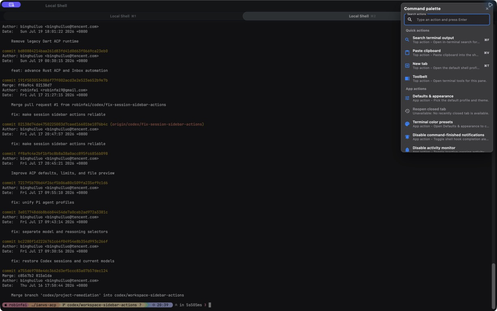

优点：命令按 Quick actions、App actions、Session actions、Shell tools 分组，并有搜索与快捷键提示。

问题：命令面板是效率入口，不应是唯一设置入口；顶部面板高度有限，后续动作被裁切；“Terminal color presets”与“Defaults & appearance”是两个标题指向同一界面，容易让用户误以为是不同功能。

建议：启用 macOS `Settings…` 与 `⌘,`；右上角图标直接打开 Settings，而不是先打开命令面板；命令面板保留为快捷入口。

### 2. 默认 Profile 与终端预设 — 健康度：基本可用

路径：Defaults & appearance → 选择默认 Profile → 选择终端色彩预设 → Save changes。

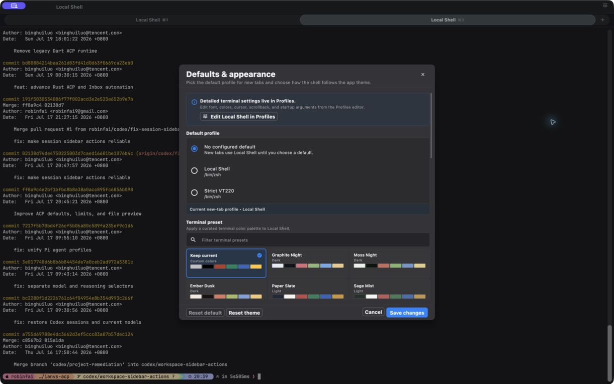

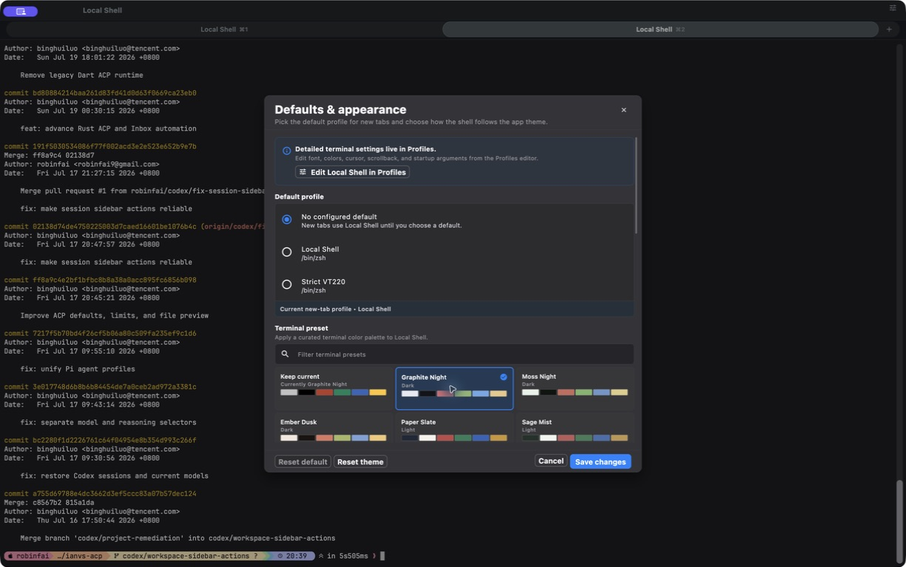

优点：默认 Profile、当前实际 Profile、预设缩略色条和选中态都清楚；支持预设搜索；提供进入 Profile 编辑器的桥接入口。

问题：终端预设实际修改 Profile 外观，却放在全局 Defaults 中；相同预设又出现在 Profile Appearance 中，形成“双入口、同能力、不同心智模型”。选中预设只有卡片边框变化，没有真实终端预览。

建议：Defaults 只选择默认 Profile；终端预设统一放入 Profile Appearance。若保留快捷设置，明确写成“修改 Local Shell Profile 的配色”，并展示实时预览与撤销。

### 3. App 外观、终端安全策略与画布间距 — 健康度：功能完整、信息架构过载

路径：继续滚动 Defaults → App Appearance → OSC 52 → URL requests → Attention requests → Variable reports → Canvas inset → Save changes。

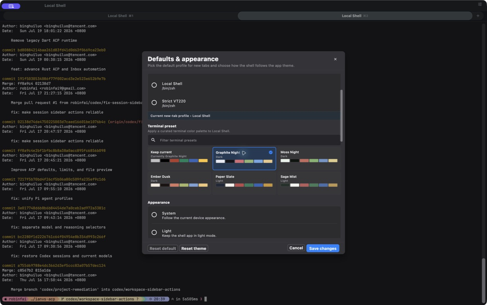

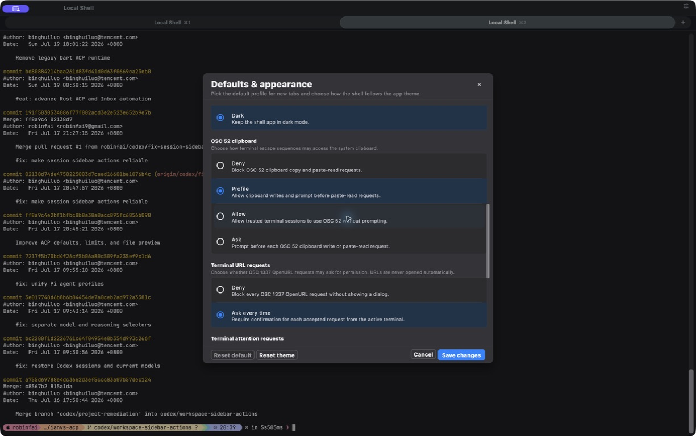

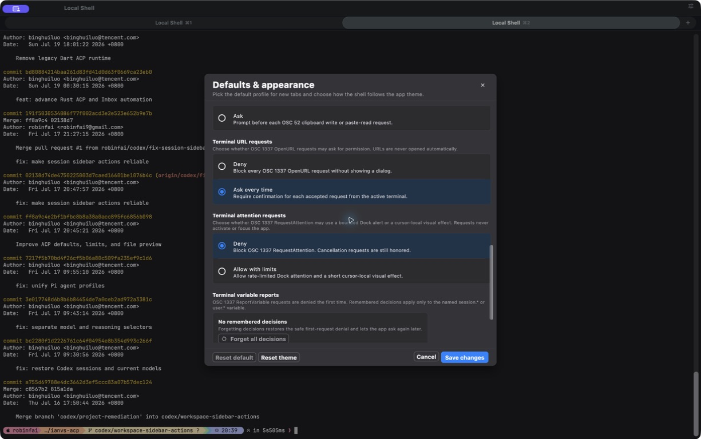

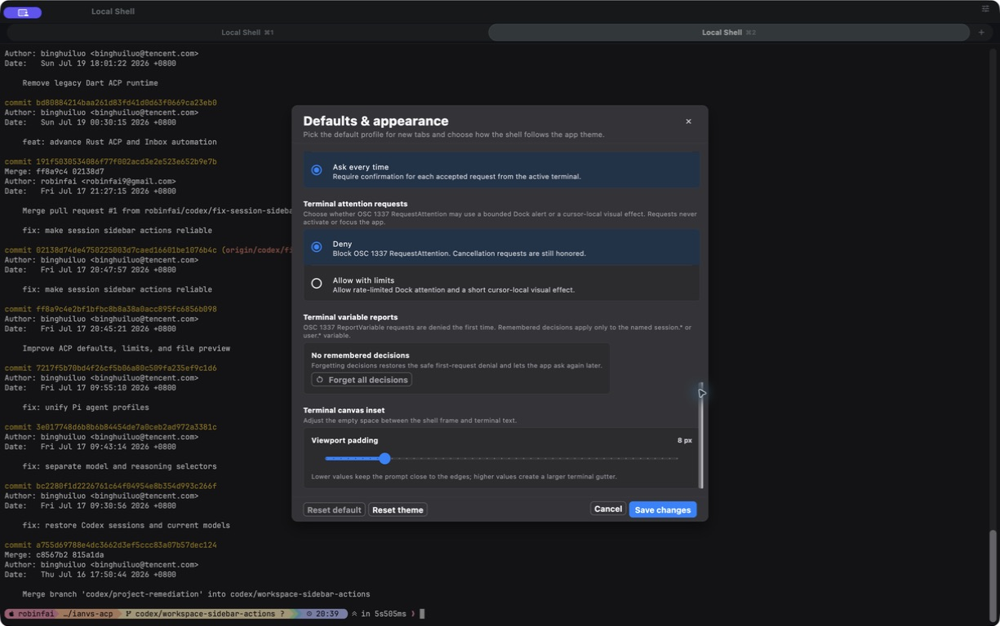

优点：默认策略偏安全；每个协议选项都有解释；变量权限支持逐项遗忘与全部遗忘；Slider 有数值反馈。

问题：一个对话框同时容纳外观、默认值、终端配色、安全权限和布局密度，滚动距离很长；安全选项大量使用 OSC 52 / OSC 1337 等实现术语；固定 Footer 让内容区偏矮；Reset default / Reset theme 的作用范围需要思考。

建议：拆到 Settings 的 `General`、`Appearance`、`Security & Integrations` 三个侧栏页；主标题用用户语言，协议名作为次级说明；每个安全策略显示“推荐”与影响摘要。

### 4. Profiles 列表、搜索与打开/编辑 — 健康度：可用

路径：命令面板 → Profiles… → 搜索 → 点击行打开新标签，或点铅笔编辑 → New 创建。

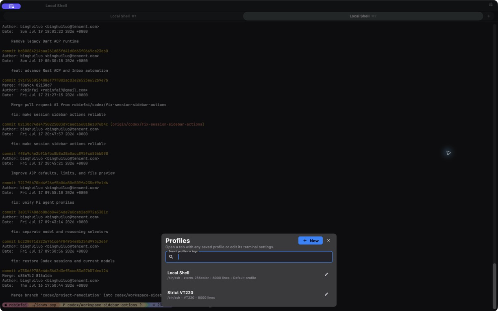

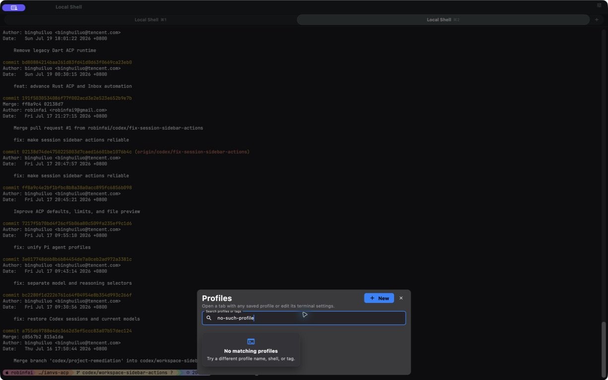

优点：搜索支持名称、Shell、Tag；列表摘要包含 Shell、Emulation、Scrollback、Default；空状态清楚。

问题：macOS 桌面端使用底部 Sheet，视觉上像移动端移植；“点击整行=打开新会话，点击小铅笔=编辑”是两个不同后果但差异不够显著；没有 Duplicate、Delete、Import、Export 等 Profile 管理动作。

建议：把 Profiles 作为 Settings 中的常驻列表/详情双栏；行选择只负责选中，右侧提供 `Edit`、`Open new tab`；右键菜单与键盘操作支持 Duplicate/Delete/Export；在 New 旁加入 Import。

### 5. Profile General — 健康度：良好

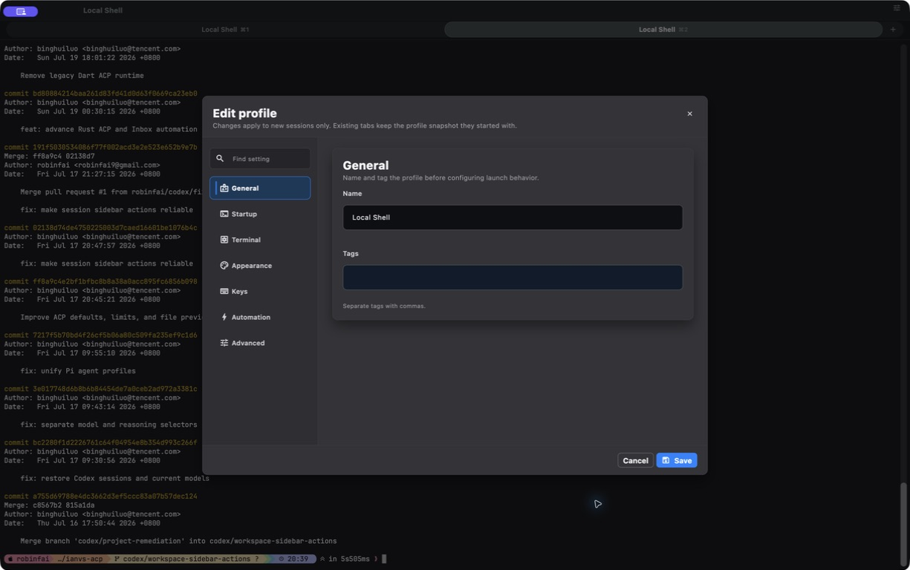

字段：Name、Tags。优点是分区清晰、字段少、搜索和侧栏导航可见。建议 Tags 使用 Chip 输入，避免用户自己维护逗号格式。

### 6. Profile Startup — 健康度：可用但偏工程化

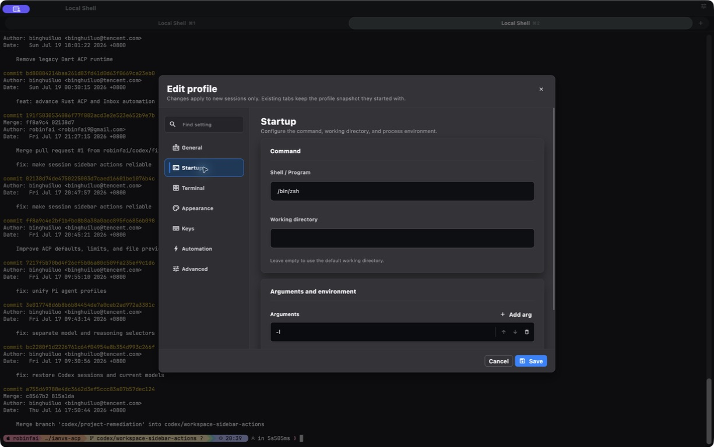

字段：Shell / Program、Working directory、Arguments、Environment variables。

优点：参数和环境变量支持增删、排序；空值说明存在。

问题：Shell、目录完全依赖手输；参数和环境变量在较小滚动区中密度高；缺少“测试启动”“选择文件/目录”“继承环境”反馈。

建议：为 Shell 和 Working directory 增加系统选择器；环境变量改为 Key/Value 表格；提供 `Test launch`，失败时把错误定位到字段。

### 7. Profile Terminal — 健康度：良好

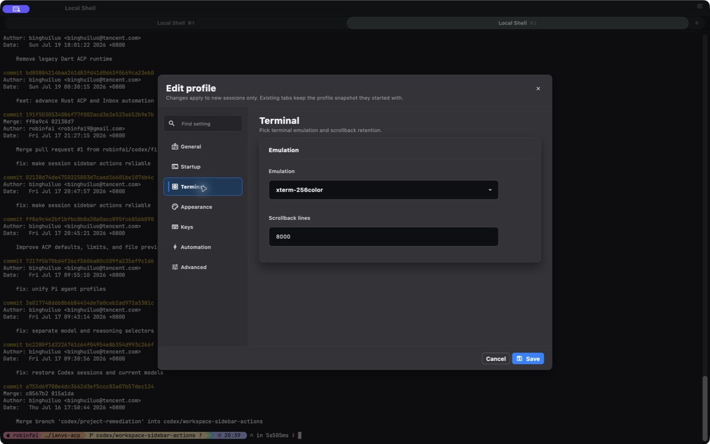

字段：Emulation、Scrollback lines。结构简单合理。建议在 Scrollback 下显示允许范围、内存影响与 Restore default；Emulation 选项附兼容性说明。

### 8. Profile Appearance — 健康度：能力强、操作成本高

路径：Typography → Fallback fonts → Font size / Line height → Theme presets → Special colors → ANSI normal → ANSI bright → Cursor。

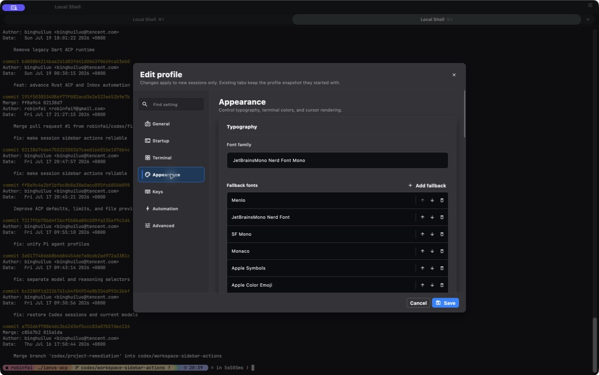

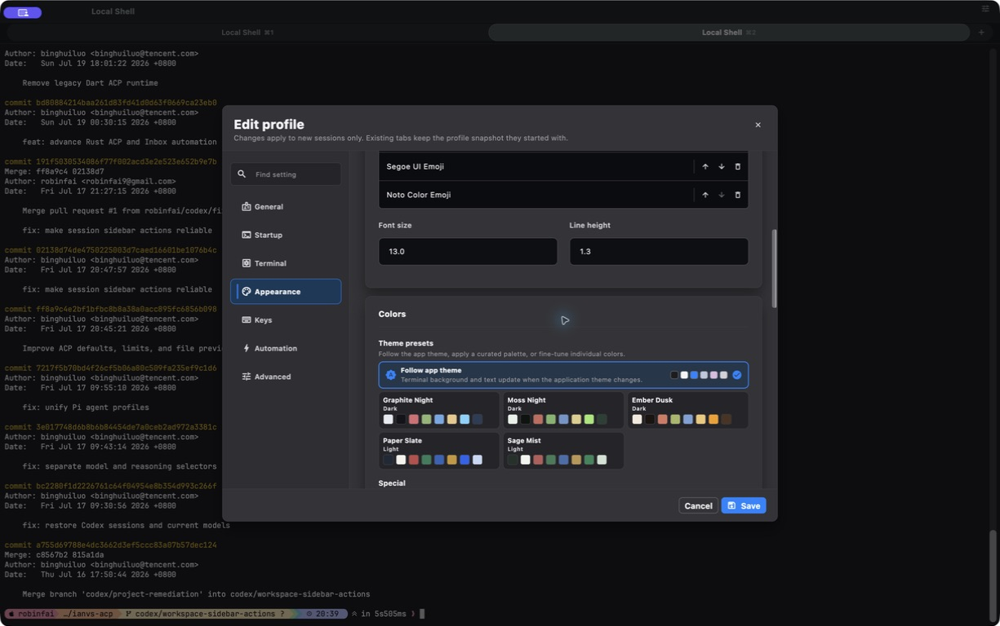

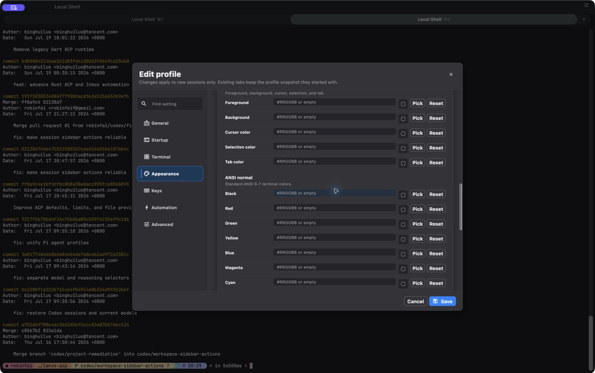

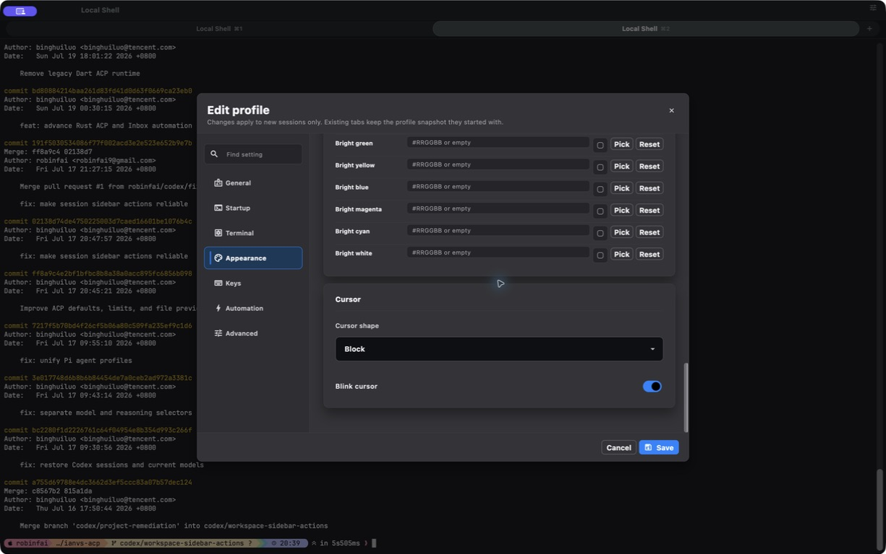

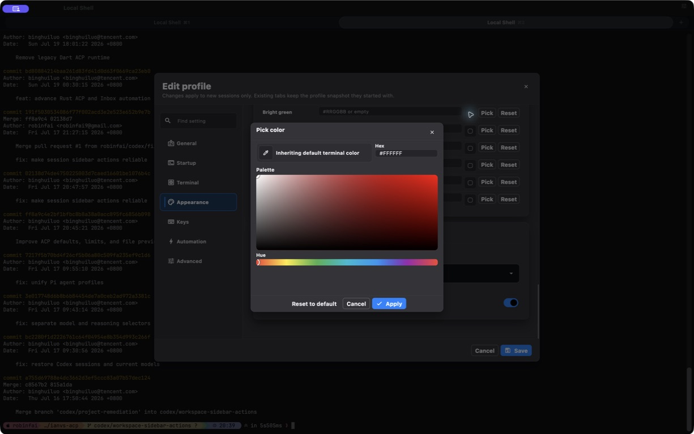

优点：支持字体 fallback 排序、预设、26 个颜色槽、逐项继承/重置、色盘和 Hex、Cursor Shape/Blink，专业能力完整。

问题：这是整个配置系统最重的页面。预设、26 行颜色、每行 Pick/Reset、Cursor 全在同一长页面；用户滚到 Cursor 时已失去上方预览和上下文；没有固定终端 Preview；颜色行重复按钮造成视觉噪声；色盘的 Hue 在辅助功能树中未表现为可调 Slider。

建议：顶部固定一个真实终端预览；用 `Presets / Typography / Colors / Cursor` 四个子页；Colors 用 8×2 色表和 Special 色卡，点击色块打开 Popover，减少 52 个重复按钮；支持 Import/Export theme 与“与当前终端对比”。

### 9. Profile Keys — 健康度：有明显视觉缺陷

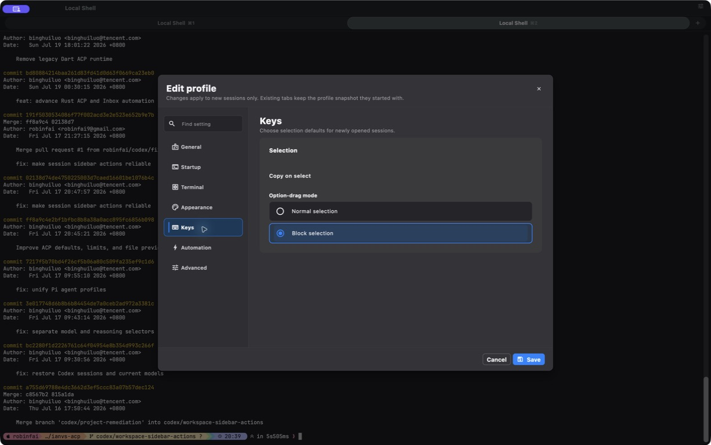

字段：Copy on select、Option-drag mode。

问题：辅助功能树能读到 `Copy on select` Switch，但截图中开关本身不可见；用户看不到当前值，也不知道这一行可交互。Profile 只包含两项交互行为，而全局 Keybindings 仅存在于 JSON，命名 `Keys` 容易造成“这里能配置快捷键”的错误预期。

建议：先修复 Switch 可见性；分区改名 `Selection & Mouse`；新增独立 `Keyboard Shortcuts` 设置页并支持冲突检测、搜索、恢复默认。

### 10. Profile Automation — 健康度：高级用户可用，新用户门槛高

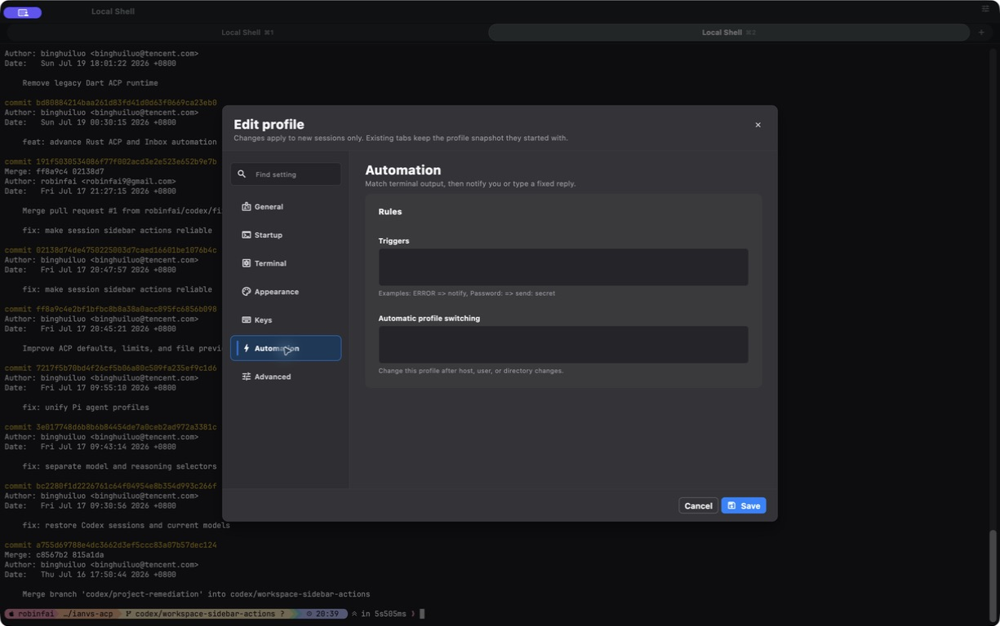

字段：Triggers、Automatic profile switching。

问题：核心交互是让用户手写 DSL，例如 `ERROR => notify`、`host:`、`user:`、`dir:`；缺少结构化规则、实时校验位置、测试样本、顺序/优先级说明。`Password: => send: secret` 还可能诱导用户把敏感信息长期保存在 Profile 中。

建议：默认提供规则构建器（When / Match / Then），保留 Advanced text mode；提供“用一段终端输出测试”；固定回复优先接入 Keychain/密码管理器，避免明文秘密进入 Profile。

### 11. Profile Advanced / Shell integration — 健康度：可用

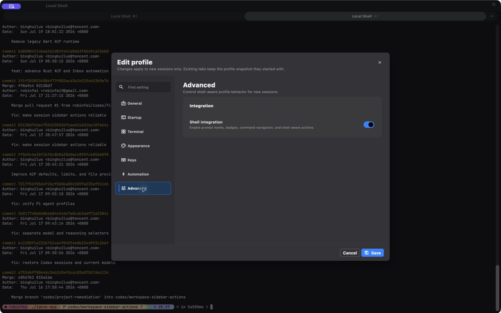

优点：开关有清晰说明，作用域是 Profile。

问题：关闭会同时影响 prompt marks、badges、command navigation 和 shell-aware actions，但没有列出会失去的具体 UI 能力，也没有依赖检测。

建议：展开显示受影响能力；检测当前 Shell Hook 是否安装/生效；提供安装与诊断入口。

### 12. 修改、保存、重置与放弃 — 健康度：大体良好，但存在状态 Bug

优点：侧栏显示 modified section；支持按分区 Reset；放弃修改使用明确的破坏性按钮。

关键 Bug：把开关改动后再手动改回原值，侧栏已没有 modified 标记：

但点击 Cancel 仍然出现放弃提示：

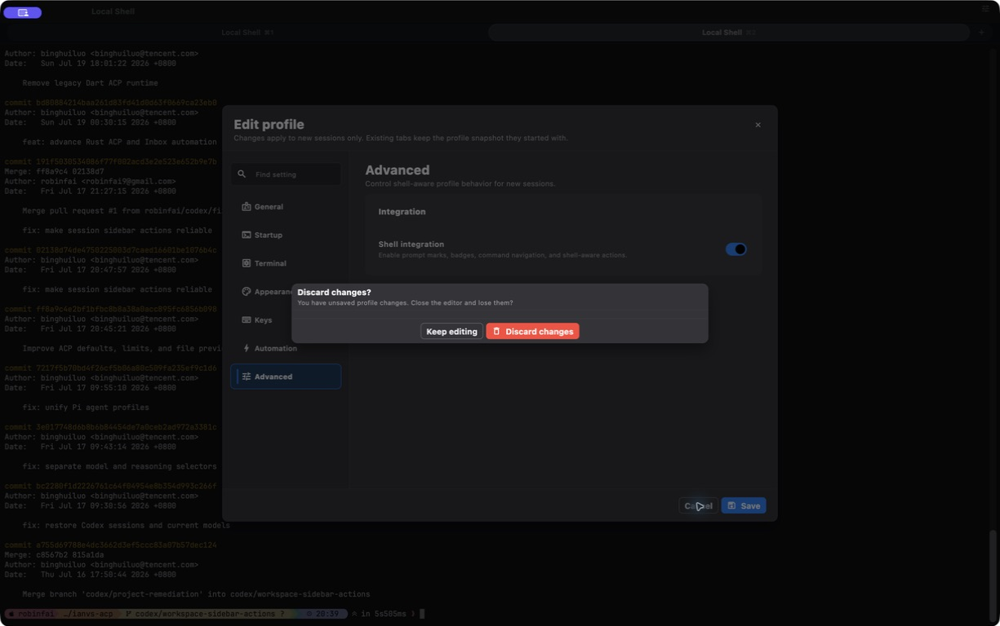

原因与设计影响：界面用“与初始值比较”计算每个分区是否 dirty，但关闭保护还依赖曾经被置为 true 的 `_didEdit`。这会让用户认为系统无法正确判断“是否真的有变更”。

建议：所有 Save enabled、dirty summary、关闭保护统一依赖同一个派生值 `hasAnyDirtySection`；当所有值回到初始值时立即恢复 clean。

### 13. 动态 Profile 导入 — 健康度：阻塞

在命令面板搜索 `dynamic` 没有对应动作：

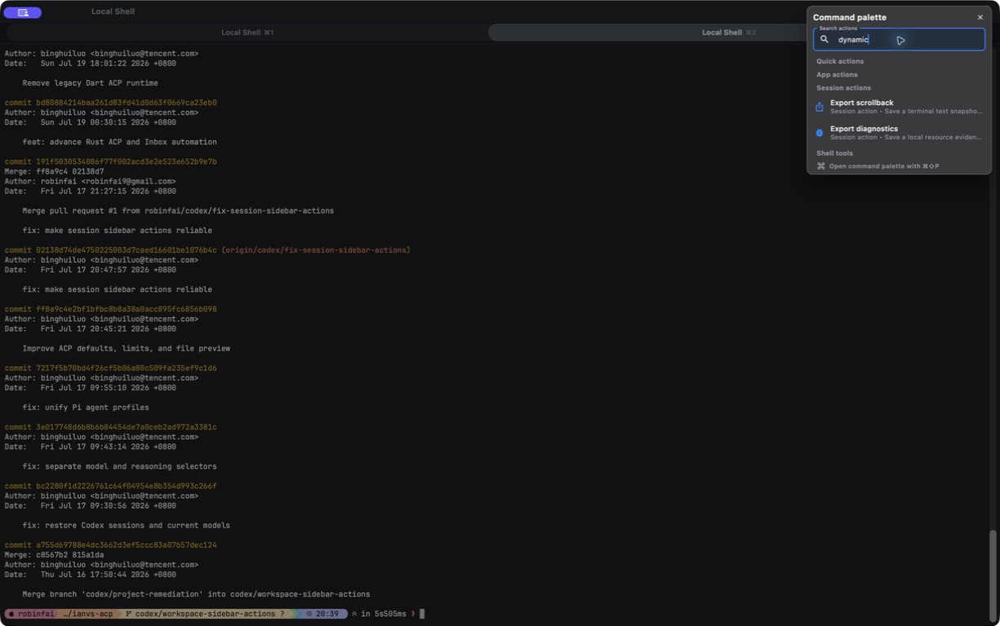

代码中已有 DynamicProfilesSheet、Preview、Import 和动作路由，但当前运行界面没有可发现入口，无法完成真实旅程。

建议：Profiles 页 New 旁加入 `Import`；支持选择文件或粘贴 JSON；Preview 明确新增、覆盖、跳过和警告；覆盖前提供逐项选择。

### 14. 通知与活动监控即时开关 — 健康度：反馈好，位置不合理

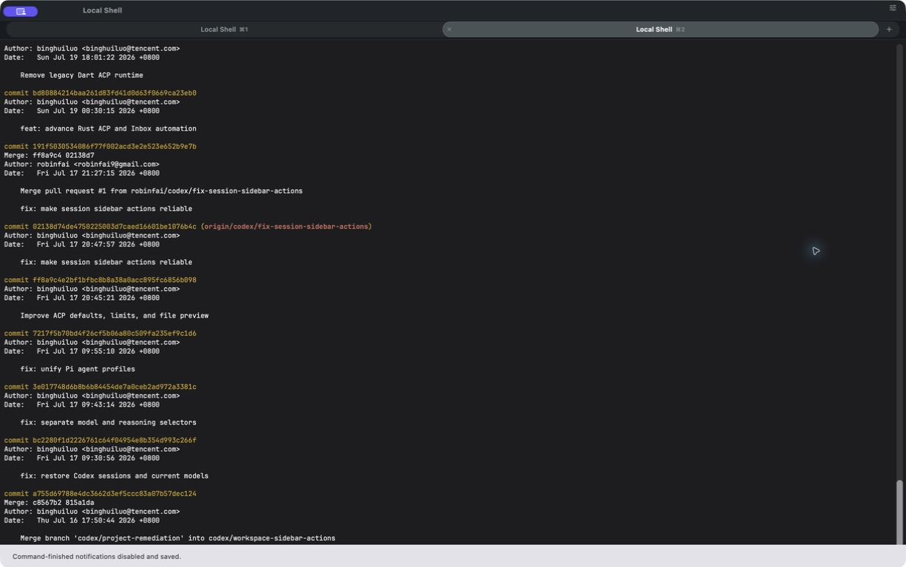

优点：动作标题会在 Enable/Disable 间切换；操作后有“已保存”反馈，状态明确。

问题：该配置即时保存，而 Defaults/Profile 使用 Save/Cancel，交互模型不一致；Bell 通知没有对应 UI；用户无法在一个地方看到 command finished、bell、activity 三者总览。

建议：增加 `Notifications` 设置页统一管理三项开关与系统权限状态；命令面板保留快速切换，并在结果中提供“Open Notifications Settings”。

## 仅存在于 JSON 的配置旅程

`ianvs_config.json` 还包含：Keybindings overrides、restoreLayout、copyOnSelect、Paste（bracketed/large/multiline/history）、Shell Integration、Notifications（enabled/commandFinished/bell/activity）、Hotkey Window。当前没有统一 UI 管理这些配置，用户旅程是“找到配置文件 → 手改 JSON → 重启/观察效果 → 出错后文件被隔离并重建”。

这条旅程只适合开发者，不适合作为产品级配置方式。建议优先补齐：

1. Keyboard Shortcuts
2. Paste & Clipboard
3. Workspace restore
4. Notifications
5. Hotkey Window

保留 JSON 作为高级导入/导出与自动化接口，不作为唯一入口。

## 建议的新配置架构

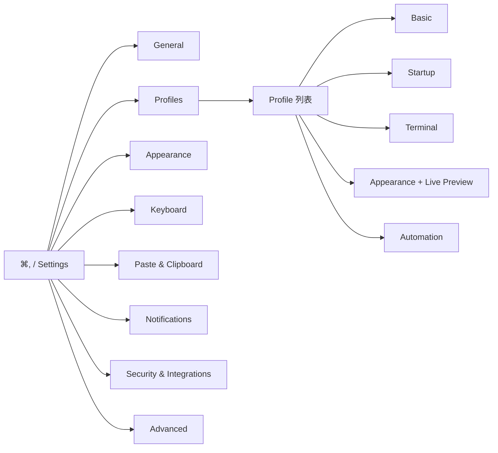
```mermaid
flowchart LR
    A["⌘, / Settings"] --> B["General"]
    A --> C["Profiles"]
    A --> D["Appearance"]
    A --> E["Keyboard"]
    A --> F["Paste & Clipboard"]
    A --> G["Notifications"]
    A --> H["Security & Integrations"]
    A --> I["Advanced"]
    C --> C1["Profile 列表"]
    C1 --> C2["Basic"]
    C1 --> C3["Startup"]
    C1 --> C4["Terminal"]
    C1 --> C5["Appearance + Live Preview"]
    C1 --> C6["Automation"]
```

交互原则：

- App 设置采用即时保存，并提供 Undo/恢复默认；复杂 Profile 编辑保留 Save/Cancel。
- 每个设置显示作用域与生效时机。
- Save 仅在真实 dirty 时可用；恢复原值即 clean。
- 安全策略用用户语言，协议名作为补充。
- Profile Appearance 始终有实时预览。
- 所有现有 JSON 配置都能在 UI 中发现；JSON 变为 Import/Export 高级能力。

## 优先级建议

### P0：先修正确性与可达性

1. 启用 macOS Settings 与 `⌘,`。
2. 修复“改回原值仍提示放弃”。
3. 为 Dynamic Profiles 增加可达入口。
4. 修复 Keys 页 Copy on select Switch 不可见。

### P1：收口信息架构

1. 建立统一 Settings 窗口和侧栏。
2. 合并重复的终端预设入口。
3. 把安全协议从 Defaults 拆到 Security & Integrations。
4. 补齐 Notifications、Keyboard、Paste、Workspace、Hotkey Window UI。
5. 为 Appearance 加实时预览与子分区。

### P2：降低学习成本与增强无障碍

1. Automation 规则构建器与测试工具。
2. 提升 9.5–11px 的辅助文字字号，验证系统文字缩放。
3. 为颜色 Hue 提供 Slider 语义、数值与键盘调整。
4. 验证完整 Tab/Shift+Tab、箭头、Return、Esc 路径和 VoiceOver 顺序。
5. 验证 Light/Dark、Increase Contrast、Reduce Motion、Reduce Transparency。

## 无障碍证据边界

本次可确认：大部分按钮、字段、分区和开关在辅助功能树中有名称；Profile 侧栏有选中态；搜索空状态、Toast、放弃确认可被读取。

本次不能仅凭截图确认：实际对比度是否全面达到 WCAG AA、完整键盘可达性、焦点环持续可见、VoiceOver 阅读顺序、系统文字放大后的重排、Reduce Motion/Transparency/Increase Contrast。需要专项键盘、VoiceOver 与系统辅助功能设置测试。

## 初始审计范围内未完成的旅程（整改前记录）

- Dynamic Profiles：当前 UI 无入口，无法进入导入 Sheet。
- 全局 Keybindings、Paste、Workspace restore、Bell notifications、Hotkey Window：当前无 UI，仅能通过 JSON 配置。
- macOS App 菜单：确认 Settings… disabled，但 Computer Use 无法为原生菜单保存有效截图，因此不作为截图证据，仅作为交互观察记录。
