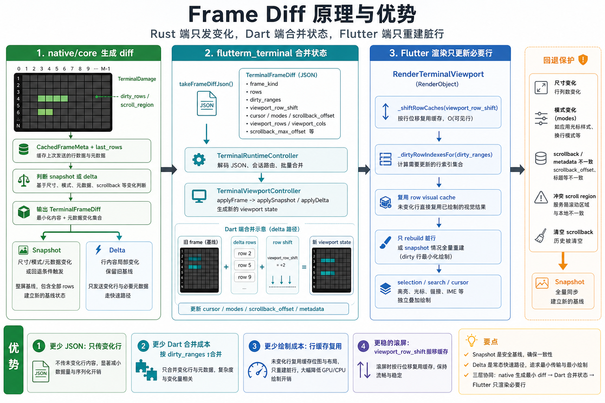
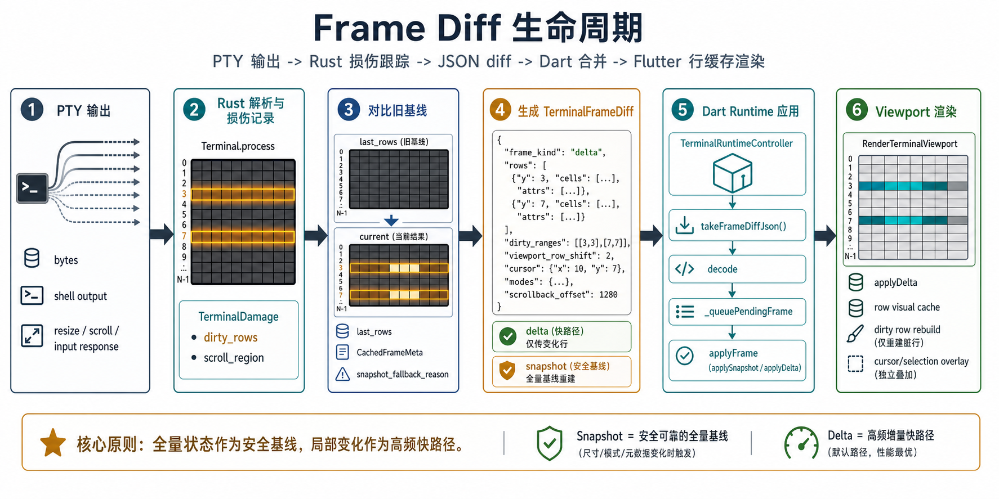
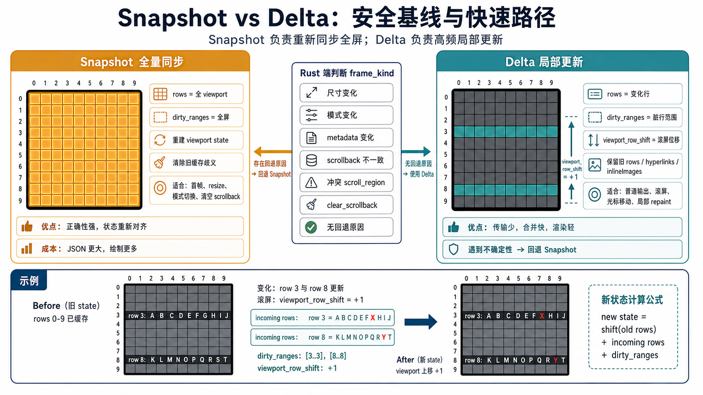
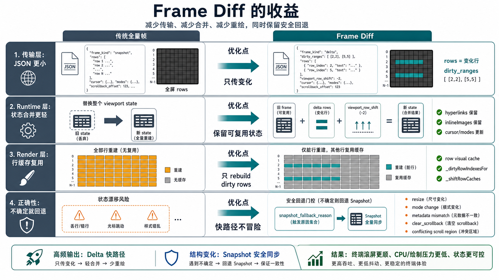

# Frame Diff

这份文档说明当前 terminal frame diff 的工作方式、回退边界和收益。图中的字段与代码路径对应：

- Rust 端生成：`native/core/src/session.rs`
- Dart frame 模型与合并：`packages/ianvs_terminal/lib/src/terminal/terminal_models.dart`
- Runtime 传输选择：`packages/ianvs_terminal/lib/src/runtime/terminal_frame_transport_coordinator.dart`
- Runtime 拉取与派发：`packages/ianvs_terminal/lib/src/runtime/terminal_runtime_controller.dart`
- Flutter 行缓存渲染：`packages/ianvs_terminal/lib/src/terminal/render_terminal_viewport.dart`

## 总览



Frame diff 的核心原则是：全量 `snapshot` 作为安全基线，局部 `delta` 作为高频快路径。Rust 端只在确定可复用旧基线时发送变化行；Dart 端把变化合并进当前 viewport state；Flutter 渲染端复用行缓存，只重建脏行。

## 生命周期



数据流从 PTY 输出开始。Rust core 解析字节流并记录 `TerminalDamage`，再和 `last_rows`、`CachedFrameMeta` 对比，生成 frame diff。Dart runtime 的传输路径如下：

```text
backend JSON / Protobuf
        ↓
TerminalFrameTransportCoordinator
        ↓
TerminalFrameDecoder facade
        ↓
JSON domain factory / Protobuf transport codec
        ↓
neutral validation + wire contracts
        ↓
TerminalFrameDiff
        ↓
TerminalViewportState
        ↓
render
```

默认的 `automatic` 偏好只在 backend 实现 Protobuf capability 且明确报告支持时调用 `takeFrameDiffProtobuf()`；不支持该 capability、或 capability 报告不支持时，走 `takeFrameDiffJson()`。显式 `json` 偏好强制走 JSON，即使 backend 同时支持 Protobuf 也不会读取 Protobuf。已选择并支持 Protobuf 后，`null`、空 payload、读取异常或解码失败都表示本次没有可应用帧，不会再消费 JSON 作为同次回退。

JSON 是保留的兼容路径，不是已删除的旧实现。`TerminalFrameDiff.fromJson()` 仍是 domain factory；Protobuf 则通过公开的 `TerminalProtobufFrameCodec.decode()` transport adapter 映射为 domain model。2.0 迁移期可使用已弃用的 `LegacyTerminalFrameDiffProtobuf.fromProtobufBytes()` facade。generated Protobuf 不再被 terminal、config 或 recording domain 导入。

两种 wire format 还有一处有意保留的省略语义：graphics 的 `preserveAspectRatio` 在 JSON 字段省略时归一为 `true`，在 Protobuf 字段省略时遵循标量默认值 `false`。语料与 parity tests 将这条兼容边界作为显式 seam 覆盖。

## Snapshot 和 Delta



`snapshot` 用于建立或重建完整基线，适合首帧、resize、模式变化、metadata 不一致、清空 scrollback 等场景。`delta` 用于普通输出、滚屏、局部 repaint 等高频路径，只携带变化行、`dirty_ranges`、`viewport_row_shift` 和必要元数据。遇到不确定性时回退 `snapshot`，避免状态漂移。

## 收益



收益主要来自四处：

- 传输层：automatic 路径优先使用受支持的 Protobuf；forced/unsupported 路径继续使用 JSON。两种格式都只携带变化行和必要元数据，减少传输开销。
- Runtime 层：Dart 端复用旧 frame，只按 `dirty_ranges`、`viewport_row_shift` 和 incoming rows 合并。
- Render 层：`RenderTerminalViewport` 复用 row visual cache，只重建脏行或 snapshot 全量重建。
- 正确性：`snapshot_fallback_reason` 把不确定情况导向全量同步，快路径不承担状态风险。
