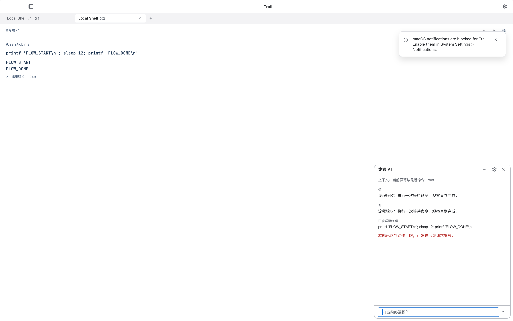
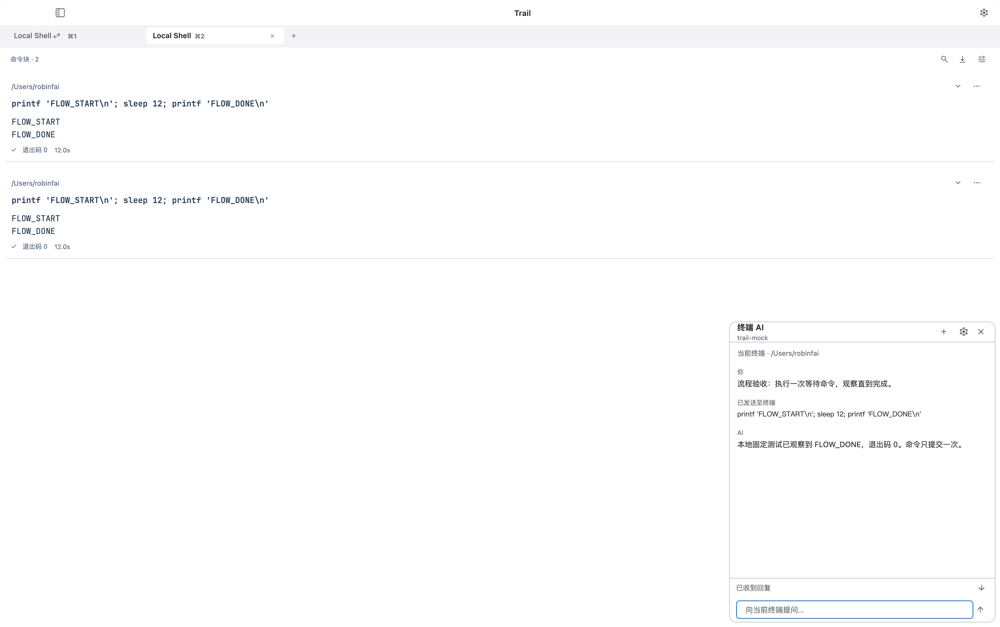
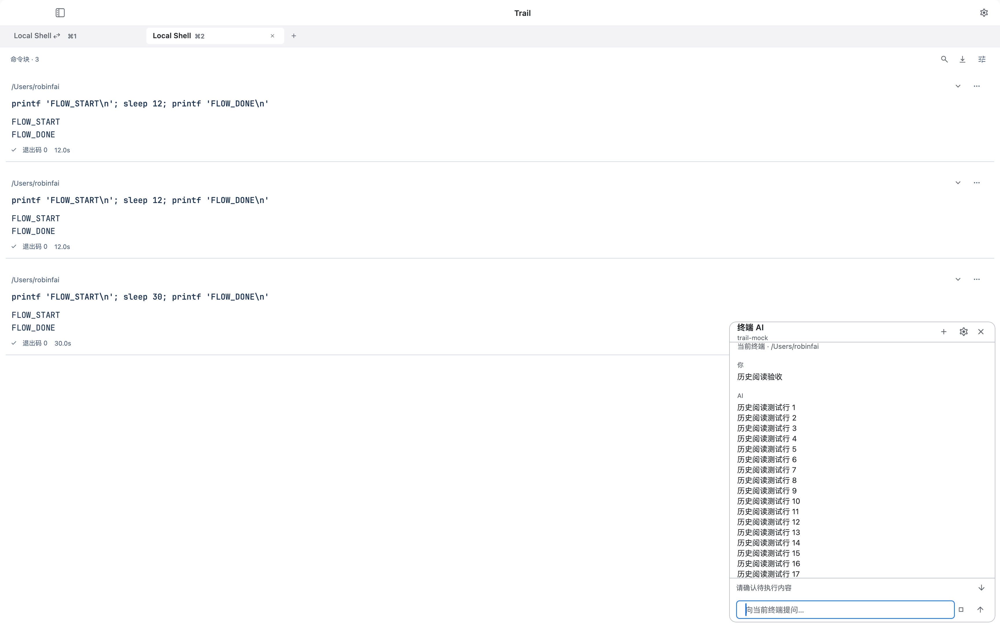
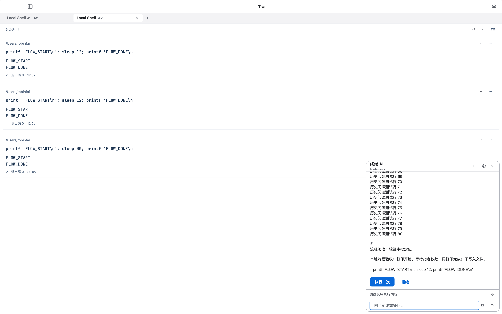

# Terminal AI acceptance — 2026-10-01

The native macOS integration test passed with the actual Trail development app,
the Rust PTY backend, a real local HTTP mock, and the installed vi/vim/k9s
executables. The model is deterministic; terminal execution and screen/file
observations are real.

## Environment and configuration

- macOS 27.0.1 (26A434), Apple Silicon. This records one tested OS, not the
  entire supported Apple release window.
- `/bin/zsh`, `/usr/bin/vi`, `/usr/bin/vim`; k9s 0.50.16, commit
  `3c37ca2197ca48591566d1f599b7b3a50d54a408`.
- Endpoint `http://127.0.0.1:8787/v1`, model `trail-mock`, public fixture API key
  `trail-local-mock`. Configured through the actual settings UI, checked with a
  real HTTP request, and read back from secure storage. The final run used
  `AI_PERSIST_CONFIGURATION=true` to retain this configuration for the tested
  development client. No credential is synchronized with terminal profiles.
- Shell HOME, files, preferences and kubeconfig were isolated. Real k9s used a
  read-only loopback Kubernetes fixture; it did not connect to a user cluster.
- Light appearance for settings/shell/editor cases; dark appearance for k9s,
  whose default skin assumes a dark terminal background.

## Observed outcomes

| Flow | Assertion / observed result |
| --- | --- |
| Natural-language Composer input | “请列出当前目录文件” opened an AI proposal. No shell block existed before approval. Approval executed `ls -la`, showing the real `ai-visible-file.txt`. |
| Failed-command correction | Real `ls --not-a-real-option` produced a nonzero exit status. AI received command/output/cwd/status, proposed `ls`, and the approved correction exited with status 0. |
| vi | The actual file remained `original\n` before approval. Approved insertion and save produced `Trail vi verified\noriginal\n`; a subsequent approved `:wq` returned to the shell. |
| vim | The same flow produced `Trail vim verified\noriginal\n` in the actual file, then returned to a ready shell. Opening AI preserved the full terminal viewport size in both editors. |
| k9s | After the actual namespace view loaded, approved Esc / `:pods` / Enter opened the real Pod view containing `trail-ai-pod`. |
| Takeover | A subsequent namespace proposal was revoked by Take over. No namespace navigation was sent and the Pod screen remained visible. |

The test explicitly waits for the k9s alternate screen and resource heading;
matching a word in the echoed launch command is not a readiness signal. Native
text-input focus is settled before follow-up conversation entry.

## Checks

- AI protocol/controller tests: 16 passed. Includes real HTTP authorization and
  UTF-8 request length, redirect rejection, cancellation, stale SSH context,
  takeover during execution, secure-store errors, and explicit key validation.
- AI widget tests: 7 passed. Includes natural-language routing, command override,
  macOS/iOS light/dark at 320 × 260 with 2× text scaling, settings, and reopening
  a conversation at the latest message without pulling subsequent reading back.
- Shared Composer, blocks, JSON client and runtime regression tests: 345 passed.
- Native active-screen tests: 2 passed; active alternate buffer, cursor/mode,
  primary-buffer preservation, scrollback exclusion and carriage-return output.
- Actual macOS integration: 1 passed; final run completed in 16 seconds after
  the build. [Native test log](evidence/native-acceptance.txt).
- Targeted Flutter static analysis: no issues. `git diff --check` passed.
- `dart run tools/sync_terminal_core.dart --check`: generated sources current.

The existing runner emitted a Material icon configuration warning and could
not foreground the test app through `open`. The integration binding still
rendered frames, captured screenshots and completed every assertion.

## Evidence

- [Configured connection](evidence/01-configured-connection.png)
- [Natural-language approval](evidence/02-natural-language-approval.png)
- [Error correction](evidence/04-error-correction.png)
- [Saved vi file](evidence/05-vi-saved.png)
- [Saved vim file](evidence/05-vim-saved.png)
- [Real k9s Pod view](evidence/07-k9s-pods.png)

## Coverage limits

This AI change was not installed on an iPhone or over the user's existing local
Trail installation during this acceptance. iOS coverage here is widget-level;
real-device networking, keyboard behavior and secure storage need a device run.
No external paid model was tested. The OpenAI-compatible protocol is exercised
over real HTTP; inference quality and provider-specific tool support remain
dependent on the configured model.

## Block task flow audit — 2026-10-02

Scope: initiating a task, reviewing input, waiting for a real command, reading
results, pausing/resuming, and locating a proposal while reading older messages.
The current development app ran on macOS 27.0.1 (26A434), with its real Rust PTY,
local zsh and Block UI. HTTP responses came from a deterministic loopback fixture;
the fixture proposed commands, and the real UI approved each write. This is a
flow regression check, not a new Terminal-Bench run or real-model quality claim.

### Findings and changes

The old read loop waited only 200 ms per observation. A 12-second command consumed
the default 24-request turn budget before AI confirmed its completion. The block
eventually showed exit code 0, while the AI panel reported a step limit and had
no direct recovery action. This mismatch makes a successful command look like a
failed task. Repeated unchanged observations also filled the context, and block
output omitted explicit running/truncation metadata.

The new loop accepts bounded waits, reports whether the wait expired, preserves
distinct observations, and deduplicates only unchanged read call/result pairs.
Block identity, running state and output bounds make the evidence explicit.
The UI keeps task status and recovery outside the scrolling transcript; jumping
to a new proposal is an explicit action. Resuming reads current terminal state
before proposing any additional input.

### Numbered flow and health

| Step | Observed flow | Health after changes | Evidence |
| --- | --- | --- | --- |
| 1 | Request → proposed command → user approval | Passed. The reason and exact command are visible before execution. | [Approval](evidence/block-flow-20261002/01-approval.png) |
| 2 | Execute → observe a 12-second command | Fixed. Baseline: 24 requests and step limit; updated: 3 requests and confirmed `FLOW_DONE`, exit 0. One command submission per run. | [Before](evidence/block-flow-20261002/02-before-step-limit.png), [after](evidence/block-flow-20261002/05-bounded-wait-result.png) |
| 3 | Recover the original stopped turn | Passed. Continue task observed the completed first command without creating another block. | [Recovery entry](evidence/block-flow-20261002/03-resume-entry.png), [result](evidence/block-flow-20261002/04-resumed-result.png) |
| 4 | Pause AI while a 30-second command runs | Passed. Status distinguished AI pause from terminal execution; the command kept running. | [Waiting](evidence/block-flow-20261002/06-waiting.png), [paused](evidence/block-flow-20261002/07-paused.png) |
| 5 | Resume after manual pause | Passed. Fresh context confirmed completion, exit 0; total blocks remained three across the three approved runs. | [Resumed result](evidence/block-flow-20261002/08-pause-resume-result.png) |
| 6 | Read old history → receive proposal → locate approval | Passed. Rows 1–17 stayed visible when approval arrived; fixed status indicated pending review. The arrow exposed the command and approval buttons. Rejecting it left no pending action or new block. | [Reading preserved](evidence/block-flow-20261002/09-history-with-pending-approval.png), [proposal located](evidence/block-flow-20261002/10-proposal-located.png) |

Steps 2–3 before/after:

Step 6, reading position and explicit review:

### Checks and reproduction

- `flutter test --no-pub test/ai test/shell/terminal_modes_test.dart`: **49 passed**.
  Includes wait completion/expiry, cancellation, resume without automatic writes,
  double-resume suppression, unchanged-observation deduplication, preservation of
  distinct output, tool/result pairing, bounds and truncation metadata.
- Widget coverage includes fixed recovery while reading history, explicit jump
  to latest, and macOS/iOS light/dark at 320 × 260 with 2× text scaling. The first
  implementation overflowed on a compact iOS panel; moving status into the header
  and using compact recovery controls resolved it before the passing run.
- Targeted static analysis of `lib/features/ai` and `test/ai`: no issues.
- Runtime error inspection after the native flows: no errors reported.
- [Metadata-only request log](evidence/block-flow-20261002/fixture-requests.jsonl):
  lines 1–24 are baseline requests; line 25 resumes that turn after hot reload;
  lines 26–28 are the fresh updated 12-second scenario. Later request serials
  restart with the fixture process for pause/history scenarios.
- Reusable fixture: `tools/mock_llm/block_flow_fixture.py`; instructions are in
  [WARP_AI_IMPLEMENTATION.md](WARP_AI_IMPLEMENTATION.md). No server-side command
  execution, external inference or file uploads are involved.
- The reusable fixture's responses matched the fixture used during native
  acceptance in six request/wait/completion/history scenarios.
- Original AI configuration was restored byte-for-byte with private file
  permissions, then the app restarted and displayed the original `gpt-6-astra`
  configuration. The temporary credential backup was removed and the loopback
  fixture stopped. No pending approval remained. `git diff --check` passed.

All accepted screenshots were captured and inspected during this audit, then
copied byte-for-byte to this evidence directory. Loading frames and incorrect
setup states were excluded. The request-count comparison uses a fast fixed
response service: latency and model behavior differ with a real provider.

### Accessibility and coverage limits

Step 6 now has a fixed, labelled latest/review control and a live status region.
Compact-layout tests verify that status and controls remain reachable at 2× text
size; they do not establish VoiceOver announcement quality or full keyboard-only
navigation. Those need separate interactive accessibility testing. This run did
not repeat iPhone hardware testing, SSH negotiation, or real-model benchmarks.
Block history still supplies a bounded tail, with explicit truncation metadata;
it does not provide arbitrary paged retrieval. A paused AI does not interrupt an
already running shell command.
