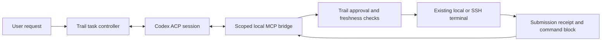

# ACP Agent backend

Trail supports two AI connection types: the existing model API and a local
Codex ACP agent. ACP owns its inference loop and conversation; Trail owns the
terminal, execution target, approval cards, submission receipts and block
evidence. The ACP backend is not an implementation of a single model completion.

## Connection

The first supported profile is `@agentclientprotocol/codex-acp@2.1.1`, model
`gpt-5.6-sol`, reasoning effort `high`. In **AI connection → Codex ACP**, an
empty launch configuration is detected and filled automatically. **Auto-detect**
repeats the search on demand. Saved/custom settings are preserved on opening;
explicit detection replaces only the executable and arguments, keeping the
chosen model. Edits made while a search is pending take precedence over its
result. Use **Test connection**, then **Save** to apply the configuration.

Discovery checks PATH, standard Homebrew/system/npm prefixes, installed
fnm/nvm/Volta/asdf Node versions, and local `node_modules` above the working
directory or application executable. A development build also checks the
repository's `tmp/acp-runtime` installation below. It resolves symlinks to stable
absolute paths, so Finder launches do not require shell startup files or an
ephemeral fnm multishell. npm adapters are launched with an absolute Node path
and their declared `codex-acp` entry point; native adapters need no arguments.
Discovery is a bounded local file lookup: it does not install packages, run
shell profiles, start an agent, access credentials or test the model. Missing
Node/adapter installations have explicit messages and manual fields remain
editable. macOS/Linux detection is supported; only macOS is locally verified.

For a custom installation, enter an absolute executable path and a JSON array
of arguments, for example Node with the adapter's `dist/index.js` as its single
argument. Executables are launched without shell interpolation.

An explicit development installation:

```sh
npm install --prefix tmp/acp-runtime @agentclientprotocol/codex-acp@2.1.1
```

The adapter uses an existing Codex file-based login (`CODEX_HOME/auth.json`, or
`~/.codex/auth.json`). No model API key is required in ACP settings. Each backend
copies credentials into a private temporary Codex home, sets file permissions to
0600 and deletes that home on disposal. It does not open Keychain or modify the
user's Codex configuration. Authentication missing from these files is reported
explicitly; interactive login is not launched automatically.

This profile runs on desktop. Mobile hosting and a remote ACP gateway are not
implemented. The agent process is local even when its bound terminal is SSH.
The current implementation is verified on macOS; Windows/Linux are not claimed
as tested. OAuth refresh in an isolated home is not synchronized back to the
original login file.

## Ownership and protocol



- ACP negotiates HTTP MCP support and selects the exact requested model. A model
  mismatch is an error; there is no silent fallback.
- The six tools are `get_terminal_state`, `read_screen`, `read_block`,
  `run_command`, `send_keys`, and `inspect_submission`.
- Writes require a current `context_version` and a unique `operation_id`.
  Manual or smart approval rechecks the actual session, SSH context, terminal guard and shell
  readiness. Only the existing terminal runtime submits input.
- Reusing an operation ID returns its prior result; changing its input is
  rejected. Unknown submissions must be inspected rather than resent.
- A delayed cwd notification from an already accepted command can advance the
  active task's directory only when its Block, session and shell node match.
  Manual input or an unrelated Block cannot authorize a directory change.
- ACP permission events only grant one-time access to a correlated Trail MCP
  call. They cannot approve terminal writes or native host tools.
- The MCP server binds only to loopback, requires a fresh bearer token and
  rejects browser-origin requests. Its target cannot be selected by the agent.
- Codex native shell, file-writing paths, apps, plugins, web, browser, computer
  use, skills and multi-agent features are disabled for this profile. The client
  does not advertise filesystem or terminal creation callbacks. This is a
  constrained official-adapter profile, not a sandbox for arbitrary executables.
- Manual input, rejection and pause revoke queued input. Cancellation sends ACP
  cancellation and closes its owned process; it does not send Ctrl+C to the
  user's running command.

Tasks retain ACP session IDs and resume with `session/load` after cancellation
or transport loss while the task remains in memory. Replay notifications during
load are suppressed. App-restart conversation persistence is not implemented.
Saving identical settings preserves the conversation. Changing a connection
involving ACP starts a new task; earlier tasks remain readable but cannot silently
resume against the replacement agent. API and ACP model selections are kept
separately while editing connection settings.

## Validation and accounting

Automatic discovery was verified on macOS 27.0.1 on 2026-10-03, with both the
terminal environment and a Finder-style minimal PATH. Both found adapter 2.1.1;
the Finder result used Homebrew Node 25.8.0 and completed a real `gpt-5.6-sol`
connection check with `OK`. All 242 AI module tests, static analysis, macOS Debug
build and strict code-signature verification passed. Light/dark Chinese settings
captures were reviewed; compact settings interaction is covered by widget tests.
This check does not rerun or change the recorded Terminal-Bench scores.

The explicit probes in `example/tool/acp_probe.dart` and
`example/tool/acp_resume_probe.dart` use the real adapter. The latter cancels at
the MCP boundary, reconnects and verifies the same session remembers a previous
phrase. Unit/widget coverage checks approval, stale observations, SSH target
changes, takeover, deduplication, receipt recovery, bridge authentication and
configuration editing.

Terminal-Bench runs use `tools/terminal_bench/run_acp.py` with an immutable
dataset revision and the previously selected 12 tasks. Each task gets one
attempt, its official instruction, resources and verifier. The harness invokes
the production controller, ACP backend, MCP tools and native SSH Command Blocks.
It approves each proposal only within the disposable task container. The application also has an opt-in smart review policy; this harness
still uses explicit container-scoped approvals and does not measure that reviewer. The local SSH relay's forced
command can enter only that exact container.

This measures the controller/agent/terminal path. It does not measure rendered
UI interaction and is not the full Terminal-Bench leaderboard. A historical
model-API/UI run with another model cannot establish the causal effect of ACP.
Hidden tests and solutions are not supplied to the solver or used for fixes.

Adapter 2.1.1's usage record describes the last inference, not total task token
consumption. Its model metadata is derived from the selected session model,
not an independent provider-response model echo. Reports preserve both limits
and do not publish those values as total tokens or provider attestation.

Reproduce or inspect a run:

```sh
tmp/terminal-bench/venv/bin/python -m tools.terminal_bench.acp_smoke
tmp/terminal-bench/venv/bin/python -m tools.terminal_bench.run_acp --run-id unique-run-id
python3 tools/terminal_bench/acp_report.py tmp/terminal-bench/acp-2-1/unique-run-id
```

The smoke runner also accepts `--scenario interactive` (command → interactive
prompt → approved keys → successful block) and `--scenario exit` (explicitly
close the disposable shell and verify that result collection survives).
`--scenario directory` verifies a delayed persistent-shell cwd update followed
by a separate approved command, using the real agent and two distinct Blocks.

Requirements: existing Terminal-Bench/Harbor environment, the pinned dataset at
`/private/tmp/trail-terminal-bench/dataset-2-1`, Docker context
`colima-trail-tbench`, a current native dylib and a configured Flutter SDK.
Logs remain local under ignored `tmp/`; do not publish raw trajectories without
reviewing their contents.

Protocol references: [session setup](https://agentclientprotocol.com/protocol/v1/session-setup),
[tool calls and permissions](https://agentclientprotocol.com/protocol/v1/tool-calls),
[official Codex adapter](https://github.com/agentclientprotocol/codex-acp).

## Smart approval

AI connection settings now offer **Smart review** and **Confirm every command**.
New configurations start with Smart review selected; existing saved configurations
without a preference retain manual confirmation. The selected scope is low-risk
reads and recoverable changes within the user's task. See
[the approval policy and validation](SMART_APPROVAL.md).

Review runs in a fresh Codex ACP session using the configured model and an isolated
profile with no MCP servers, host terminal/filesystem callbacks or permission
grants. It does not share the acting agent's conversation. An HTTP backend uses a
separate request without tools. Reviewer failure never grants permission. ACP
permission events for the acting agent still grant only correlated bridge access;
Trail's common execution gate owns the final command approval.
