# Ianvs Terminal 用户视角功能验收

日期：2026-07-23
验收版本：`a200a232`（macOS Debug build）
验收范围：`docs/TERMINAL_PRODUCT_SCOPE.md` 定义的本地终端产品，以及当前界面实际可见或动作注册表中声明的功能。

## 结论

Ianvs Terminal 的核心价值已经成立：本地 shell、标签页与分屏、按文件夹打开、搜索、Profile、录屏与回放都能完成真实任务，而且录屏/回放、Shell Integration、只读模式等能力有明显差异化价值。

当前影响“可交付感”的主要问题不是功能缺失，而是三类收口不足：

1. **macOS 原生集成不足**：Settings 被禁用，Help 为空，File/View/Window 菜单没有映射应用内大部分能力，也没有 New Window。
2. **功能入口不一致**：命令面板只展示动作注册表的一小部分；分屏、布局模板、动态 Profile、自动补全、Auto Composer、Bell 通知、热键窗口等能力要么隐藏很深，要么没有可发现入口。
3. **回放与弹窗的可访问性有阻断级问题**：Instant Replay、录屏回放在部分状态下只暴露一个容器；退出后主界面语义树还可能不恢复。Defaults & appearance 可见时也未进入辅助功能树。

建议先完成 P0/P1 的产品壳层、入口和可访问性收口，再继续扩展新的终端能力。

## 本轮处置结果

验收后已直接修复不涉及产品方向选择的项目：回放与弹窗可访问性、回放键盘退出、Clear 确认、标准 Settings 菜单、主窗口尺寸位置记忆、默认 Profile 回退文案、导出/录屏反馈和命令面板说明截断。

需要改变产品定位、默认行为或信息架构的项目未直接调整，集中记录于 [《直接处置与待讨论清单》](DISCUSSION.md)。

## 验收方法与状态口径

- 以真实用户路径操作当前 macOS 应用，检查可见反馈、空态、禁用态、关闭/重开、窗口状态和辅助功能树。
- 以动作注册表、产品范围文档和现有测试补足不适合破坏性操作或涉及剪贴板/外部进程的边界。
- 目标测试：录屏库、只读状态、搜索状态和粘贴策略，共 24 项通过。
- 状态口径：
  - **顺畅**：入口明确、任务完成、反馈清楚。
  - **可用但有摩擦**：任务能完成，但发现性、说明或状态反馈需要优化。
  - **高风险**：任务可见但存在可访问性、状态一致性或用户误操作风险。
  - **证据受限**：实现或测试可确认，但本轮未执行完整真实环境路径。

## 核心旅程与截图证据

### 1. 启动本地 Shell — 顺畅

启动后直接进入可输入的本地 shell；主工具栏、标签页和终端区域层级清楚。

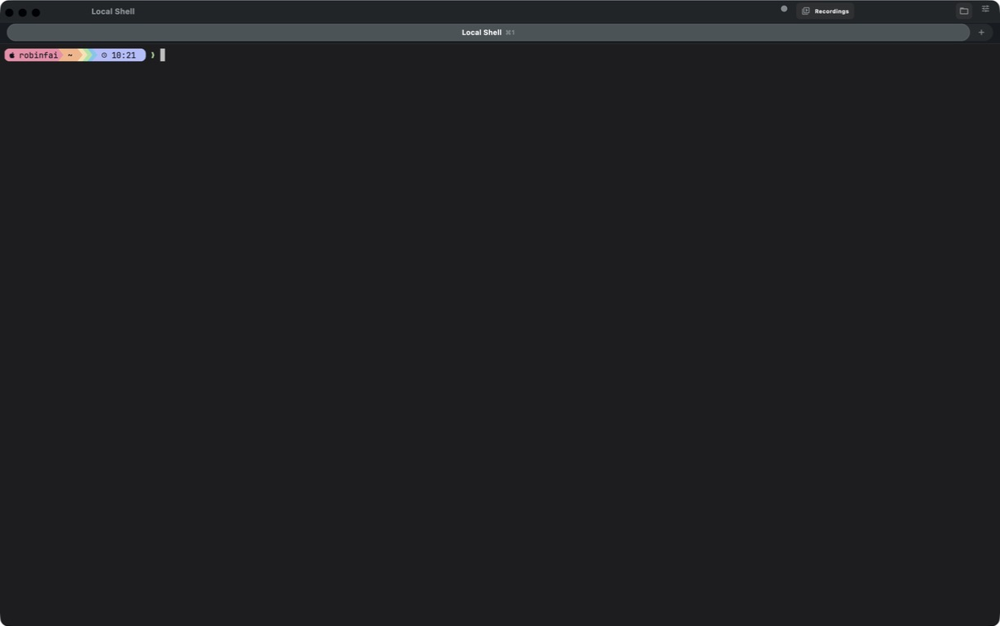

### 2. 通过命令面板寻找动作 — 可用但有摩擦

常用动作排在前面，禁用态有原因；但面板偏窄、说明被截断，搜索只覆盖少量动作，且匹配相关性不稳定。

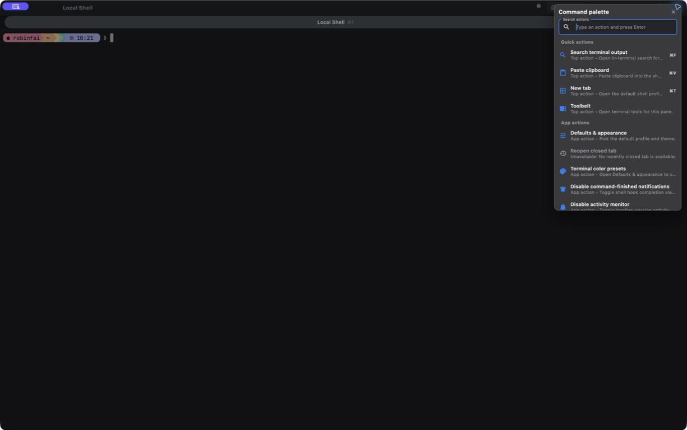

### 3. 从标签页上下文菜单管理 Pane — 可用但入口偏深

右键标签页可找到复制当前目录、分屏、恢复 Pane、应用布局、调整、交换、关闭等动作；能力完整，但多数用户不会自然在标签页右键中寻找 Pane 操作。

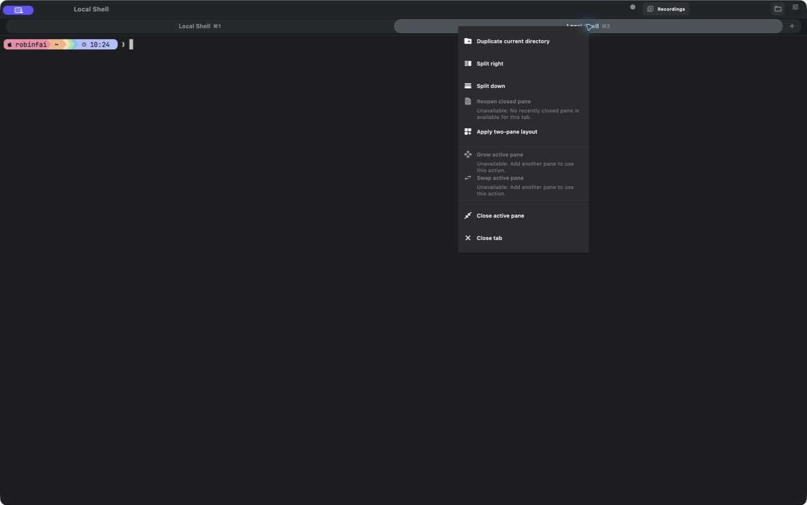

### 4. 分屏、聚焦、缩放、关闭与恢复 — 顺畅

左右分屏、焦点切换、缩放/还原、关闭/恢复 Pane 均可完成；分隔条明确。

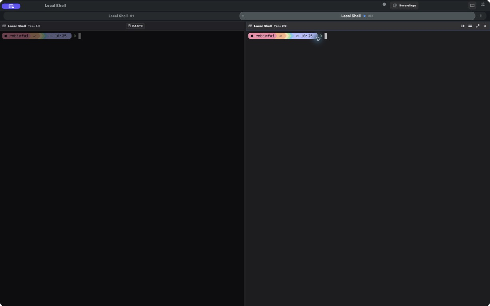

### 5. 录制、保存、进入录屏库并回放 — 顺畅

录制明确提示输入会脱敏；录屏库有搜索、筛选、排序、数量和敏感信息提醒；回放支持时间轴、速度、前后跳转、搜索、复制和适配。

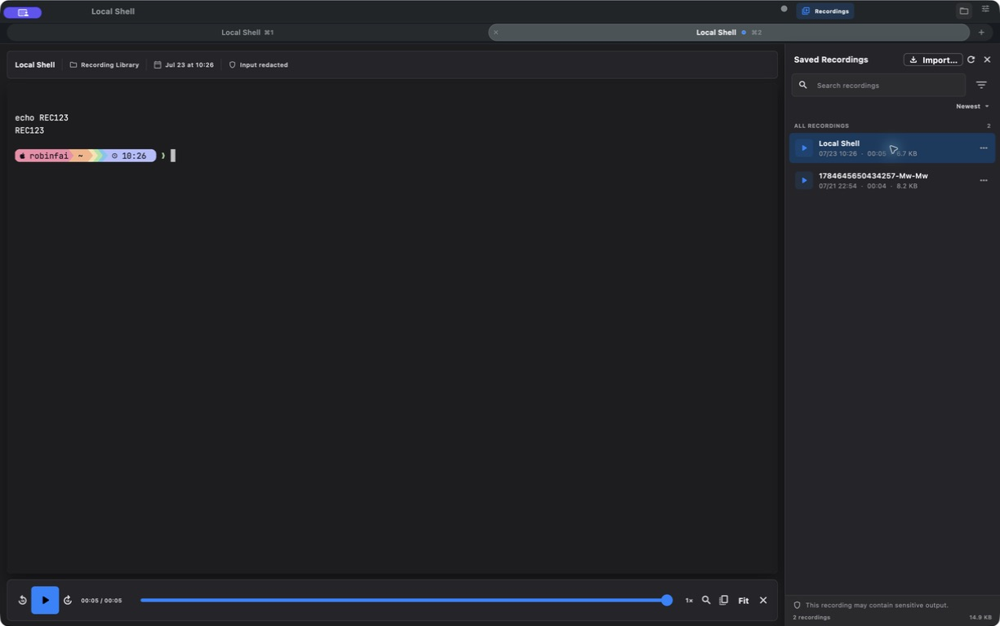

### 6. 编辑 Profile — 可用但信息密度偏高

General、Startup、Terminal、Appearance、Keys、Automation、Advanced 分区完整，也明确提示“仅影响新 Session”；高级用户价值高，但 Appearance 和高级配置需要渐进披露。

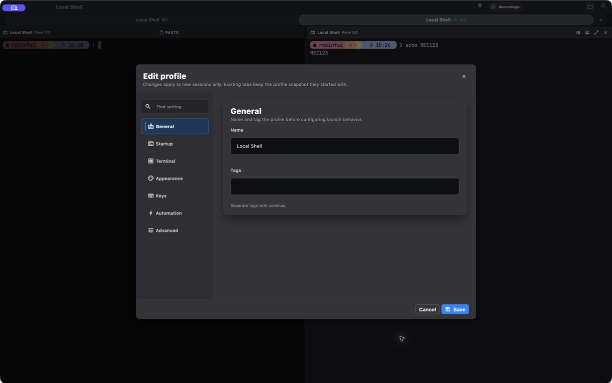

### 7. 设置默认 Profile 与外观 — 可用但状态表述冲突

“No configured default”被选中时，底部同时显示“Current new-tab profile: Local Shell”，容易让用户无法判断新标签实际使用哪个配置。

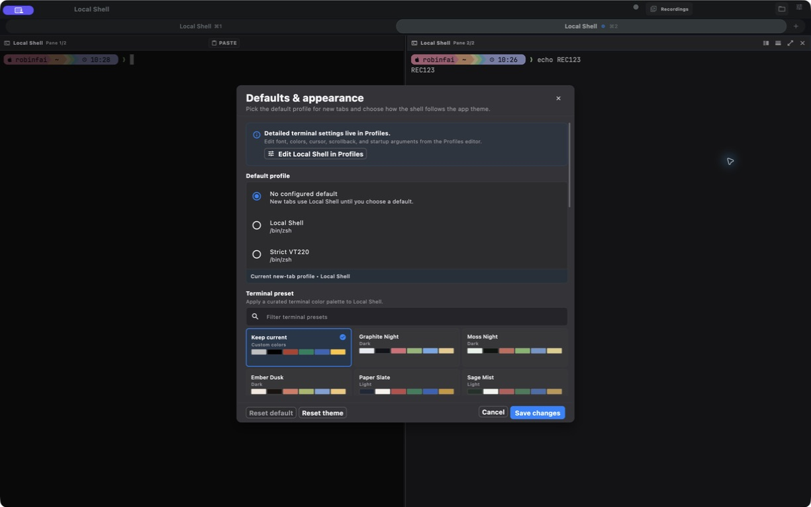

### 8. 搜索当前终端输出 — 顺畅

真实键盘输入 `REC123` 后返回 `1/1` 并高亮匹配。此前自动化直接赋值产生的 0 结果不是产品缺陷。

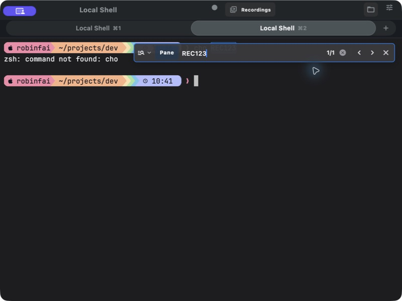

### 9. Instant Replay — 功能有价值，但可访问性高风险

时间轴、逐帧、播放、搜索、复制、适配、清空都可见，适合找回刚刚消失的输出；但进入后操作控件未暴露到辅助功能树，退出后主界面语义也可能不恢复。

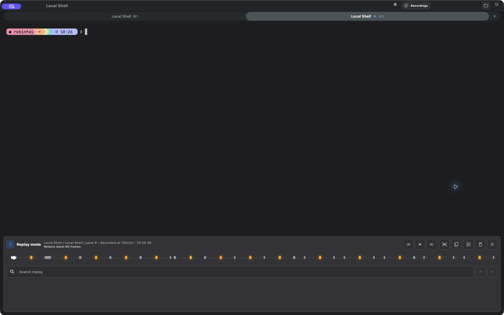

### 10. 在指定文件夹打开终端 — 顺畅

使用原生文件夹选择器，选中后新建标签并进入该目录，且有成功提示。这是高频、高价值路径。

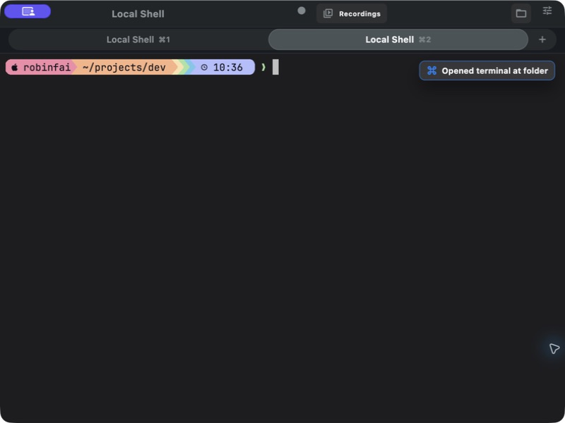

### 11. 全局搜索所有标签页 — 顺畅

搜索 `REC123` 返回 1 个匹配，并显示标签页和行号上下文。

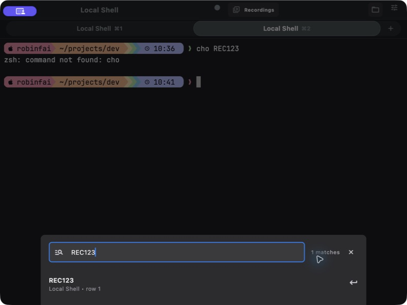

### 12. 在录屏回放中搜索 — 功能顺畅，可访问性高风险

搜索 `REC123` 返回 2 个匹配并高亮；视觉流程可用，但关闭录屏库侧栏后，回放控件从辅助功能树消失。

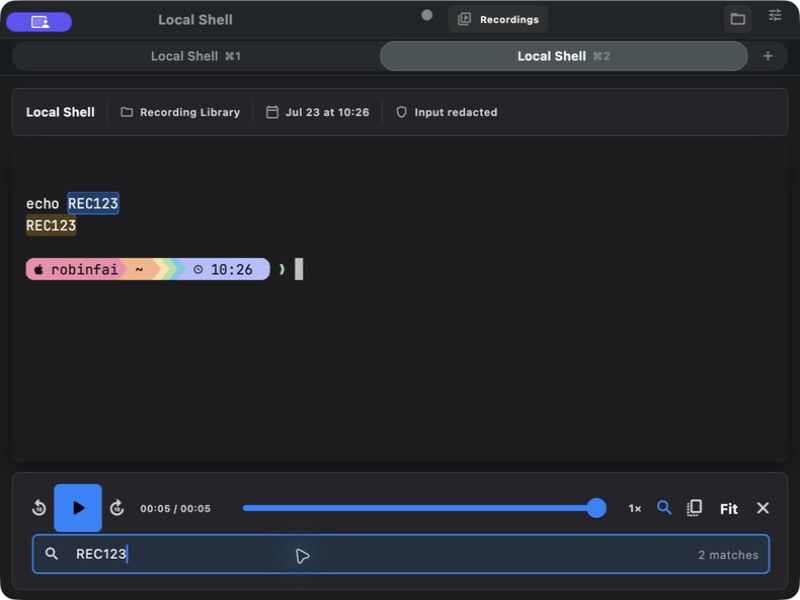

## 逐特性价值与交互判断

| 功能特性 | 用户目标与实际路径 | 用户价值 | 流程健康度 | 调整建议 |
|---|---|---:|---|---|
| 本地 Shell / PTY | 启动即进入 shell，输入、输出和新 Prompt 正常 | 高：产品基础 | 顺畅 | 保持启动直达；把底层协议兼容继续视为质量能力，而不是新增入口 |
| 标签页生命周期 | 新建、关闭、恢复已关闭标签均可完成；退出活动 Session 有确认 | 高：并行任务基础 | 顺畅 | 将 New/Close/Reopen 映射到 File/Window 菜单，并提供 New Window |
| Pane 与布局 | 分屏、聚焦、缩放、交换、关闭/恢复、两栏模板均存在 | 高：多任务核心 | 可用但有摩擦 | 在命令面板与 View 菜单提供完整 Pane 动作；工具栏增加可理解入口 |
| Relaunch / 窗口状态 | 重启可回到应用，但本轮窗口由约 1225×768 重置为 800×600；布局恢复受配置影响 | 高：连续工作 | 可用但有摩擦 | 默认记忆窗口尺寸/位置；在设置中解释“恢复布局”的开关和边界 |
| Open Terminal at Folder | 原生选取文件夹后创建新标签并进入目录 | 高：日常高频 | 顺畅 | 成功提示显示目录名或缩略路径，并提供“在 Finder 中显示”关联入口 |
| Profiles | 新建/编辑入口清楚，配置范围完整，仅影响新 Session 的提示明确 | 高：不同项目/环境复用 | 可用但有摩擦 | General/Startup 默认展开，高级 Terminal/Automation/Advanced 渐进披露 |
| Defaults & appearance / Theme | 可选默认 Profile 和终端配色预设 | 中高：建立个人工作环境 | 可用但有摩擦 | 统一“未配置默认值”和“实际回退 Profile”的表述；修复弹窗语义树 |
| Dynamic Profiles | 已有 iTerm2 JSON 预览/导入实现，但当前命令面板和 Profiles 界面无可见入口 | 中：迁移高级用户 | 入口不足 | 放入 Profiles 的 Import 菜单；明确支持字段、忽略字段和本地命令安全边界 |
| 命令面板 | 常用动作、分类、禁用原因、快捷键提示可见 | 高：复杂产品的总入口 | 可用但有摩擦 | 由统一动作注册表生成；加宽到 380–440px；改善搜索词权重并完整显示说明 |
| macOS 原生菜单 | File 只有 Open Terminal at Folder；Settings 禁用；View 很少；Help 为空 | 高：平台学习成本 | 高风险 | 映射 App/File/Edit/View/Window/Help 标准命令，启用 Settings，补快捷键帮助 |
| 当前终端搜索 | 面板内输入、匹配计数、上下条和高亮可用 | 高：定位输出 | 顺畅 | 保留；补充正则/大小写状态的可读标签与无结果建议 |
| 全局搜索 | 跨标签返回结果卡、标签名和行号 | 高：多 Session 排障 | 顺畅 | 支持键盘上下选择并直接聚焦目标 Pane；强化查询范围提示 |
| Shell Integration / Prompt Marks | 可查看 shell、cwd、最近命令/目录/Prompt 标记并跳转 | 高：把终端输出变成结构化历史 | 可用但有摩擦 | 合并 Toolbelt 与 Shell Integration 的重复入口，统一成“History & Marks”信息架构 |
| 最近命令与目录 | Toolbelt 中可插入历史命令；目录选择会插入 `cd` | 高：减少重复输入 | 顺畅 | 明确区分“插入”与“立即执行”；为危险命令保持只插入不执行 |
| 命令输出选择 / Captured Output | 有选择、复制和输出收集入口；本轮拖选未稳定复现 | 中高：分享与复盘输出 | 证据受限 | 给每个 Prompt block 增加可见的 Copy output 操作，减少对文本选择状态的依赖 |
| Copy / Copy Mode | 标准 Edit 菜单与动作实现存在，取决于有效选择 | 高：基础能力 | 证据受限 | 在无选择时解释 Copy disabled；为 Copy Mode 提供显式状态和退出提示 |
| Paste / Advanced Paste / Paste History | 简单粘贴直发；多行粘贴需确认；只读状态在读取剪贴板前阻断；策略测试通过 | 高：基础能力且涉及安全 | 可用但有摩擦 | 将 `PASTE` 状态改成“Bracketed Paste”或提供首次解释；在确认框显示行数/字符数 |
| Read-only | 开启后真实键盘输入被阻断，Paste 禁用并解释原因 | 高：演示/审阅时防误操作 | 顺畅但状态不够醒目 | 已有 `READ ONLY` 指示器，但小窗口下不够显眼；在 Pane 边框或标题同步显示锁定状态 |
| Session Recording | 开始/停止/保存成功，明确输入脱敏 | 高：审计、复现、分享 | 顺畅 | 保存提示不要展示完整内部路径；使用短提示 + Reveal in Finder |
| Recording Library / Import | 搜索、筛选、排序、大小统计和敏感输出提醒完整；Import 未执行 | 高：管理历史录屏 | 顺畅 | 导入前显示内容、安全和冲突预览；保留敏感信息警示 |
| Recording Replay | 播放、暂停、跳转、速度、搜索、复制和 Fit 可用 | 高：复盘与故障分析 | 高风险 | P0 修复全部控件的语义、焦点顺序和退出后语义恢复 |
| Instant Replay | 保留近期帧，可搜索、播放和恢复最近输出 | 高：应对瞬时输出 | 高风险 | P0 同上；将“Clear”设为需要明确确认的破坏性操作 |
| Autocomplete | `⌘;` 有实现与测试，基于可见词和命令历史；命令面板搜不到 | 中高：提升输入效率 | 入口不足 | 在命令面板、Keys 设置和首次提示中可发现；空结果解释数据来源 |
| Auto Composer | 有完整 UI 与执行逻辑，但没有默认快捷键，也未出现在当前命令面板 | 中：组织较长命令 | 入口不足 | 若保留，给出明确入口和定位；否则不应作为“已交付用户特性”计数 |
| Notifications | Command finished 和 Activity toggle 实测可保存；Bell/OSC 通知有实现与测试 | 中高：长任务后台反馈 | 可用但有摩擦 | 将 Bell toggle 放入同一设置区；提供通知权限状态和测试通知按钮 |
| Export scrollback / diagnostics | 可导出到 Application Support，并可复制路径 | 中：分享与支持排障 | 可用但有摩擦 | Snackbar 不要长时间排队遮挡；提供 Reveal in Finder、Dismiss 和更短路径 |
| Hotkey Window | `⌥⌘Space` 动作和桥接存在，但命令面板刻意隐藏，本轮 modifier 自动化无法验证 | 高（重度终端用户） | 证据受限 / 发现性低 | 在 Settings > Hotkey Window 集中设置、权限、冲突检测与“测试热键” |
| tmux integration | 可查看未连接状态并 Start/Attach，控制态前动作禁用 | 条件性：tmux 用户高 | 可用但偏专业 | 放入 Advanced tools；解释“便利入口，不是 Workspace 后端” |
| Coprocess | 可配置进程、输入模式与输出处理 | 条件性：自动化用户 | 可用但偏专业 | 补 TextField 语义标签、示例和安全说明；与 Profile Automation 统一概念 |
| Annotations | 说明了选择输出、添加注释、回看三步 | 条件性：复盘/协作 | 证据受限 | 在选区出现就地 Add note；未选中时明确提示如何选择，不要只依赖说明弹窗 |
| Password Manager | 仅应用 Session 内存储，并在 Prompt 条件下发送 | 条件性，且信任敏感 | 可用但命名有风险 | 改名为 Session Secrets；明确“不写入 Keychain/重启即丢失”，避免用户误判安全模型 |
| Debug 完成度面板 | Debug Toolbelt 显示 objective/milestone/backlog/verification | 对终端用户无价值 | Debug 限定可接受 | 必须继续由 `kDebugMode` 隔离，Release 不可出现 |

## 优先级建议

### P0：发布前阻断

1. 修复 Instant Replay 和 Recording Replay 的辅助功能树：所有控件有 label、role、value、焦点顺序；退出后主工作区语义必须恢复。
2. 修复 Defaults & appearance 弹窗未进入辅助功能树的问题。
3. 建立回放模式的键盘逃生路径：`Esc`、关闭按钮和菜单命令行为一致，且不依赖鼠标坐标。

### P1：一轮产品收口

1. 用统一动作注册表生成命令面板与 macOS 菜单，消除“有实现但找不到”的功能。
2. 启用 Settings，补齐 File/View/Window/Help；加入 New Window、Pane、Search、Recording、Profiles、快捷键帮助。
3. 提高 Read-only 状态显著性；将 `PASTE` 等协议状态翻译成用户能理解的文本。
4. 记忆窗口尺寸/位置；明确 Relaunch Layout 的开启状态和恢复范围。
5. 优化 Profile 渐进披露，以及默认 Profile 的“配置值/实际回退值”表达。
6. 精简导出/录制后的路径反馈，解决 Snackbar 排队、遮挡和长期停留。

### P2：差异化能力打磨

1. 重组 Toolbelt：History（Commands/Dirs/Output/Paste）为主，tmux/Coprocess/Annotations/Secrets 放入 Advanced。
2. 为 Autocomplete、Auto Composer、Dynamic Profiles、Hotkey Window 建立可发现入口；无法说明定位的功能暂不计入发布特性。
3. 将 Password Manager 重命名并清晰说明内存生命周期与 Keychain 差异。
4. 为录屏导入、注释选择、通知权限和热键冲突增加引导与可验证反馈。

## 可访问性与平台检查

- **已确认良好**：主工作区大部分按钮有语义名称；原生文件选择器可访问；Profile 编辑器有分区导航；禁用动作通常有原因；深色主题下焦点和选中态可辨。
- **已确认问题**：回放模式控件语义缺失；回放退出后语义可能不恢复；Defaults & appearance 弹窗语义缺失；Coprocess 输入框名称不足；macOS Settings/Help 菜单不可用。
- **需下一轮专项验证**：完整 VoiceOver 顺序、键盘仅操作、200% 文本缩放、Light mode、Reduce Motion、Reduce Transparency、High Contrast、多显示器与全屏切换。

## 证据边界

- 未执行 Clear scrollback 和 Clear replay，因为它们会删除当前可见历史；只核对了实现和入口。
- 未读取或粘贴用户原有剪贴板；粘贴安全由目标测试验证，多行确认和只读阻断测试通过。
- 未实际导入录屏或 Dynamic Profile，避免把外部内容写入用户配置；检查了入口、空态和实现边界。
- 未启动 tmux control mode、Coprocess 或输入 Secret，避免启动额外进程或处理敏感数据。
- macOS 全局热键及部分 `⌘` 快捷键无法由本轮 Computer Use modifier 注入可靠触发；不把该工具限制判定为产品缺陷。
- 本轮没有完整触发应用失焦后的系统通知，但通知生成、权限失败、Bell、Activity 和 OSC 通知已有测试覆盖。
- 终端底层协议兼容（OSC、键盘协议、图像/文件链接、IME 等）属于核心质量层，本轮不为每个协议构造独立用户旅程；以已有集成/单元测试作为补充证据。

## 最终判断

当前版本适合继续作为高能力本地终端的内部/技术预览版本：核心任务可完成，主要功能对目标用户有真实价值。若目标是面向普通 macOS 用户发布，建议将“平台菜单 + 统一入口 + 回放可访问性 + 窗口状态”作为一轮完整的 convergence，而不是继续增加更多高级工具。
