# Trail：Block 与 AI 融合交互设计

日期：2026-10-02。基于当前 `composer` 分支的实际能力、既有审美取舍及 Warp 官方文档。本文和配套 imagegen 图是待实现的设计方案，不是产品已实现或已通过运行验收的声明。

## 目标与取舍

把「用户目标 → 上下文 → 可审阅动作 → 真实执行 → 可引用结果 → 下一步」放进同一条可追溯流程。保留终端的精确输入和输出，把 AI 作为有状态的协作者。普通执行无需出现额外 AI 面板；进入任务后，问题、解释、提案和真实命令块按时间排列，替代当前右下角浮动对话框。

既有约束全部保留：桌面整块默认不超过终端可用区域的 1/3；手机最多 6 行预览并有独立阅读页；真实 Terminal 渲染输出；SSH 按当前节点协商，失败自动 Normal、恢复手动 Blocks；模式入口为 tab 右键或触控会话菜单；手机平台默认 Blocks；top/vim 等全屏程序占用完整可用 terminal。

## 官方参考与 Trail 决策

下列来源于本次重新打开的官方文档，访问日期 2026-10-02。参考图片也已直接查看，保存在 references/；它只说明公开 UI，不证明 Warp 内部架构。下文其余状态、尺寸和实现建议均为 Trail 的设计决策。

| 参考 | 借鉴 | Trail 的具体取舍 |
| --- | --- | --- |
| [Terminal and Agent modes](https://docs.warp.dev/agents/local-agents/interacting-with-agents/terminal-and-agent-modes/) | 命令与 AI 意图可辨认；AI 控件按需出现；任务有连续视图 | 保留单一 PTY，AI 任务成为主时间线中的可折叠分组；同一执行只有一个 canonical block，普通终端和任务视图通过引用切换，不复制输出 |
| [Blocks as Context](https://docs.warp.dev/agents/local-agents/agent-context/blocks-as-context/) | 选择后待附加、发送后固定；命令结果可进入后续问答 | 清楚显示来源、范围、完整性；可选多块或选中行；跨会话内容只能作显式资料，不能隐式变更执行目标 |
| [Full Terminal Use](https://docs.warp.dev/agents/capabilities/full-terminal-use/) | AI 可读同一终端并向交互程序发送输入，用户可接管 | AI 页面不改变 TUI 的 PTY 行列；每次写入仍单独审阅；读屏、等待、暂停模型、向终端发中断是不同动作 |
| [Block basics](https://docs.warp.dev/terminal/blocks/block-basics/) | 命令与结果成组、选择和导航 | 延续细分隔线；失败只用图标和退出码，不引入整块红底、彩色侧栏 |

## 四组独立状态，避免把所有事情都叫「模式」

1. **会话显示**：Blocks / Normal，由当前能力与用户选择共同决定。入口在 tab／会话菜单。
2. **输入意图**：命令 / AI 提问，始终以文字和主操作区分。切换只改变输入去向，不能执行或切换显示模式。
3. **执行归属**：shell 就绪 / 普通运行命令 / TUI / 用户接管 / 已断开。一个 PTY 同时只有一个输入所有者。
4. **AI 任务**：草稿 / 澄清 / 思考 / 待审批 / 提交中 / 观察中 / 暂停 / 需恢复 / 已完成。命令运行时 AI 可以暂停；模型有回复时任务未必完成。

会话内任务保留原始目标、追加约束、消息、命令引用、待批 revision 和阅读位置。任务切换不启动第二个后台执行器。退出应用后的任务持久化、云端任务同步、自动批准均不属于本方案默认能力；若未来增加，需另行设计。

## 空间结构

- 顶部保留现有应用 chrome 与 session tabs。AI 任务打开时显示一行任务面包屑，可返回终端或选择本会话任务。
- 主区只有一条时间线。普通块由命令、输出、状态组成；AI 解释为正文；提案在执行前显示可审阅边界，接收后原位关联真实块。
- 状态条固定在 Composer 之上，仅表达当前任务与必要恢复／定位入口。不能在看不到完整提案时直接批准。
- Composer 沿用环境、编辑、操作三层结构。命令补全／历史与 AI 附件工具按输入意图出现；两个草稿分别保留。初次选块是待附加上下文，提交后才变成任务证据。
- 宽屏保持同一内容列，不自动创建聊天侧栏。输出阅读器可暂时扩展；短窗口状态并入任务标题。移动端审批与输出阅读用专用页面，正常列表避免双层纵向滚动。

## 布局与视觉 tokens

复用 `IanvsTheme`、`AppThemeTokens`、`ComposerTheme` 与已许可的 outline 图标。浅色为安静底色、冷灰 chrome、深墨正文、蓝色单一主操作；深色为 charcoal/raised surface，使用配对前景色。错误、警告、运行都同时带文本或形状，不只依赖颜色。

间距 4/8/12/16/24；控件圆角 6、dock 12；正文 14–16，命令约 14、行高约 1.5，状态 12。默认边界 1px，高对比增强；编辑器沿用 caret-only focus，按钮／菜单保留可见键盘焦点。桌面点击目标至少 32，触控至少 44。长警告可换行，不把关键原因截断。

宽度 >= 960 采用完整环境行与文本操作；600–959 合并次级 metadata，保留所有入口；<600 单列、次要动作进入菜单。断点最终应由实际字体测量和可用约束调整。桌面 2× 文字不全局压缩，优先换行与缩短 metadata；手机设计、实现和验收只考虑固定字号，不要求跟随系统字号、动态文字缩放或大字号适配（见根目录 AGENTS.md）。横屏／短窗保持主操作可见。

桌面默认块高：`max(0, floor((H_terminal/3 - H_header - H_status - H_padding)/lineHeight))` 行输出。标题状态不可被压掉；若剩余不足一行，改为折叠行 + 查看全部，而不是溢出。手动扩大属于该块的阅读偏好，不受后续输出刷新重置。手机按最多 6 行自然高度，和软键盘高度解耦。

## 行为合同

**滚动**：用户手动回看暂停跟随；输出更新不重建 ScrollController，不取消惯性、不以 hover 强制 reveal。桌面边界可把剩余 wheel delta 交给外层；手机预览不拦截纵向拖动，全屏 reader 单滚动。锚点使用 blockId/lineId 和像素偏移，分页插入补偿。只有显式「回到最新」恢复跟随。

**焦点与快捷键**：Cmd+I 进入／切换 AI 意图并保留草稿；Enter 遵循当前明确主操作；Shift+Enter 换行；IME 组词时 Enter 不提交；Tab 保留命令补全采用语义，采用不执行。Esc 按最内层弹层→reader/任务视图→输入的层级关闭，不能同时发送给 TUI。Ctrl+C 只在终端拥有焦点时发送。审批按钮必须获得焦点或被明确点击，不把全局 Enter 当作批准。

**审批与恢复**：提案绑定 sessionId/contextId/cwd/lease/revision。用户编辑、目标变化、手动输入或暂停都会撤销未执行批准。输入提交确认与命令退出分开。未知结果只检查原提交，不自动重发。继续任务先读新状态，保留原目标和约束；任务结束应由证据支撑，退出码 0 只证明对应命令的结果。

**上下文**：块引用含 id、命令、cwd、状态、原生输出范围、总行数、是否截断／淘汰。用户可审阅附加范围。自动读取限定当前任务相关结果；截断明确告知，必要时可提议读取指定范围。未来 range-read 工具应是只读、有上限、有来源，不用 shell 重跑命令模拟历史。仅去掉完全重复观察，不能丢掉唯一证据或用户约束。

**SSH**：握手能力只属于当前节点；协商时输出仍可用。自动降级保护可见输出和同一 PTY。首次成功按偏好启用，降级后的能力恢复只提示；手动选择通过桌面 tab 右键／触控会话菜单。Normal 下 AI 仍可按实时屏幕提供经批准的按键，不伪造 block 边界。

**可访问性**：关键状态使用温和 live region，仅在阶段变化播报；不要每行输出都播报。命令、来源、退出码和范围可被朗读。选择块与选中文本语义独立；菜单可键盘退出且焦点回到触发点。Reduce Motion 关闭装饰动画；高对比和桌面2×字号有独立验收，图像稿本身不能证明合规。

2026-10-03 验收范围调整：用户明确要求跳过 VoiceOver。本次不以实际 VoiceOver 朗读作为完成条件，并将该项保留为未验收；上述语义、键盘、高对比与减少动态效果要求仍保留。当前实现与证据见 [CURRENT_ACCEPTANCE.md](CURRENT_ACCEPTANCE.md)。

## 交互场景

每个场景都有独立设计图、完整 imagegen prompt、详细流程和验收条件。`scenes.json` 是对应索引；图像中示例命令和结果均为 mock 数据，不代表本仓库真实执行结果。图像文字如与本文冲突，以行为合同和场景正文为准，并在视觉复核中记录。

### D01 统一输入与待附加上下文

入口：完成块「询问 AI」或 Cmd+I。主要动作：发送给 AI。出口：D02；缺少配置进入 D14 后返回草稿。

从已完成块的「询问 AI」或 Cmd+I 进入；保留命令草稿与选区。选择块只进入待附加上下文，发送后才固定为该任务的输入。用户可移除上下文；自然语言识别仅建议 AI 意图，显式覆盖在当前草稿内保持。发送按钮明确写「发送给 AI」，不能把自然语言发给 shell。

验收：切换意图不执行、不丢草稿；IME 组词 Enter 不提交；附件范围可查看；首次无配置转 D14 并保留草稿。

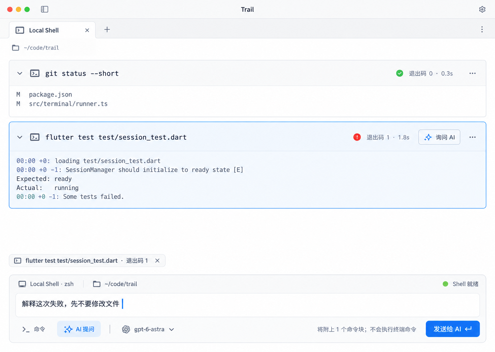

[生成提示词](prompts/D01.txt)

### D02 任务建立、澄清与计划

入口：新任务存在目标或约束歧义。主要动作：发送补充。出口：解释结果 D05，或提出可审阅动作 D03。

新任务获得会话内 taskId、原始目标、约束和所附块。有实质歧义时先澄清；答案写入同一任务。计划是可修改的说明，不是命令授权；明确「只分析」后不能擅自给出自动修改。简单问题直接解释，不强制计划页。

验收：澄清不写 PTY；计划更新保留用户约束；取消保留草稿；无依据不显示已完成步骤。

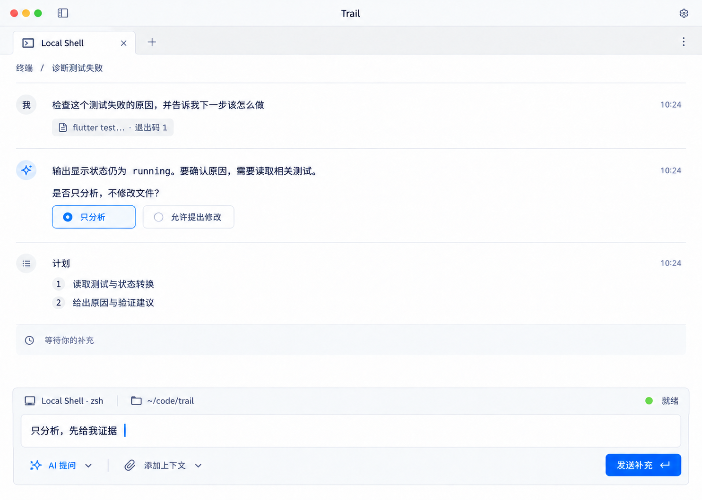

[生成提示词](prompts/D02-v3.txt)

### D03 命令提案审阅与单次执行

入口：模型返回未执行提案。主要动作：执行一次。出口：收到提交回执进入 D04；目标改变进入 D09；回执未知进入 D10。

提案包含用途、精确目标、目录与完整命令／命名按键。编辑后生成新 revision，废弃旧审批；拒绝只记一条拒绝事件。执行一次冻结 revision，获取最新 session/context/lease 核对后提交；双击只产生一个 submissionId。

验收：目标变更撤销确认；命令不省略不可见后缀；审阅区内 Enter 不隐式执行；键盘焦点到执行按钮才触发；多条提案逐条确认。

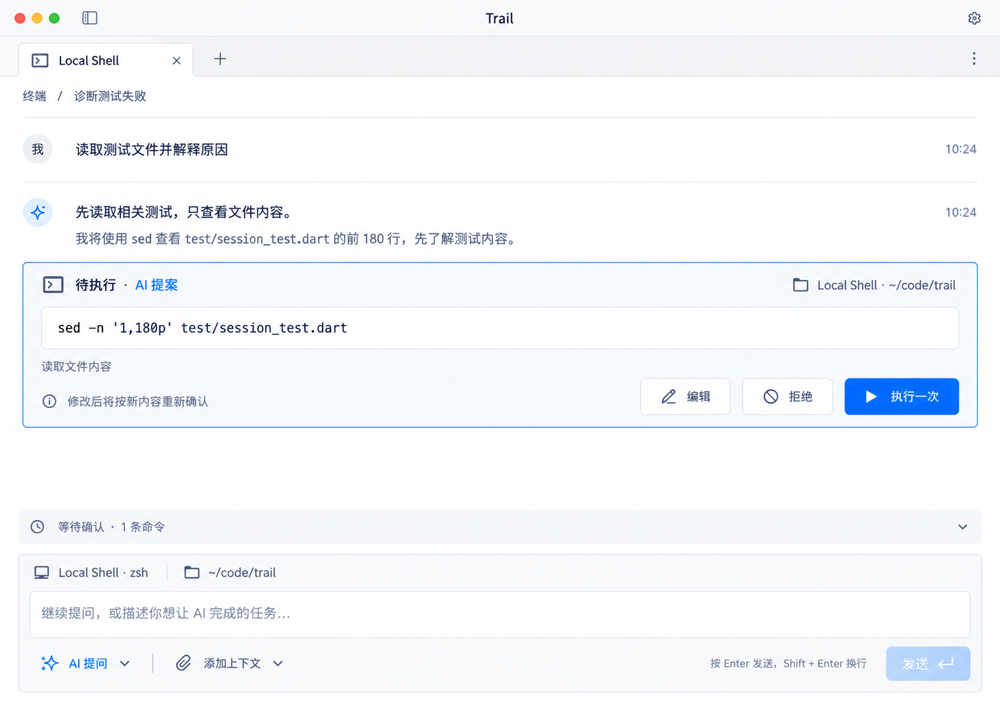

[生成提示词](prompts/D03.txt)

### D04 执行、等待与新输出

入口：已批准动作收到提交回执。主要动作：补充要求；必要时暂停 AI。出口：命令完成进入 D05／D06，需恢复进入 D09／D10。

提案原位关联同一真实块，状态为提交中→运行中→已退出；接收回执不等于命令成功。AI 等待是单独状态，限时读取但不重复提交命令。输出到来时跟随仅限用户本来在底部；手动回看立即暂停跟随。「补充要求」只更新同一任务约束，不向 PTY 写入；取消旧推理、撤销未执行提案，下一轮读取新状态并采用追加约束。已提交命令不会因此中断。

验收：暂停 AI 不发 Ctrl+C；「中断命令」是独立显式操作；长期静默显示已等待时长与最后输出时间，不伪造进度；整个桌面块默认不超过可用视口 1/3。

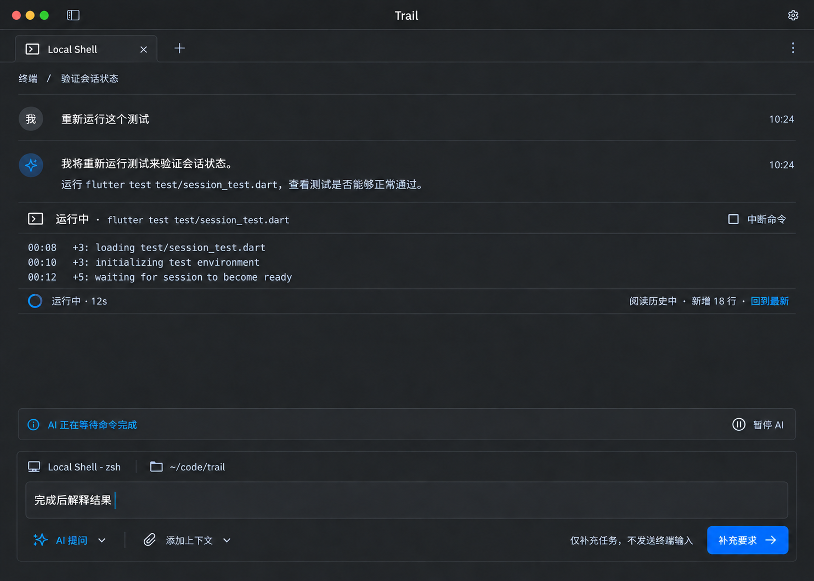

[生成提示词](prompts/D04-v3.txt)

### D05 结果、证据与继续追问

入口：命令退出且结果可核实。主要动作：继续提问。出口：沿用任务进入 D02／D03，或返回终端。

命令退出后由实际退出码和可见证据驱动总结；总结引用 blockId 和输出范围。点击证据定位原块而非复制出第二块。任务完成恢复输入焦点但不抢走用户阅读位置；追问默认沿用同一任务约束，明确新任务才重置。

验收：退出 0 不等于需求完成；区分模型推断与命令证据；总结注明验证范围与截断；无输出命令仍可根据退出码说明。

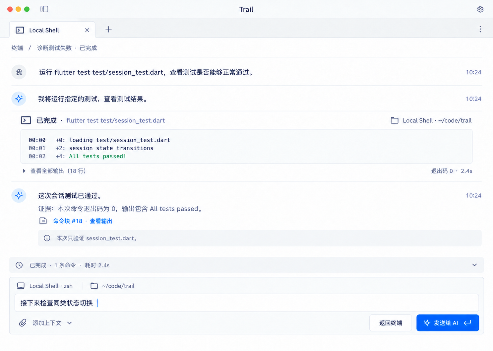

[生成提示词](prompts/D05-v2.txt)

### D06 失败诊断与修正提案

入口：真实命令非零退出，用户提交诊断请求。主要动作：审阅修正提案。出口：新提案 D03；原失败块永久保留。

错误块快捷入口只附加该块并打开 AI 草稿，不自动发送修复。发送后先解释错误和依据，再提出新的修正命令。原失败块永久保留原始状态；修正执行另建块并关联来源。对环境、凭据等问题不得编造可直接重试的修复。

验收：纠正按钮不执行；没有规则或证据时明确不足；原输出、命令及退出码不被新命令覆盖；重复失败回到诊断。

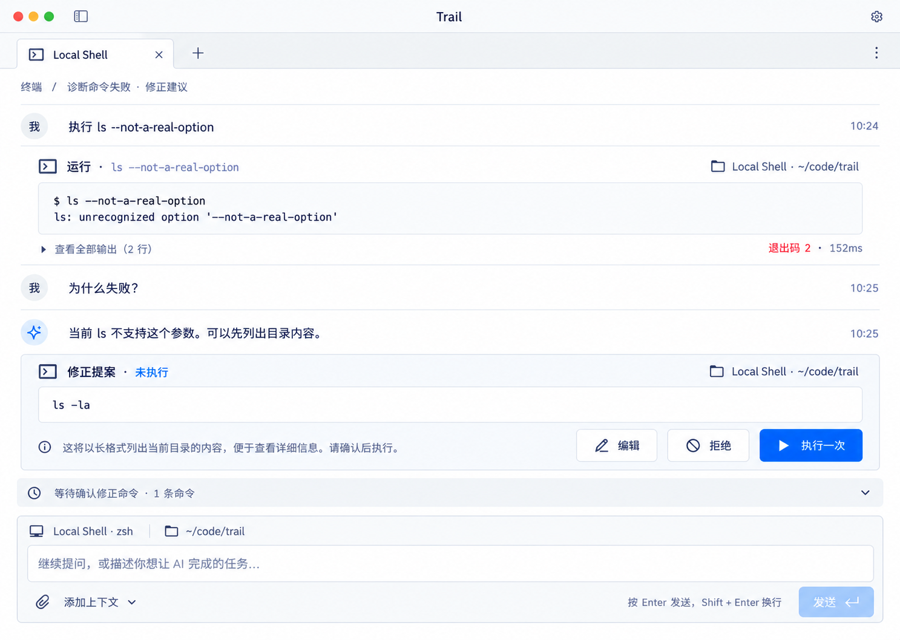

[生成提示词](prompts/D06.txt)

### D07 选择多个块作为 AI 上下文

入口：从块标题选择一个或多个块。主要动作：附给 AI。出口：D01 的待附加区；发送后成为固定证据。

块选择、文字选择与附件是三个状态：单击标题选块，拖动输出选文字；Cmd 多选、Shift 连选。点击「附给 AI」生成待附加引用。默认当前会话；跨会话资料需显式选择且清楚标源，不能成为执行目标。发送时冻结输出版本与范围。

验收：移除附件不删除命令块；显示末尾 160 行、总量、淘汰或不完整；只有用户确认的上下文发送；手动选择片段可替代整块。

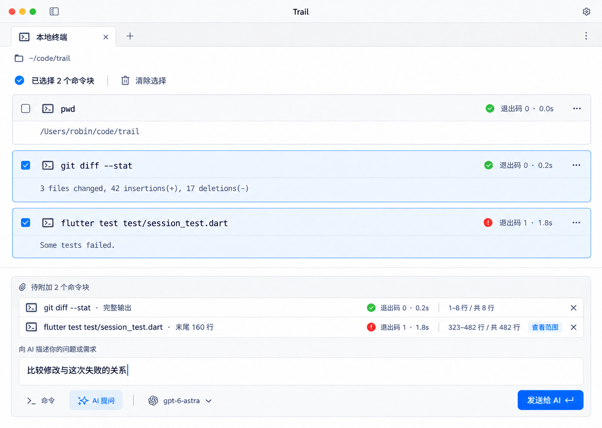

[生成提示词](prompts/D07-v2.txt)

### D08 长输出阅读、搜索与引用

入口：桌面块「查看全部输出」。主要动作：将所选行附给 AI。出口：返回任务并恢复草稿、选区和历史位置。

展开桌面块进入受约束的大阅读区；标题固定，分页读取真实终端保留行。行内查找、过滤只影响展示，默认复制原始完整保留输出；复制所选／过滤结果必须明确命名。选择行后作为带来源范围的附件，返回恢复草稿和列表锚点。

验收：一次纵向手势只有一个滚动归属；到边界可继续滚动外层；新输出不拉回；范围淘汰明确提示不可读取；扩展内容不能假装已经全量发送 AI。

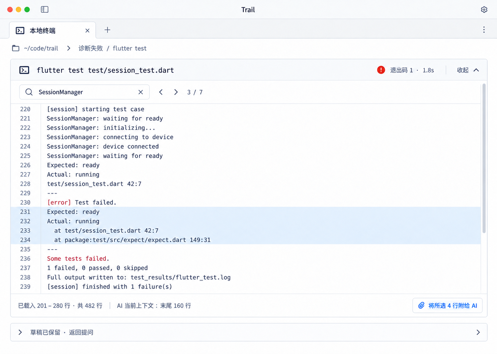

[生成提示词](prompts/D08-v2.txt)

### D09 暂停、接管与目标变更

入口：手动接管、暂停或执行目标变化。主要动作：读取新状态后继续任务。出口：同目标观察 D04；新目标重新提案 D03。

用户输入、暂停、关闭任务视图或目标改变均撤销尚未执行提案；已执行命令继续运行。继续任务先读新状态，保留原目标与约束。当前 session/context 不同，必须明确选择回到原目标或基于新目标继续，旧批准不能迁移。

验收：恢复不重复已提交命令；双击恢复只启动一轮；用户接管过程中不发送晚到模型指令；关闭视图与终止任务语义分开。

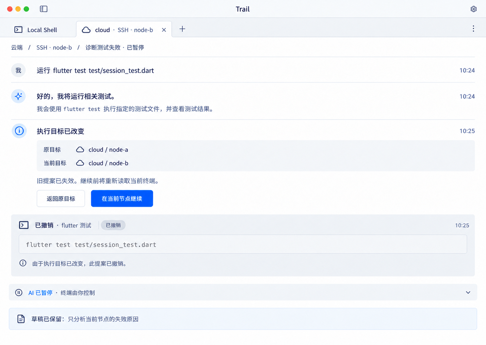

[生成提示词](prompts/D09-v2.txt)

### D10 未知执行结果与连接恢复

入口：断线、请求失败或提交回执未知。主要动作：重新连接并检查。出口：确认原命令结果后 D04／D05；仍未知保持人工检查。

区分模型请求失败、终端断线、提交结果未知和正常等待超时。模型失败可继续观察；提交未知不能自动重发。重连后先查询原 submission/block，再给可确认结果；仍未知提示人工检查。认证错误转配置页并保留任务。

验收：错误不吞目标／草稿／历史；原命令提交计数不变；取消网络请求不会回滚 PTY；连接恢复不自动授予新动作。

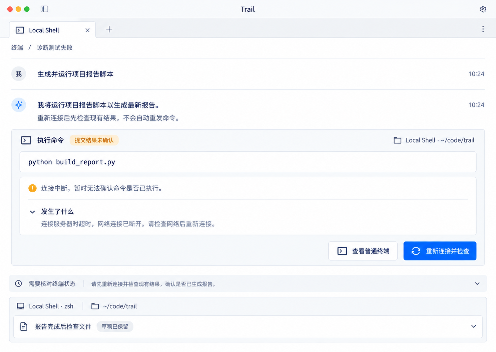

[生成提示词](prompts/D10.txt)

### D11 SSH 协商与显示模式回退

入口：当前 SSH 节点能力失效／协商中。主要动作：tab 右键查看模式与原因。出口：Normal 保持可用；能力恢复后用户手动选择 Blocks。

每次 SSH／嵌套 shell 按当前节点协商能力，握手期间继续显示原终端输出。失败自动 Normal，tab 显示原因；初次成功依新会话偏好启用 Blocks，已降级后的恢复只通知可切回。桌面右键 tab／手机会话菜单手动选择；重检不重连、不静默写配置文件。

验收：外层 shell 能力不能用于内层；降级不丢输出／草稿／同一 PTY；AI 上下文更新节点且撤销旧提案；不能使用 block 时仍允许读取当前屏幕与审阅按键。

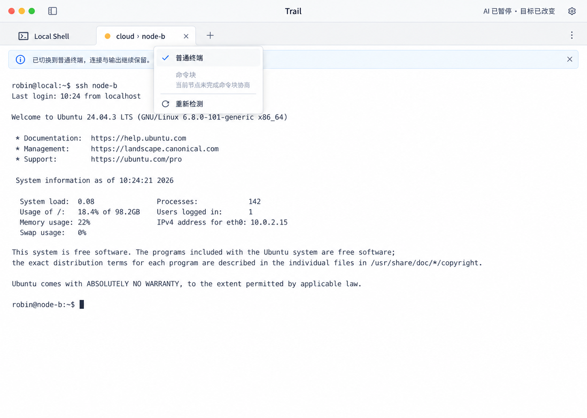

[生成提示词](prompts/D11-v2.txt)

### D12 全屏 TUI 与 AI 输入交接

入口：vim／top 等接管终端。主要动作：终端原生命令或暂停／查看 AI。出口：退出程序后提示可手动恢复 Blocks；AI 审批覆盖页不改变 PTY 网格。

进入 alternate screen／鼠标报告／特殊协议时沿用 Normal 的完整终端网格，撤走块与 dock，保持行列不因 AI 控件而变。AI 状态入口位于既有 chrome；打开阅读／审批页可临时覆盖视图但不 resize PTY。批准后关闭覆盖并把焦点交回 TUI；手动按键即接管。

验收：top/vim/k9s 占据完整 terminal；Esc 先关闭 AI 页后才交给 TUI，Ctrl+C 仅在终端拥有焦点时送 PTY；退出 TUI 提示可手动恢复 Blocks。

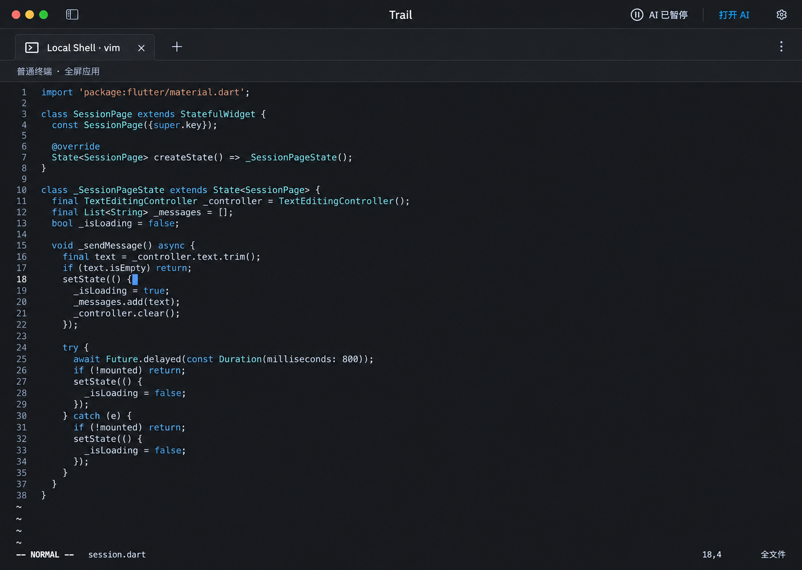

[生成提示词](prompts/D12.txt)

### D13 历史阅读与待审批定位

入口：用户回看历史时出现新结果或提案。主要动作：查看待确认命令。出口：定位 D03，取消定位可返回原阅读锚点。

后台回复、工具结果和新提案都不夺走阅读位置。固定条汇总新结果／待确认，点击后定位同一提案。任务列表只保存会话内任务及其状态，切换任务不复制执行块、不启动新代理；离开正在审批的任务不等于同意。

验收：回看时无自动滚到底；点击跳转后可返回原锚点；状态只播报关键变化；切换任务的草稿、附件、阅读位置相互隔离。

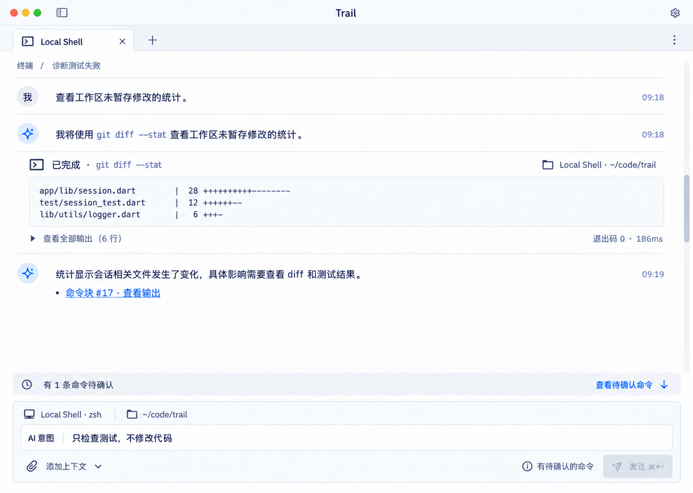

[生成提示词](prompts/D13-v2.txt)

### D14 模式偏好与 AI 配置入口

入口：应用设置或首次使用 AI 缺少配置。主要动作：保存偏好／进入 AI 配置。出口：返回原草稿；模式偏好只影响新会话。

平台默认与显式用户偏好分开：手机默认 Blocks；桌面沿用现有偏好。设置仅作用新会话，不在旧会话偷偷切模式。AI endpoint/model/key 原配置表单保留，空配置入口不阻塞普通终端；测试连接成功与保存成功分开反馈。开发版存储策略为实现约束，不进入普通用户流程。

验收：设置变更不执行命令、不启动 AI；连接失败保留编辑；凭据不出现在任务历史／设计稿；不得增加未授权的云端代理或自动批准。

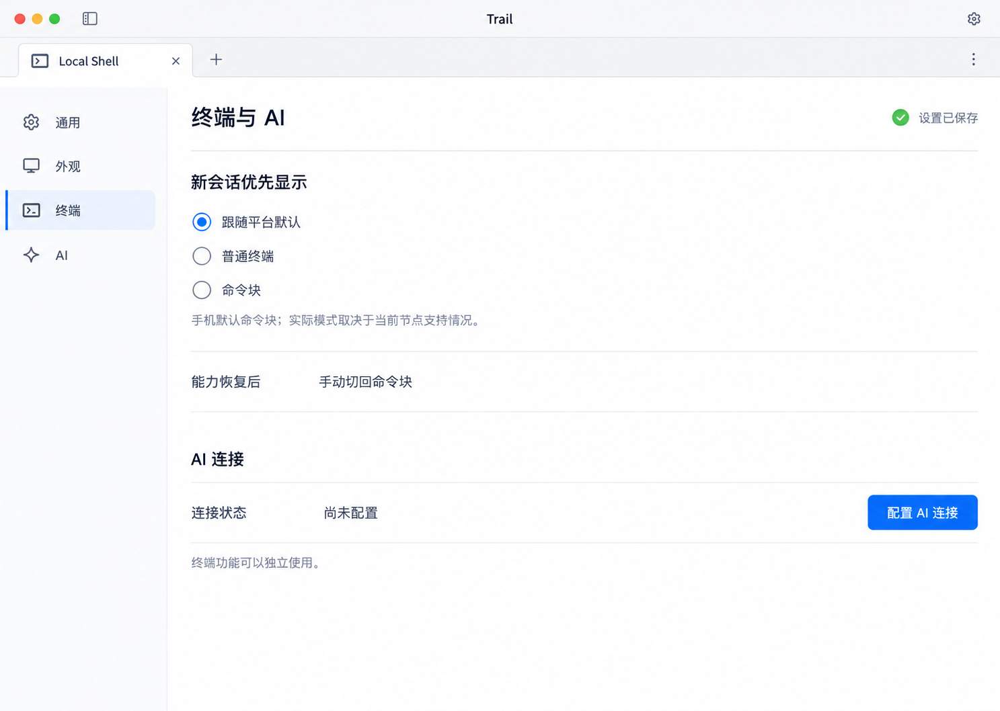

[生成提示词](prompts/D14.txt)

### M01 手机任务输入与键盘

入口：手机默认 Blocks、选择失败命令上下文。主要动作：发送给 AI。出口：M02 审阅；收起键盘保留草稿。

手机进入协商后优先 Blocks。输入区随键盘整体抬升，历史视口变短但每块预览不反复压缩；AI 提问有显式意图标签，命令草稿单独保留。系统返回／收键盘只改变键盘，不丢任务。

验收：预览最多末尾 6 行，不出现块内纵向滚动；键盘出现不抢历史锚点；44px 触控区域；手机固定字号；横屏／短窗保持输入与主要操作可达。

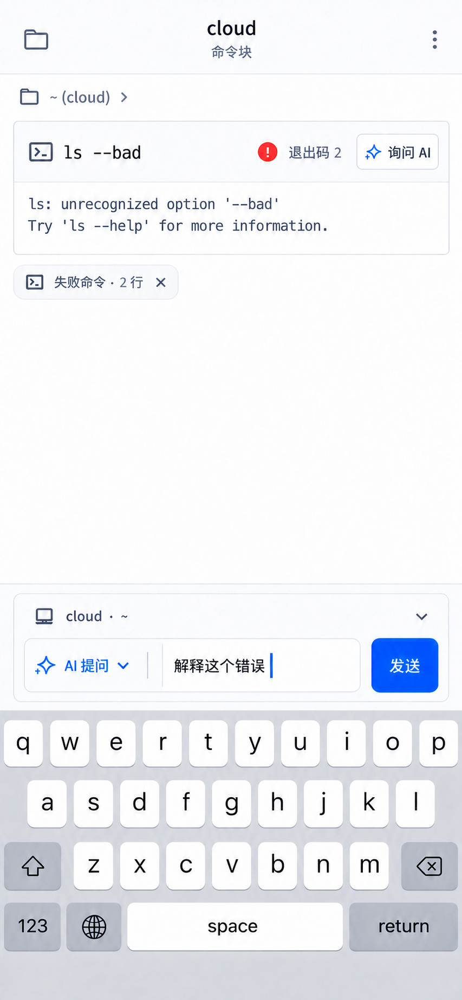

[生成提示词](prompts/M01-v3.txt)

### M02 手机完整审阅与确认

入口：手机收到待执行提案。主要动作：执行一次。出口：M03；返回／拒绝不执行，编辑后重新审阅。

手机审批使用专用页面，关闭键盘，完整展示目标与命令；长命令审阅可单一滚动，确认区固定但必须与当前 revision 绑定。编辑进入编辑态，保存后回到确认，不能直接执行；拒绝回任务并保留解释。

验收：小屏可查看完整命令、目标、原因；触摸滑动不触发确认；页面进入不自动聚焦执行；变化的目标撤销按钮。

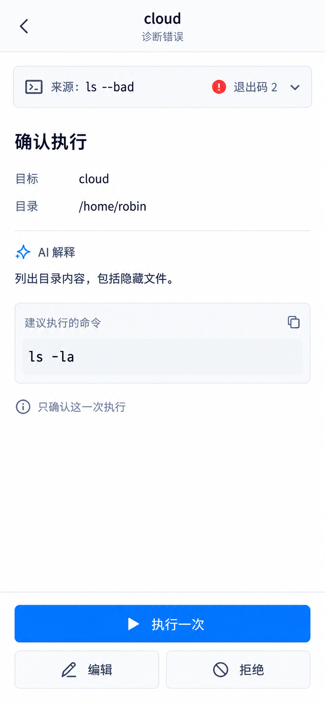

[生成提示词](prompts/M02.txt)

### M03 手机运行预览与暂停

入口：命令运行且 AI 观察中。主要动作：查看全部；需要时暂停 AI。出口：M04；后台暂停模型动作，回前台核对连接。

运行块以末尾 6 行预览，列表滚动与内容刷新独立；点击查看全部进入 M04。AI观察、终端运行和用户是否跟随是独立状态；暂停 AI 不中断命令。进入后台暂停模型动作，回前台核对连接和状态再恢复。

验收：静默日志没有假失败；回看不回弹；运行时预览更新不重置列表；进后台不能偷偷执行待批命令；耗时状态保留。

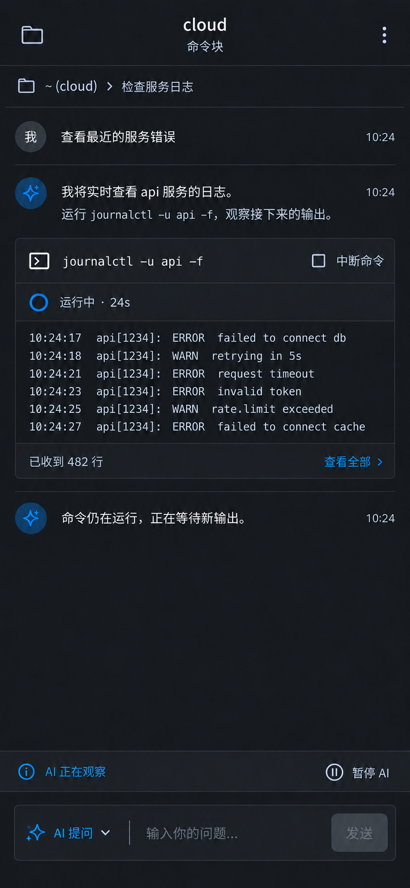

[生成提示词](prompts/M03-v2.txt)

### M04 手机全屏输出阅读与选段

入口：手机块「查看全部」。主要动作：将所选行附给 AI。出口：M01／任务页，恢复原位置与草稿。

查看全部隐藏 Composer 与键盘，输出独占阅读页且仅一个滚动容器；记录 anchorLineId+像素偏移。搜索／选段后可附给 AI，返回恢复原列表、选区和草稿。新输出仅增加计数，手动点回到最新才恢复跟随。

验收：反复滑动不被拉回；加载前页按锚点补偿；丢弃行显示「早期输出已释放」；退出页面不停止命令。

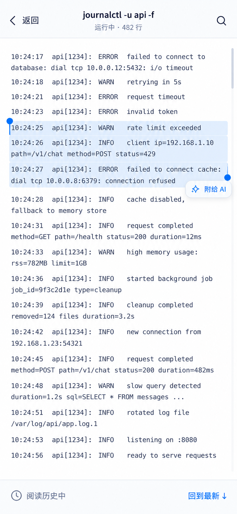

[生成提示词](prompts/M04.txt)

### M05 手机 Normal 入口与能力原因

入口：会话菜单，或节点不支持 Blocks。主要动作：普通终端／重新检查支持情况。出口：同一 PTY 的 Normal；能力恢复后手动 Blocks。

右上会话菜单始终可达，适用于触控且不依赖长按 tab。能力失效自动Normal并说明当前节点；菜单可手动选择Normal。能力恢复显示「命令块可用」，仍由用户切回；偏好只改变新会话默认。

验收：菜单开关不发送 PTY 输入、不改变 PTY 行列；降级提示不反复弹出；不能支持时禁用项必须附原因。

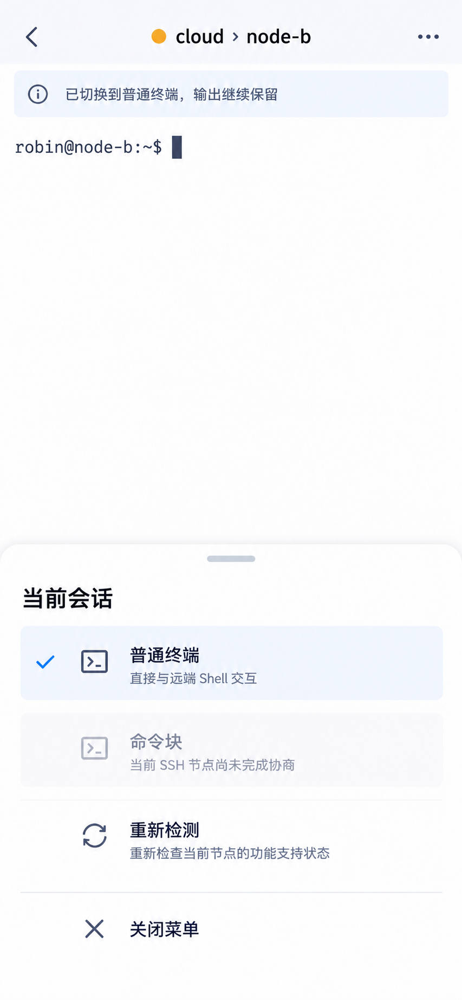

[生成提示词](prompts/M05.txt)

### M06 手机全屏程序与输入所有权

入口：手机进入全屏终端程序。主要动作：终端辅助键／原生输入。出口：关闭键盘恢复网格；退出程序提示手动 Blocks。

全屏TUI使用实际可用终端区域；系统键盘减少可用高度属正常resize，但AI状态入口不能额外压缩终端。输入直接送当前程序，辅助键按终端语义；打开AI页时先暂停手动输入并显示目标程序，完成批准后回到TUI。

验收：vim/top不缩在块内；键盘收起恢复行列；AI输入和terminal辅助键不混用；退出TUI后提示手动切回Blocks。

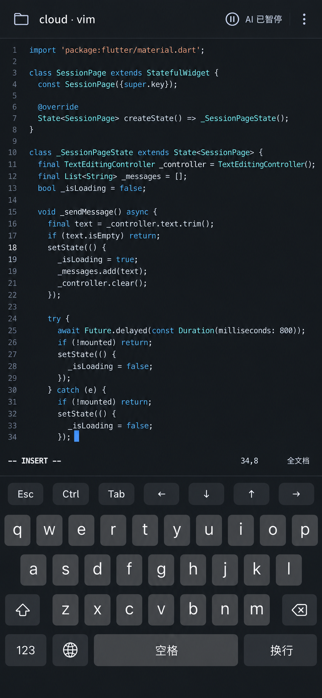

[生成提示词](prompts/M06.txt)

## 事件与状态转换

输入来源和会话目标优先于模型回复。任何有写入效果的动作都必须先通过当前 revision 和目标核对；晚到推理不能重新激活已撤销的提案。

| 事件 | AI 任务变化 | 终端变化 | 用户看到什么 |
| --- | --- | --- | --- |
| 发送问题或澄清 | 草稿／澄清 → 思考 | 不写 PTY | 问题与固定上下文进入时间线 |
| 返回命令提案 | 思考 → 待审批 | 不写 PTY | 完整目标、命令和单次执行入口 |
| 批准当前 revision | 待审批 → 提交中 | 至多提交一次 | 先显示提交中，收到回执后关联真实块 |
| 收到提交回执 | 提交中 → 观察中 | 命令可能仍在运行 | 块运行状态与 AI 观察状态分列 |
| 有新输出／等待到期 | 保持观察或给出有依据的下一步 | 不重复命令 | 更新结果；等待到期本身不是命令失败 |
| 命令退出 | 观察 → 总结或新提案 | 记录真实退出码 | 原块结果固定；下一条动作仍需审阅 |
| 补充要求 | 取消旧推理、撤销待批提案，读取新状态 | 已提交命令继续 | 约束追加到当前任务；无 PTY 输入 |
| 暂停 AI／用户手动输入 | → 暂停或用户接管 | 暂停不发送 Ctrl+C；用户按键按当前所有权处理 | 区分“AI 已暂停”和“命令仍在运行” |
| 中断命令 | 等待中断结果，不直接写成功 | 向明确的当前命令发送中断 | 命令的真实退出状态随后到达 |
| 目标／cwd／lease 改变 | 撤销旧提案 → 需恢复 | 保留现有终端 | 明确原目标与新目标，继续前重新读取 |
| 提交回执未知 | → 需恢复 | 不自动重发 | 重新连接并检查原 submission |
| SSH 能力丢失 | 撤销受影响提案、核对上下文 | 同一 PTY 自动 Normal | tab 提示原因；能力恢复后手动切回 |
| TUI 接管 | 保持观察或暂停，变更输入所有权 | 完整终端网格 | 终端原生输入；AI 页面覆盖不 resize |
| 手机进入后台 | 暂停新的模型动作 | 不承诺后台持续连接 | 回前台先核对，再提供继续入口 |

在补充要求到达与动作提交竞争时，以实际提交边界为准：尚未提交的 revision 立即失效；已经提交的动作展示“已提交，补充要求将用于下一步”。不能用界面取消假装撤回已经交给 PTY 的命令。同一 submission 的所有回执只关联一个 blockId。

## 典型路径与异常路径

- 桌面分析与修复：D01 → D02（仅有实质歧义时）→ D03 → D04 → D05；非零退出保留原块并进入 D06。
- 基于历史提问：D07 → D01；需要精确片段时 D08 → D01。新提案到来使用 D13 明确定位。
- 暂停与恢复：D04 → D09 → 读取新状态 → D04／D05／D03；提交未知走 D10，绝不通过恢复按钮重跑原命令。
- SSH／全屏程序：D11 或 D12 保留同一 PTY；退出并恢复能力后只提示手动切回 Blocks。
- 手机：M01 → M02 → M03；长输出 M03 → M04 → 原位置；失去能力 M05；全屏程序 M06。
- 首次缺少 AI 配置走 D14，再回原草稿；普通命令与 Normal 始终可继续使用。

## 当前差距与实施顺序

本设计未修改产品 UI。当前代码已有同一 PTY 的 AI bridge、逐次审阅、等待／恢复、块范围元数据与模式回退；以下仍是实现工作，不能从图像推断已存在。

1. **统一状态和证据**：任务保存原始目标、约束、命令引用及输出范围；将命令运行、模型等待、提交未知分开。优先建立事件归属与 submission 幂等边界。
2. **主时间线与审批**：替代浮动 AI 面板，提案与真实块通过 id 关联；新增提案不抢阅读位置；可跳转审阅、回原位置。补充约束要撤销旧推理与提案。
3. **上下文与输出读取**：当前 AI 使用块末尾最多 160 行，尚缺任意范围分页读取；新增只读 range API、选择范围与固定引用版本，并清楚反馈淘汰和截断。
4. **手机页面与空间**：列表预览、完整审阅、输出阅读及 TUI 是不同空间；取消手机嵌套纵向滚动，按真实行高和键盘约束布局。
5. **场景验收**：先做故障可复现的执行／恢复回归，再验证主时间线和滚动，最后做真实模型任务比较。视觉稿不可作为行为测试替代品。

近期问题依据见 [AI 行为验收记录](../../ai/ACCEPTANCE.md) 与 [Terminal-Bench UI 报告说明](../../ai/TERMINAL_BENCH_2_1_UI.md)：12 秒命令旧循环耗尽 24 次请求，更新后的固定响应服务场景降至 3 次；这证明该等待回归被修正，不能外推为真实模型提速八倍。相同三项代表任务、三个模型的最新结果为 Normal 与 Blocks 各 7/9；整体模式样本数不同，且有网络与评测中断，不可直接把总分或墙钟时间当作模式性能差异。

## 交付与验收边界

[index.html](index.html) 是设计稿浏览器，支持按场景、平台切换及放大查看；不是 Trail 的可运行原型。[scenes.json](scenes.json) 记录最终图片、完整提示词、入口／出口和检查项。[REVIEW.md](REVIEW.md) 记录逐图复核与修订。

20 张定稿均以 built-in imagegen 生成／编辑，保存原始输出字节；修订版本保留为同目录兄弟文件。桌面以 1440×1024、手机以 390×844 的逻辑比例表达，实际栅格分辨率可能不同。布局尺寸、中文标点与行高最终按 Flutter tokens 和本文合同实现；不是按生成图片硬编码坐标。

浅／深色示例已覆盖；桌面 2× 文字、VoiceOver、键盘焦点、滚动惯性、分页补偿与网络竞争均需要实现后独立验证。本轮未进行 iPhone 真机测试，也未重新运行 Terminal-Bench。此前验收记录与本轮设计审阅分开保留。
