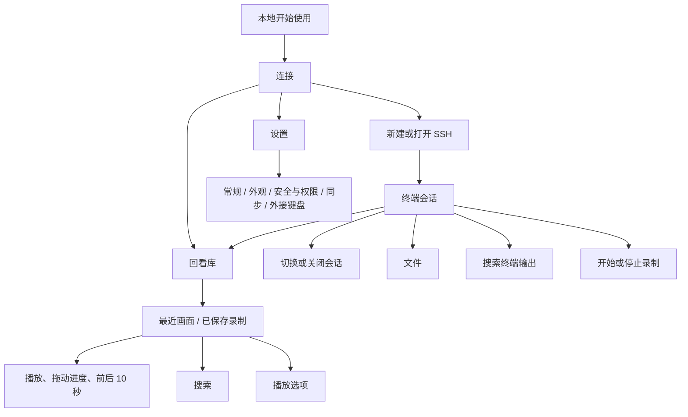

# Trail iPhone 功能层级与回放交互调整

日期：2026-09-11。版本：0.1.0（1）。基于 `ianvs_design 0.2.1`，在现有 Flutter 应用中实现。本轮关注手机的任务入口、可用功能和操作层级；桌面仍使用原有工作区布局。

## 临时对比网页

本机临时地址：[打开前后对比](http://127.0.0.1:4178/)。网页含 38 个场景、原图放大与 22 项功能取舍说明，代码位于 `comparison/`。仅在本机预览服务运行期间可访问。

## 设计依据与主路径

参考 Apple [Toolbars](https://developer.apple.com/design/human-interface-guidelines/toolbars)、[Playing video](https://developer.apple.com/design/human-interface-guidelines/playing-video)、[Accessibility](https://developer.apple.com/design/human-interface-guidelines/accessibility)。采用少量常用操作、明确返回入口、按需出现的工具与可滚动的次级设置。

主路径为：**连接 → 终端会话 → 文件 / 搜索 / 录制 / 回看**。连接页还提供设置与回看库。终端底部是操作工具栏，不承担页面切换；没有增加与这些工具重复的 Tab Bar。



## 全功能取舍表

| 功能族 | 手机入口与处理 | 保留的能力与边界 |
|---|---|---|
| 首次启动 | “开始使用”为主要操作；“设置同步”为次要入口 | 无需同步账号即可使用本地配置和 SSH；必需服务模式的部署约束不变 |
| 连接 | 首页直接显示已保存 SSH 和新建连接 | 本地 shell 继续由现有 iOS 平台策略禁用 |
| 连接管理 | 首页管理入口；每项“更多”提供编辑、删除 | 只有 SSH 类型时直接进入创建表单，跳过单选项类型弹窗；原有删除保护继续生效 |
| SSH 身份验证 | 主机、端口、用户、认证方式作为表单主体 | 密码、私钥、键盘交互认证保留；主机信任、安全提示保持独立 |
| SSH 专业参数 | 表单内高级选项 | 主机校验、跳板、保活、转发等仍可配置，不占据首屏 |
| 会话 | 顶部标题打开会话选择器；显式关闭按钮 | 返回连接页不结束会话；已恢复的分屏子会话逐个显示和选择 |
| 桌面布局 | 手机不显示横向标签轨、面板标题、分屏/缩放布局入口 | 没有删除保存的数据或后台会话；桌面布局继续保留 |
| 输入与字体 | 键盘收起时显示键盘、搜索、录制、回看四项；输入时换成终端辅助键 | 字号调整收进一个入口；Esc、Tab、Ctrl 等按输入需要提供 |
| 终端搜索 | 查询输入一行，结果与前后跳转一行；模式收进选项 | 不再并排堆放模式、范围、清除等桌面控件 |
| 只读与历史 | 会话“更多”内 | 手机“复制终端历史”直接写入剪贴板，避免只生成一个难以访问的应用内部导出文件 |
| 诊断与窗口操作 | 移除手机可见入口及相关快捷键配置项 | 本地目录启动、窗口退出、诊断目录导出和分屏操作继续用于桌面 |
| 文件浏览 | 独立完整页面，左上返回；每项可见“更多” | 目录导航、复制完整路径、创建目录、带确认的删除；按实际后端能力显示操作 |
| 桌面文件传输工作流 | 手机文件点击改为操作菜单 | 隐藏当前不支持 iOS 的保存位置选择器及“本地编辑/监视回传”；桌面下载与编辑逻辑保留。本轮不声称实现 iOS 文件下载或分享 |
| 录制 | 终端工具栏开始、停止、重试保存 | 回看库不再同时堆放录制控制；原有本地存储及输入保留策略不变 |
| 回看库 | 独立页面，最近画面、保存列表、打开文件 | 从播放器返回库，再返回原会话/连接页 |
| 回放主要控制 | 底部进度、时间、播放/暂停、前后 10 秒 | 手机默认真实时间；拖动期间暂停，松手后按原状态恢复；退到后台暂停 |
| 回放次级控制 | 顶部搜索、更多；倍速入口 | 倍速、跳过空闲、逐帧、详情、复制可见文本及清除历史按需展开；不显示可拖动浮动控制台 |
| 回放内容 | 捏合缩放、平移；专注模式可随时恢复控件 | 手机回放内容禁止输入焦点；关闭搜索主动收起键盘 |
| 常规、外观 | 设置目录进入单个页面 | 语言、系统/浅深色在前；默认连接、终端配色、画布留白等按需展开 |
| 安全、权限 | 专门设置页；主密钥等放高级选项 | 原有终端权限、安全确认和账号操作未移除 |
| 可选同步 | “仅此设备”与“同步服务” | 本地仍是使用入口；启用同步时再填写地址、账号及登录配置；同步实现未重写 |
| 外接键盘 | 设置最后一项 | 保留适用于手机任务的绑定；移除窗口、目录、分屏等桌面项的配置入口 |

## 本轮证据与已修复问题

以下 before / after 均为本轮当前运行截图。`before/00-current-test-state.png` 是系统主屏幕，不作为 Trail 界面证据。集成截图来自 Flutter 渲染层，不包含系统状态栏与软键盘；原生截图另外保存，不能将集成截图单独视为系统键盘验证。

1. **回放缺少主次层级、受键盘挤压**：旧界面仍有桌面标签栏和浮动控制台。采集到的旧回放处于键盘/搜索状态，不能代表普通播放的全部控件。新页分离播放、搜索与选项，并独立处理输入焦点。
   - [调整前回放](before/10-replay.png)
   - [最近画面回放](after/10-replay.png)、[保存录制播放](after/17-saved-replay.png)、[播放选项](after/15-replay-options.png)、[搜索](after/16-replay-search.png)
2. **菜单同时混入全局、会话、桌面操作**：取消手机命令搜索框自动聚焦，改为简短会话操作表；低频项进一步展开。
   - [调整前菜单](before/04-command-menu.png)、[调整后会话选项](after/04-session-options.png)
3. **文件侧栏占据手机窄屏且没有触控菜单入口**：改为完整页面，并保留终端实例，避免进出文件页重建输入连接。文件操作用可见按钮触发，不依赖鼠标右键。
   - [调整前文件页](before/14-sftp-directory.png)、[调整后文件页](after/14-sftp-directory.png)、[文件操作](after/19-file-actions.png)
4. **设置和连接存在过多并行操作**：连接直接进入 SSH，编辑/删除在次级菜单；设置分成五个目录，高级参数折叠。
   - [连接](after/01-ssh-home.png)、[SSH 表单](after/02-ssh-form.png)、[输入](after/03-ssh-input.png)、[设置目录](after/05-settings.png)、[外观](after/06-settings-appearance.png)、[同步](after/06-settings-data.png)
5. **可用性回归修正**：文件/回看 Stack 必须填满约束；横屏键盘上方的连接管理消除溢出；回放防止终端自动获取焦点；原生复核脚本开启真实触控事件和连续渲染。

## 验证方法与范围

- iPhone 17 模拟器，iOS 26.3，402 × 874 pt；实际渲染全流程覆盖连接表单、五类设置、终端、文件、搜索、最近回放、保存回放、播放选项与专注模式。
- Widget 覆盖 375 × 667、402 × 874、874 × 402，1/2/3 倍文字；检查主要点击目标至少 44 pt、浅深色、大字体和键盘布局。
- 会话测试检查返回不丢失会话、分屏会话逐个切换和关闭；播放测试检查暂停/继续、拖动恢复、后台暂停、搜索清空、倍速和专注模式。
- 最终代码完整相关回归 656 项通过，包含文件入口、播放器焦点和历史复制；原生验证结果见下方记录。
- 集成流程使用内存 SSH/SFTP 与录制夹具，验证真实 iOS 渲染和应用交互，不证明真实服务器传输或生产同步服务可用。通用 ProfileEditor 的七分区截图属于组件覆盖，不是 iOS 本地 shell 的可用性声明。
- 本轮没有做完整 VoiceOver 人工遍历；也没有新增文件/回放内部页面的 iOS 交互式边缘返回手势。返回按钮、语义标签与触控目标有测试覆盖。

复现：在 `example` 目录运行以下命令，设备 ID 替换为本机 Simulator：

```sh
TRAIL_REVIEW_SCREENSHOTS=../docs/design/ios-navigation-20260911/after flutter drive -d D1F18210-1C75-40E6-92EC-9A82D5949023 --driver test_driver/ios_design_review.dart --target integration_test/ios_design_review_test.dart --no-pub
flutter test --no-pub test/recording test/app/ios_app_adaptation_test.dart test/startup/app_startup_host_test.dart test/shell test/config/shortcut_editor_test.dart test/profiles test/ssh/new_session_launcher_test.dart test/ui/sftp_touch_layout_test.dart test/sftp
```

可用 `--dart-define=IANVS_MOBILE_LAYOUT_REVIEW=true` 在保存回放页留出三分钟原生触控检查窗口。安装真机使用正式 `lib/main.dart`，不包含这些测试夹具。

## 最终验证记录

- 最终代码完整相关回归：656 项全部通过（含手机焦点防护、历史复制、文件入口和桌面回归）。原生集成及 Luna 触控复核另行通过。
- Luna 子代理通过 Simulator 原生触控再次验证：播放/暂停、打开关闭选项、专注模式与恢复均可用，返回后控制条在底部安全区内，键盘已收起。[最终原生截图](after/native-player.png)。
- 修复前原生键盘残留证据另存为 [native-player-keyboard-regression.png](after/native-player-keyboard-regression.png)，不作为最终效果。
- 录制夹具只有少量输出，保留的终端行数和画面宽高比会产生空白区域；可捏合放大和平移，这不代表播放控件被遮挡。
- 最终原生集成：两项场景及框架清理均通过（日志 +3）；原生触控复核通过。
- 静态检查无错误、无警告；SFTP 文件原有 `prefer_initializing_formals` 信息级提示保留。`git diff --check` 通过，文档中的本地图片链接均存在。
- 真机版本为 0.1.0（1），正式入口 `lib/main.dart`。编译进入签名步骤后，`codesign` 返回 `errSecInternalComponent`，证书有效。随后通过 macOS SecKeychainGetStatus 确认登录钥匙串已解锁（flags=7），因此不能将错误简单归因于锁定。Computer Use 拒绝访问 Terminal/iTerm，未执行桌面终端脚本；改由 Xcode 原生构建继续排查。用户已补充开发团队，Xcode 原生 Release 构建仍在 Flutter.framework 和 objective_c.framework 签名时报 errSecInternalComponent。随后按用户要求暂停真机安装，仅制作临时网页对比；尚未安装本轮新包。
