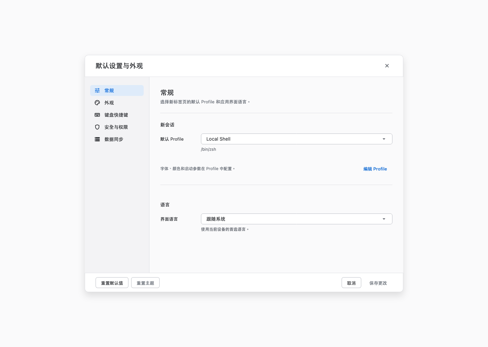
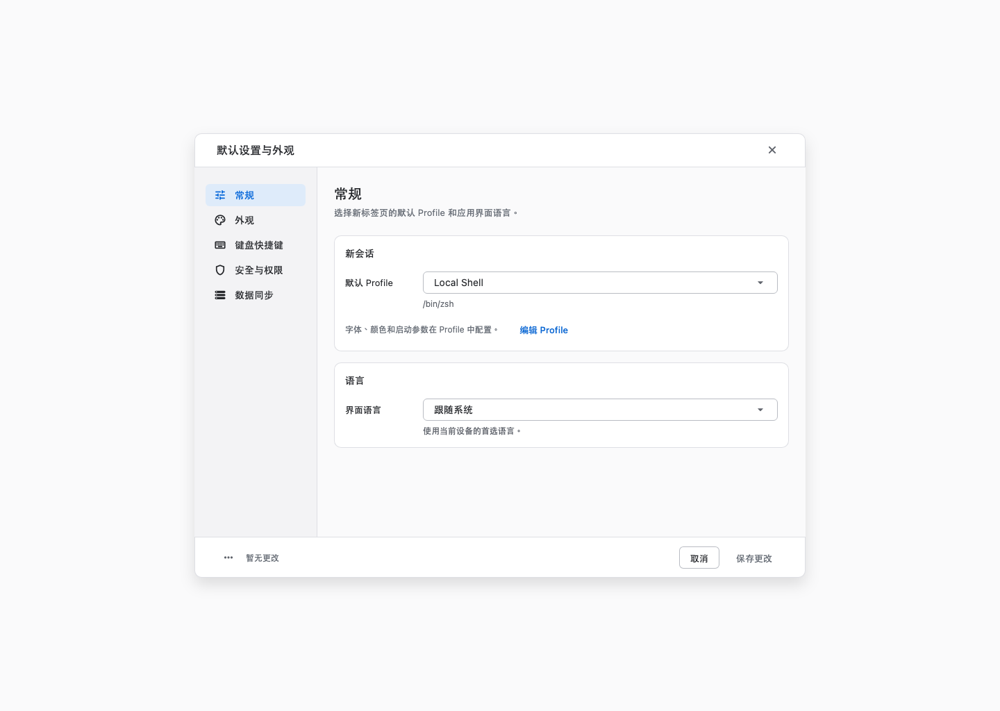

# 设置界面重构与验收

2026-09-12。范围为「默认设置与外观」的常规、外观、键盘快捷键、安全与权限、数据同步五个页面，以及共用的表单和焦点样式。

## 设计问题与处理

[ImageGen 问题标注图](02-imagegen-annotated.png)根据用户提供的截图生成，标注头部占高、表单过宽、Profile 编辑入口距离过远、分组留白、焦点描边和底部操作层级六类问题。[生成提示词](imagegen-prompt.txt)已保留；该图是问题说明，实际实现以代码和验收截图为准。

| 范围 | 已完成的处理 |
| --- | --- |
| 共用布局 | 桌面弹窗上限从 940 × 700 调整为 880 × 640，收紧头部、导航与内容边距，移除页面介绍下的装饰分隔线。窄窗口按可用空间适配。 |
| 常规 | 新会话与语言组成两个表单分组；统一标签和控件对齐；将 Profile 编辑入口放回说明旁。 |
| 底部操作 | 两个重置动作收进带提示的菜单；新增「暂无更改 / 有未保存的更改」，与取消、保存状态联动。重置仍需保存才生效。 |
| 外观 | 足够宽时将主题选择合并为一行，显示所选项说明；窄窗口和大字体恢复纵向排列。保留预设搜索及空结果状态。 |
| 安全与权限 | 展示完整说明；权限控件按宽度和字体大小换行；管理决定一行也支持纵向排版；选中动画响应减少动态效果设置。 |
| 数据同步 | 可用宽度不足或字体放大时收起横向比较列，将信息放进描述，避免列挤压。 |
| 键盘快捷键 | 小高度或大字体下，标题和筛选器随列表滚动；修复搜索无结果时面板缩成窄条的问题。 |
| 共用控件 | 沿用产品颜色、字阶、间距、圆角和面板 token；桌面输入框焦点描边调整为 1.5，保留焦点颜色及键盘可见性。 |

## 同尺寸对比

以下两张图使用相同 1440 × 1024 视口、Local Shell、跟随系统语言和浅色主题。旧版图来自修改前的设置界面源码，新版图来自最终组件。

| 修改前 | 修改后 |
| --- | --- |
|  |  |

## 电脑自动化验收

使用电脑控制工具操作本地 `Trail Development.app`，读取辅助功能树并保存原生窗口截图。验收入口为仓库已有的 `example/tool/macos_ui_acceptance.dart`：使用生产界面和原生 PTY，配置保存在内存中。保存与重开的验证覆盖当前运行内的设置状态，不代表真实用户配置的磁盘持久化验收。

| 步骤 | 结果与证据 |
| --- | --- |
| 1. 打开设置并切换五个分类 | 通过；[常规](03-after-general.png)、[外观](05-after-appearance.png)、[快捷键](13-after-shortcuts.png)、[权限](09-after-security.png)、[同步](11-after-data.png)。 |
| 2. 使用键盘选择默认 Profile，保存、重开 | 通过；选择保留，状态恢复为暂无更改；[选择菜单](04-profile-menu.png)。 |
| 3. 打开 Profile 管理并进入编辑器 | 通过；[编辑入口](17-profile-edit-entry.png)，取消退出。 |
| 4. 改变界面语言，再取消重开 | 通过；语言描述和未保存状态更新，取消后恢复；[语言菜单](18-language-menu.png)。 |
| 5. 保存深色主题并重开 | 通过；[深色界面](07-after-dark.png)。 |
| 6. 打开重置菜单，执行重置，再取消 | 通过；重置显示未保存状态，取消后保留原选择；[重置菜单](08-reset-menu.png)。 |
| 7. 外观预设搜索无匹配项，再清除搜索 | 通过；[预设空状态](06-preset-empty.png)。 |
| 8. 滚动权限说明，打开管理决定 | 通过；完整说明可读，管理入口可达；[权限详情](10-security-detail.png)。 |
| 9. 选择远程同步模式并检查表单 | 通过；显示配置字段，配置未完成时保存不可用；[远程表单](12-remote-form.png)。未填写凭据或验证远程服务连接。 |
| 10. 打开快捷键分类菜单，用 Escape 关闭；搜索无匹配项 | 通过；[分类菜单](14-shortcut-category-menu.png)、[修复后的空结果](15-shortcut-empty.png)。 |
| 11. 将原生窗口缩至 800 × 600 | 通过；常规两组字段和底部操作可见；[小窗口](16-small-window.png)。 |

## 自动检查

- 56 项相关测试通过，覆盖设置保存/取消、重置、跨分类未保存状态、快捷键筛选、Profile 交接、主题及下拉控件。
- 桌面 680 × 620、2 倍字体下的五个分类在浅色/深色主题均无溢出；保留并运行现有 iPhone 字体缩放测试。
- 11 张视觉快照生成通过：五个分类各两种主题，加一张窄窗口大字体；文件位于 `renders/`。
- 修改涉及的 7 个源码/测试文件静态分析通过，`git diff --check` 通过。
- macOS 调试构建通过，并用最终构建复测快捷键空状态。

从 `example/` 目录运行：

```sh
flutter test --no-pub test/shell/defaults_appearance_redesign_test.dart test/shell/shell_screen_phase3_test.dart test/config/shortcut_editor_test.dart test/ui/app_theme_contract_test.dart test/ui/app_dropdown_form_field_test.dart
flutter test --no-pub --update-goldens test/design/settings_final_capture_test.dart
flutter build macos --debug --no-pub -t tool/macos_ui_acceptance.dart
```

视觉快照使用 macOS 系统字体，需要在 macOS 上生成。未执行应用发布。
