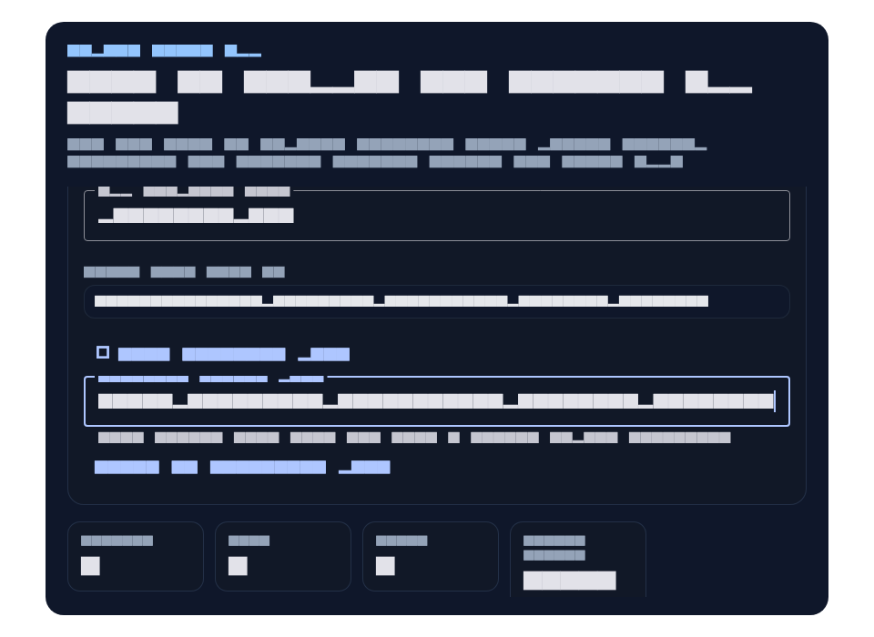
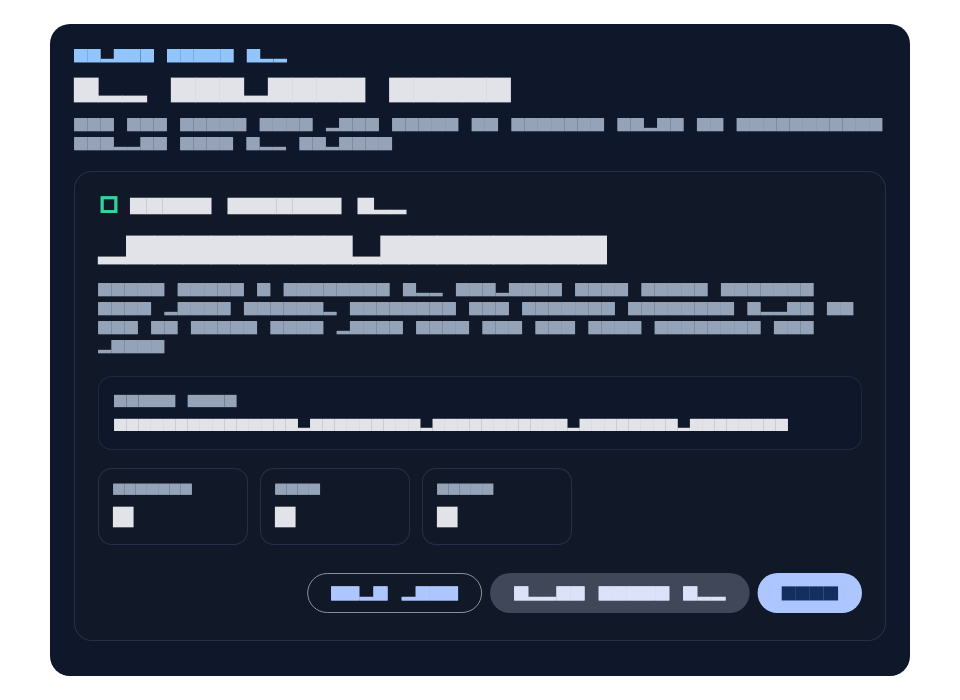
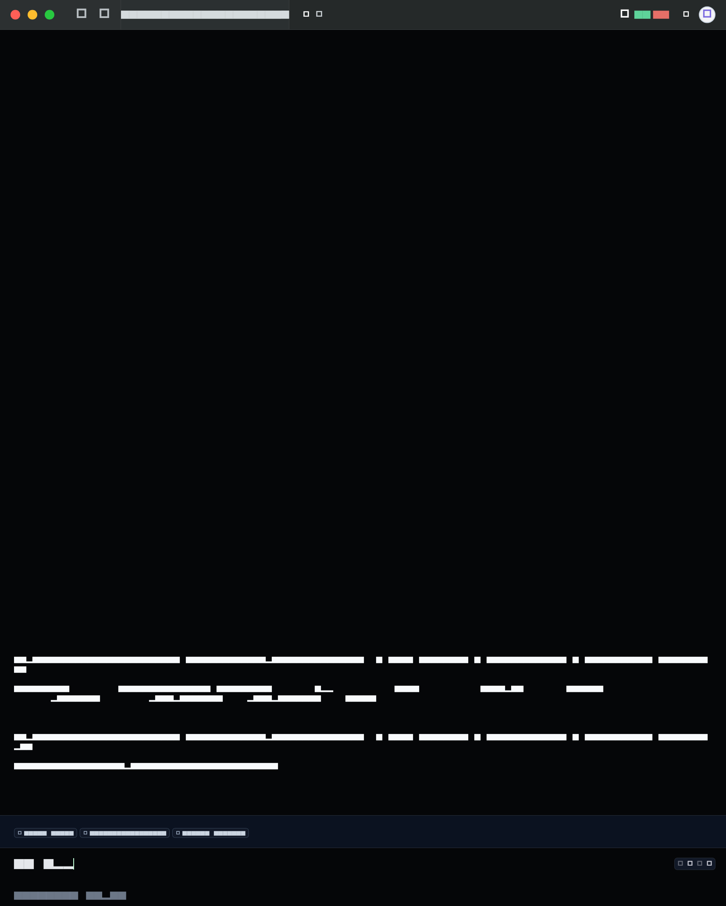
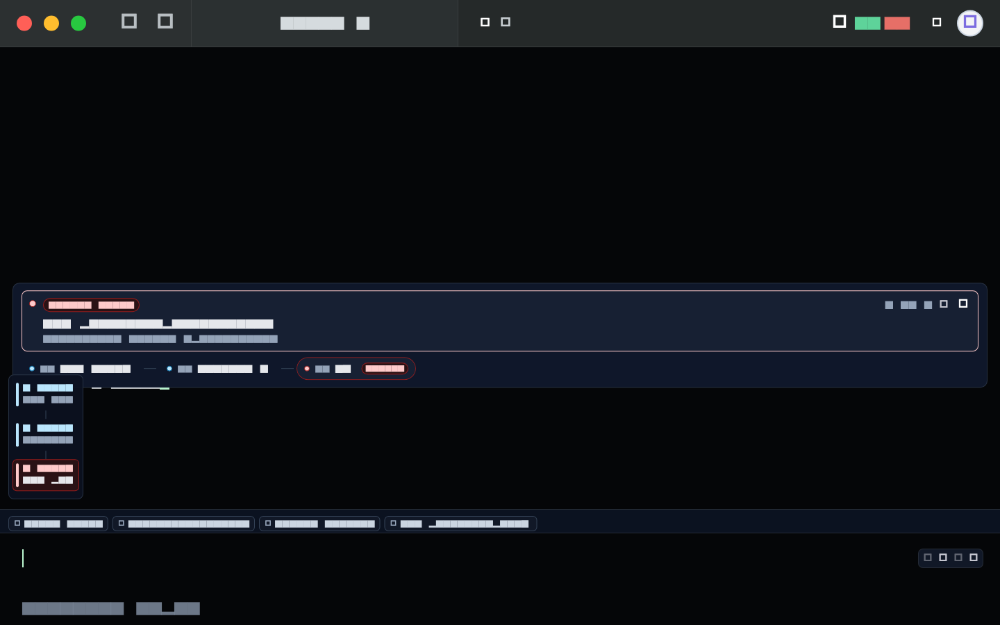
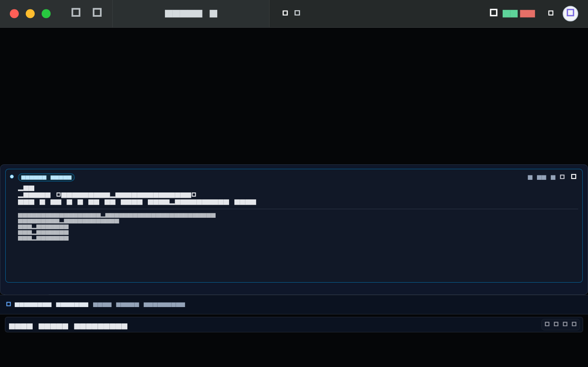
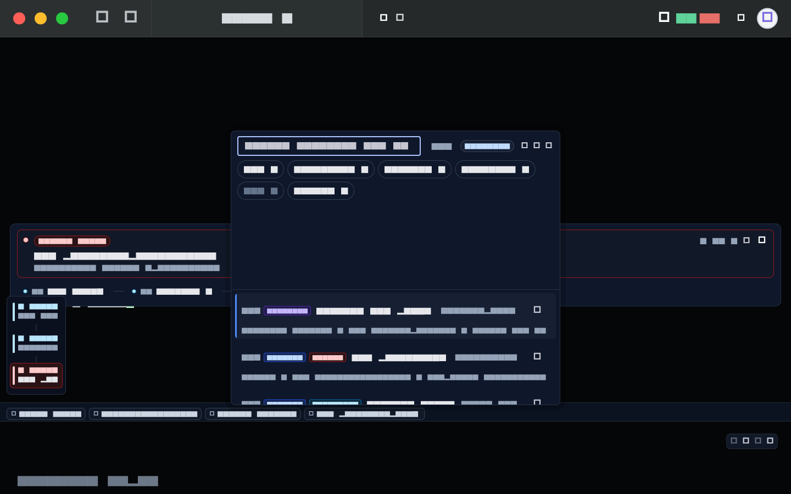
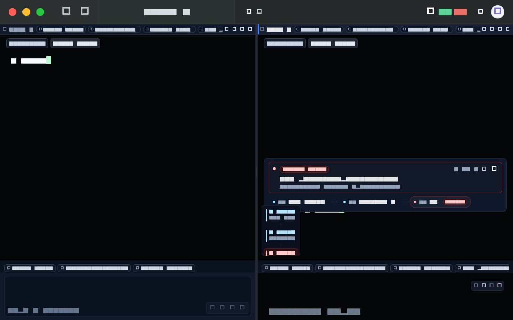
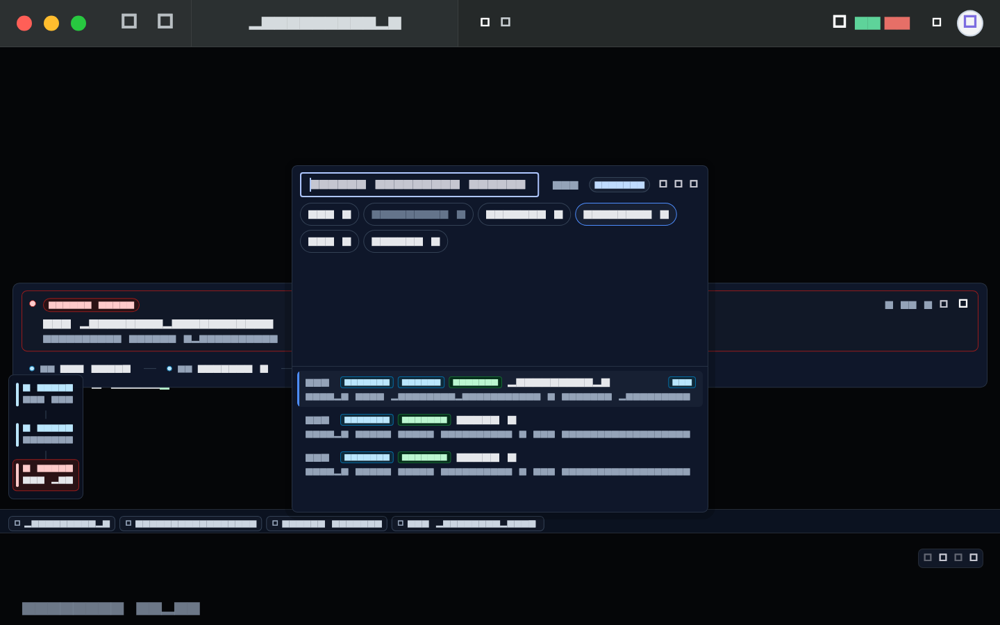
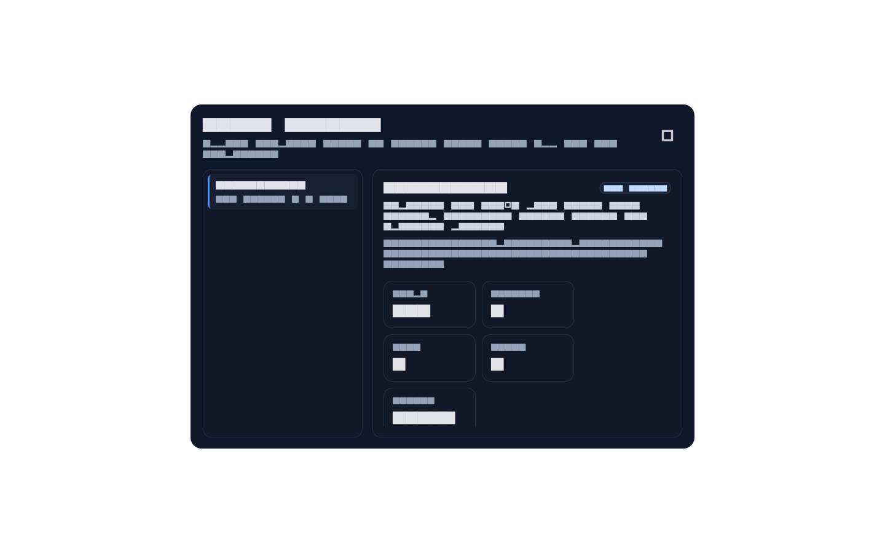

# Warp Alignment Snapshots

本目录主要保存 Ianvs Terminal 自己的截图工件，不复制 Warp 品牌素材或产品 UI 到 Ianvs。`warp_interaction/` 例外保存用户手动截取的本机 Warp 交互样本，只用于对齐观察和文档复审，不作为 Ianvs golden。

Warp 参考基线：

- 语义：`Launch Configurations (Legacy)`
  `https://docs.warp.dev/terminal/sessions/launch-configurations`
- 视觉：`Tab Configs`
  `https://docs.warp.dev/terminal/windows/tab-configs/`
- Blocks：`Terminal Blocks` / `Block basics`
  `https://docs.warp.dev/terminal/blocks`
  `https://docs.warp.dev/terminal/blocks/block-basics`
- Palette：`Command Search` / `Session Navigation`
  `https://docs.warp.dev/terminal/entry/command-search/`
  `https://docs.warp.dev/terminal/sessions/session-navigation/`
- Panes：`Split panes`
  `https://docs.warp.dev/terminal/windows/split-panes/`
- 相关截图文件名：
  - `save-new-tab-config.png`
  - `saved-tab-config-menu.png`
  - `annotated_blocks-1.png`
  - `command-search-panel.png`

Ianvs 截图工件：

- `default_terminal_layout.png`
- `block_actions_layout.png`
- `completion_input_layout.png`
- `launch_config_compose.png`
- `launch_config_success.png`
- `blocks_command_palette.png`
- `split_pane_layout.png`
- `split_session_palette.png`
- `saved_config_sidecar.png`

Warp 本机交互样本：

- `warp_interaction/01_terminal_blocks.png`
- `warp_interaction/02_block_not_hover_click_actions.png`
- `warp_interaction/03_command_search.png`
- `warp_interaction/04_completion_input.png`
- `warp_interaction/05_split_pane.png`
- `warp_interaction/06_tab_or_launch_config_entry.png`

Completion input 重新审图工件：

- `analysis/04_completion_input_regions.png`
- `analysis/completion_input_regions.png`
- `analysis/completion_input_alignment_review.md`

全量重新标注 / 10 轮对齐复跑工件：

- `analysis/default_display_view_annotation.json`
- `analysis/default_display_view_annotation.svg`
- `analysis/reannotated/README.md`
- `analysis/reannotated/alignment_regions.json`
- `analysis/reannotated/alignment_iteration_report.md`
- `analysis/reannotated/*_comparison.svg`

生成命令：

```bash
flutter test test/launch_config_golden_test.dart --update-goldens
flutter test test/warp_alignment_golden_test.dart --update-goldens
flutter test test/warp_alignment_golden_test.dart
python3 docs/design_snapshots/warp_alignment/analysis/reannotate_alignment.py --iterations 10
```

对照结论：

- 当前 Ianvs 导出面板已经从 path-first 表单收口成 name-first 保存流，主标题、命名输入、路径预览、主 CTA 和 success state 都在同一个大 modal 里完成，层级接近 Warp 文档截图的保存节奏。
- `default_terminal_layout.png` 现在以用户补充的 1656 x 2064 默认显示截图为基准：顶部 chrome、空白 terminal viewport、底部可见 scrollback、input context chips、input editor 和可见 input toolbar 按 `analysis/default_display_view_annotation.json` 做 1:1 rect contract；单 pane 默认态不再显示 pane-local header 或 block rail 浮层。
- `block_actions_layout.png` 对齐的是 Warp 本机 `02_block_not_hover_click_actions.png` 的 block hover / selected 状态：active block card 保持原位置和尺寸，只改变交互层高亮，右侧 actions 仍贴近 block 本体。
- `completion_input_layout.png` 以 Warp `04_completion_input.png` 为视觉基准；对齐时先排除 Warp sidebar / app chrome，再用 terminal pane-local 坐标约束 block band、command/output body、actions、terminal command strip 和 input editor。Ianvs 侧对应 key 为 `terminal-pane-surface-1`、`terminal-inline-block-row`、`terminal-inline-active-block-command-output-body`、`terminal-inline-block-actions-button`、`terminal-input-command-detection-strip` 和 `terminal-modern-input-bar`；该 strip 只表达 shell command 输入状态，不复制 Warp legacy Universal Input 的 Agent / natural-language auto-detection。
- `launch_config_compose.png` 对齐的是 Warp `Tab Configs` 截图的视觉重点：保存入口不再是单纯 JSON path，首屏先强调命名、主按钮、app config / tab config 范围说明和当前 snapshot 摘要；Ianvs 额外保留了 app-level window / tab / pane 统计与 startup command 编辑，这是为了匹配 Ianvs 的应用导出语义。
- `launch_config_success.png` 对齐的是 Warp `LaunchConfigSaveModal` 源码里的 `NotSaved -> Success` 流：保存后不直接消失，而是留在模态内显示文件结果，并提供继续验证的动作。Ianvs 这里用 `Apply saved app`、`Copy path`、`Done`，没有照搬 Warp 的 `Open file`。
- `blocks_command_palette.png` 固化当前 block rail、block side panel、editor-style input bar 和 input-adjacent command palette 的组合状态。它用于防止后续改动把 block 视觉退回为纯 header toolbar、把输入区退回成表单框，或把 command palette 退回为只搜当前 tab history。
- `blocks_command_palette.png` 现在也固定 workflow-like saved command source badge、Launch config source、command palette source rail 和 results list 的内部节奏，确保 saved command / launch config 不再退回纯字符串 history 列表或只靠 prefix 提示发现。
- `split_pane_layout.png` 单独固化 split pane、pane local header / active marker / drag handle、pane-local context chips 和每个 pane 的底部 editor；非 active pane 使用不可输入的 editor preview，避免 split 后只剩 active pane 有底部输入区。
- `split_session_palette.png` 固化 split pane、SSH tab、居中 session palette、source rail 和 results list 的组合状态。它用于防止 workspace/session search 再退回只搜 active window，也用于观察完整 pane drag gesture 与 Warp split pane 截图的差距。
- `saved_config_sidecar.png` 固化 saved config discovery、app/tab scope 摘要、sidecar CTA 和 `Make default` / `Edit file` / `Remove` / `Apply` 动作；本轮截图也包含 pane context chip / menu 的 header 变化。它对应 Warp `saved-tab-config-menu.png` 的发现入口与侧栏关系，但不复制 Warp 文案。
- `test/warp_alignment_golden_test.dart` 现在包含归一化像素 contract：default display 1:1、default block / input、block actions hover、completion input pane-local、command palette、session palette、add menu、split pane 和 saved config sidecar 的关键 rect 继续验收；default display 读取 `analysis/default_display_view_annotation.json`，completion、command/session palette 与 saved config sidecar 的目标比例 / rect 直接读取 `analysis/reannotated/alignment_regions.json`。`test/launch_config_golden_test.dart` 另覆盖 Launch Config compose / success 的 panel 与内部关键控件 rect。Flutter golden 继续负责截图防退化，pixel contract 负责防止“看起来有截图但布局没有对齐”。
- `analysis/reannotated/` 对全部 10 张当前 Ianvs 布局对比图逐一重新标注：default display、block actions、completion input、blocks command palette、split pane、split session palette、add menu、saved config sidecar、launch config compose 和 launch config success。`alignment_regions.json` 保存每个 rect 和归一化 delta；`alignment_iteration_report.md` 记录 10 次重复生成 fingerprint 全部一致，并且 30 个可比 region 均在 `<= 0.05` 对齐阈值内。Launch Config compose / success 没有本地 Warp modal 截图，因此用 Warp `Tab Configs` 文档与 `launch_configs/save_modal.rs` 语义做右侧 Ianvs 标注和说明。

仍然保留的差异：

- Ianvs 已将 New Tab、New Window、New SSH、saved configs、save current tab/app 和 Launch Config 收敛到 `+` add menu，并把搜索、split、copy/paste/restart、session context、settings 等低频动作迁入 overflow；和 Warp 的具体菜单文案与素材仍不复制。
- Ianvs 保留了显式 `Advanced path`，因为当前产品仍需要可控地导出 app-level JSON 文件；Warp 文档截图更偏日常保存入口，而不是 Ianvs 当前这条导出任务的全部约束。
- Ianvs block rail 已为 terminal viewport 预留顶部 padding，并增加左侧 status rail 显示状态色与 command preview；active block card 也已有 sticky command header 行为和 inline actions 菜单。block 仍不是 Warp `BlockList` 那种 terminal scroll/render 模型内的原生分组。
- Ianvs 输入区已从表单式 TextField 收口为 editor 容器和 trailing toolbar；command/session palette、completion 和 legacy history 共用 input 附近的 inline shell。和 Warp 的具体快捷键文案、图标和菜单结构仍不复制。
- Ianvs 默认布局现在在底部 editor 上方显示 input context strip，直接暴露 target、cwd、status 和最近命令，避免默认画面只在顶部 chrome / pane header 承载 session context。
- Ianvs completion candidate panel 的来源标签、selected state 和接受行为继续由 widget tests 覆盖；`04_completion_input.png` 对齐只覆盖基础输入识别布局，不绕过 flutterm terminal 输入。
- Ianvs command palette 已把 saved commands 显示成 `Workflow` source，并新增 saved launch config source，可通过 `workflow:` / `saved:` / `history:` / `session:` / `ssh:` / `launch:` 过滤；选择 launch config 会直接 apply saved app / tab snapshot。
- Ianvs command palette 现在在截图里直接显示 source rail 计数：Workflow、History、Sessions、SSH、Launch。这里不展示 Files、prompts、notebooks、conversations 等 Warp 类别，因为 Ianvs Terminal 当前没有实现这些非 terminal-local 来源。
- Ianvs 已在 Launch Config 和 Saved Config UI 中拆分 app config / tab config 的用户概念；Settings 也预留了 new session shell、startup shell、split/tab/window cwd policy 的承载位置。
- Ianvs session palette 已覆盖所有 app windows，并显示 prompt-ish context、cwd、target、running / last command 和 recency；prompt fidelity 仍受当前产品层可获得信息限制。
- Ianvs split pane 已有 pane header、active marker、drag handle、pane-local context chips、每个 pane 的底部 input 区和 pane menu；pane menu 支持把 split pane 移到新 tab，但还没有完整拖拽到 tab bar 的 gesture。
- Ianvs 不复制 Warp 品牌、图标、文案和菜单结构，只对齐交互层级与保存节奏。


















