# 05 · 桌面示例设计稿与逐屏说明

16张例稿为1440×810逻辑画布（16:9），由同目录HTML规格页渲染；不是实际Flutter App截图，也不是原生测试证据。输出均为公开虚构fixture。运行时必须用Flutter控件与真实TerminalViewport，不能铺图或用静态文本代替原生终端。

[打开完整离线设计册](design/index.html)。每张都有可修改HTML与PNG；单图HTML是静态规格，没有真实执行/网络功能。图中的按钮表示应实现的行为，不是一个已运行的交互原型。

## 约束优先级

00/11的安全、数据与所有权合同 → 每阶段功能/状态需求 → 14的键位/几何 → 本文逐屏说明 → 图的颜色与像素。生产配色跟随AppThemeTokens，例稿主色不是硬编码要求。单层顶栏、底部状态栏、Dock、H/3 Block规则必须保留。

图中没画的故障状态仍按PRD实现；例如长命令不能因为例稿只有一行就省略完整审阅。系统输入法、VoiceOver、真实DPI/PTY、模型结果只能由实施阶段原生证据证明。

## D1

### UX1-01 · 失败 Block 的桌面快捷诊断

对应：D1-R01/R02。保留单层顶栏、底部状态栏与三层Dock；失败Block直接显示AI诊断。点击只准备草稿。

[独立HTML](design/UX1-01.html)

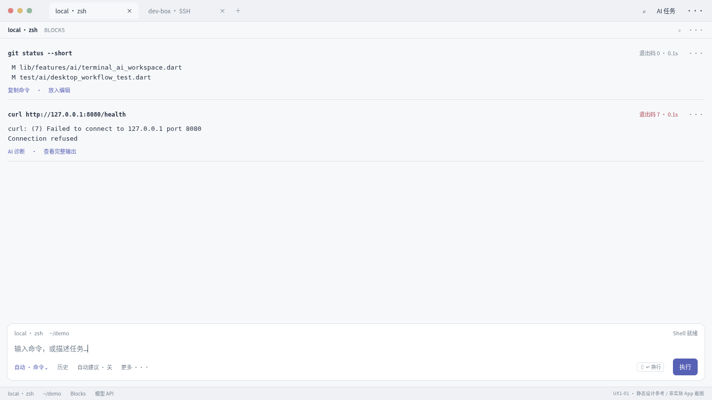

### UX1-02 · 从 Block 准备诊断任务

对应：D1-R03/R04/R05。来源与草稿可编辑；准备阶段没有推理或执行。当前会话与任务目标没有变化。

[独立HTML](design/UX1-02.html)

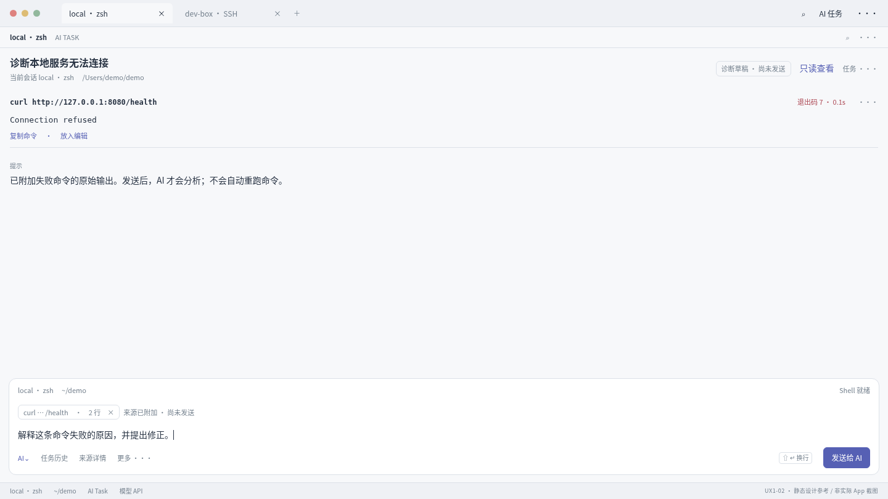

### UX1-03 · 完整命令审阅层

对应：D1-R06/R07/R08。完整目标和命令、固定操作；摘要不直接批准；编辑/切pane需校验原revision。

[独立HTML](design/UX1-03.html)

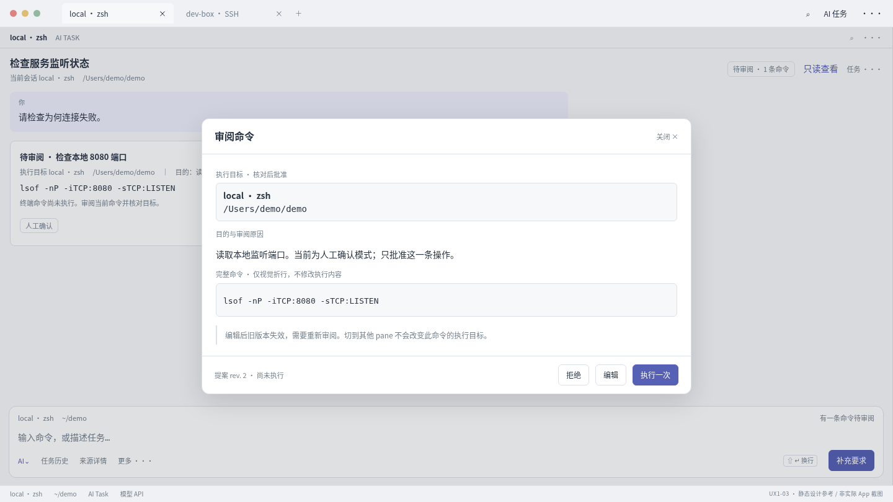

### UX1-04 · 任务结果与只读观察

对应：D1-R05/R09/R10。右区是显式打开的只读观察，不是第二PTY；复制可用，键鼠报告不写入。

[独立HTML](design/UX1-04.html)

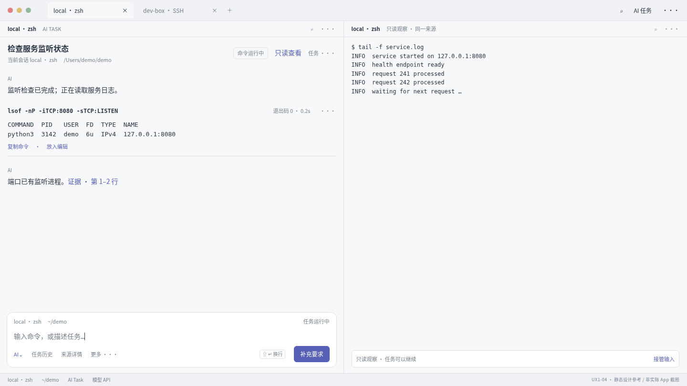

## D2

### UX2-01 · 宽 pane 补全与详情

对应：D2-R01/R04/R05。候选、详情与主动作同步；不因鼠标hover改变滚动位置；Tab只授权当前查询。

[独立HTML](design/UX2-01.html)

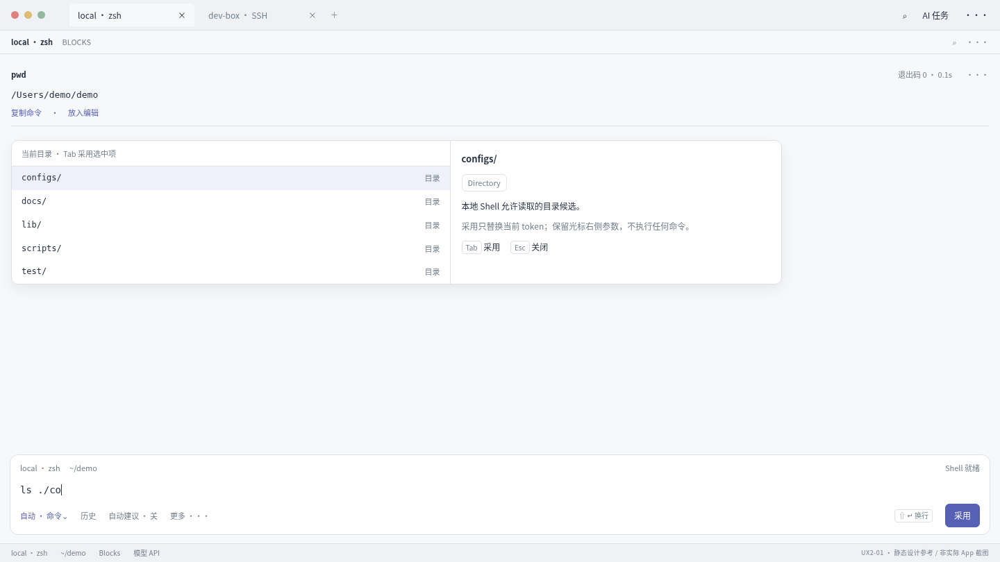

### UX2-02 · 四 pane 的独立输入与任务

对应：D2-R10/R11/R12。A运行、B待审、C写稿、D交互；B的回复/审批不得抢C焦点，选中pane不重定向任务。

[独立HTML](design/UX2-02.html)

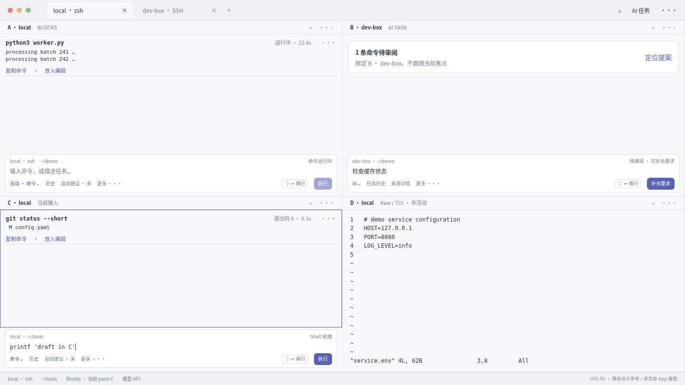

### UX2-03 · 查找、分页与证据检查器

对应：D2-R09/R15。按需检查器可关闭；来源/行范围清楚；过滤显示不改原始数据，阅读不改写目标。

[独立HTML](design/UX2-03.html)

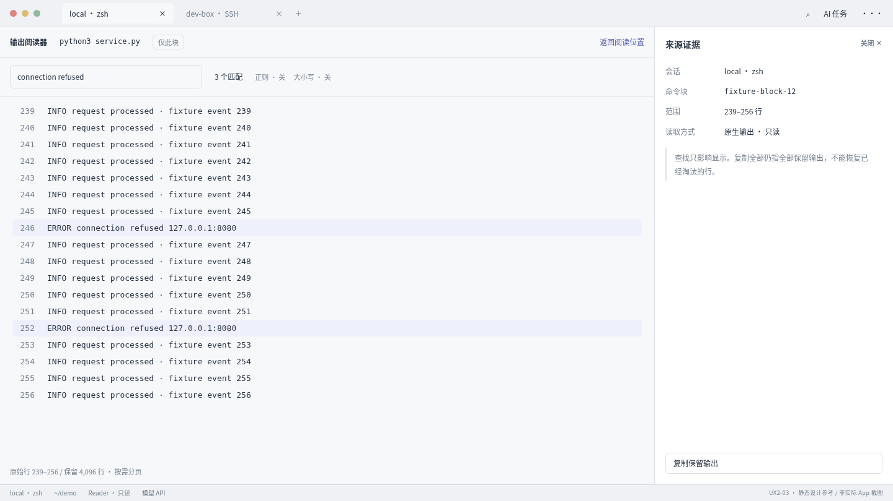

### UX2-04 · 历史采用与多行草稿

对应：D2-R01/R03/R05。历史取消恢复原稿和selection；最近命令靠近Dock。真实IME需实施阶段系统截图，不以此静态稿证明。

[独立HTML](design/UX2-04.html)

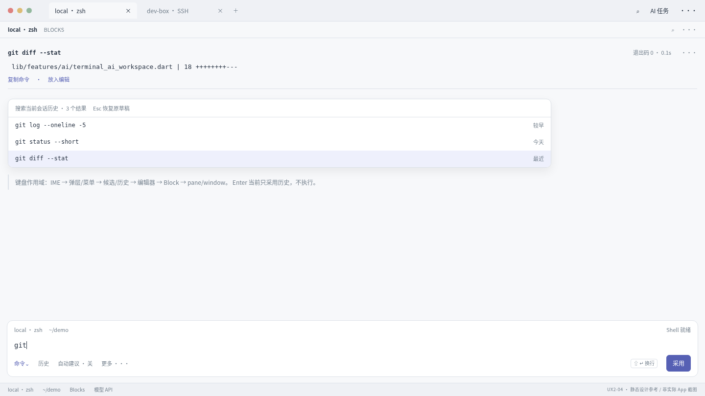

## D3

### UX3-01 · 浅色桌面层级

对应：D3-R01/R02/R03/R04。安静表面、轻分隔、清楚状态，延续已有Dock方向；主色只是例稿主题。

[独立HTML](design/UX3-01.html)

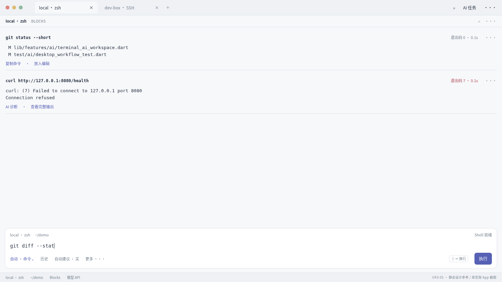

### UX3-02 · 深色同内容对照

对应：D3-R01/R02/R03/R04。与浅色同内容的深色映射；终端ANSI与UI状态分离，不通过滤镜生成正式验收图。

[独立HTML](design/UX3-02.html)

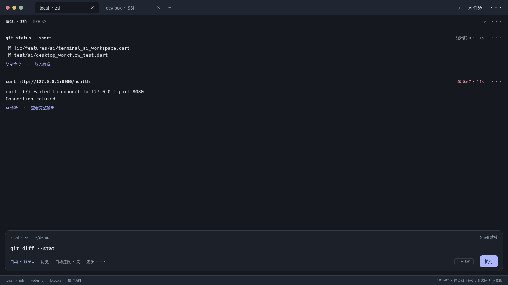

### UX3-03 · 任务与执行状态册

对应：D3-R06/R09/R16。这是设计状态总览，不要求产品增加测试中心；每状态的文案与合法动作必须落实。

[独立HTML](design/UX3-03.html)

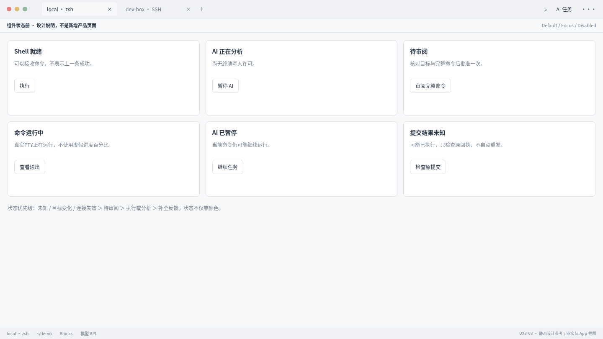

### UX3-04 · 放大文字与邻 pane

对应：D3-R07/R08/R14。缩放时优先减少低频信息与折行/详情，不隐藏主动作或缩小字号；稿展示布局方向，实际1/1.5/2须原生验证。

[独立HTML](design/UX3-04.html)

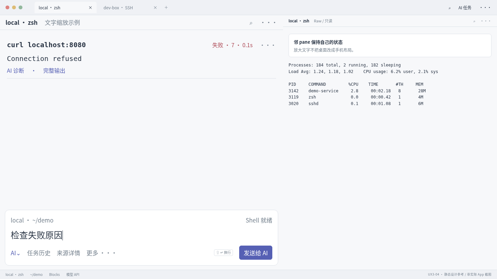

## D4

### UX4-01 · 未知回执不可伪装失败重试

对应：D4-R06/R10。高优先未知提示持续；禁止重复执行；保留operation身份供真实日志校验。

[独立HTML](design/UX4-01.html)

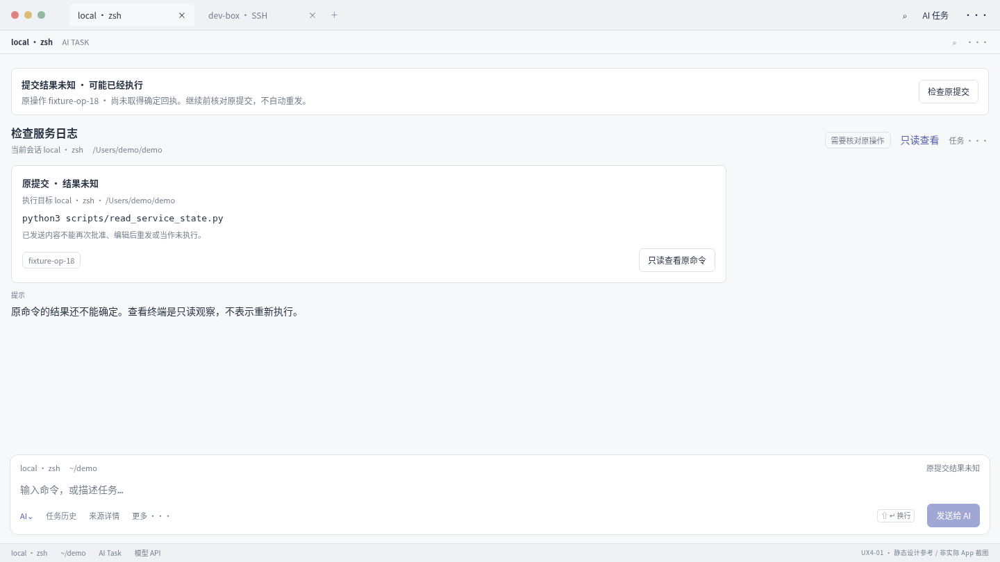

### UX4-02 · 本地 ACP 的桌面设置

对应：D4-R03/R04/R05。双后端独立验收；示例路径不可硬编码。Finder检测、测试与保存均不等于任务执行。

[独立HTML](design/UX4-02.html)

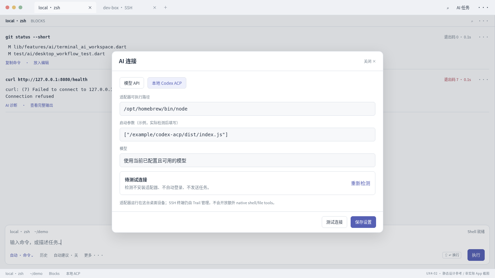

### UX4-03 · 断连恢复与目标对照

对应：D4-R06/R10/R14。恢复与授权分离，原/当前目标明确；无法证实就保持未知，不复活死PTY。

[独立HTML](design/UX4-03.html)

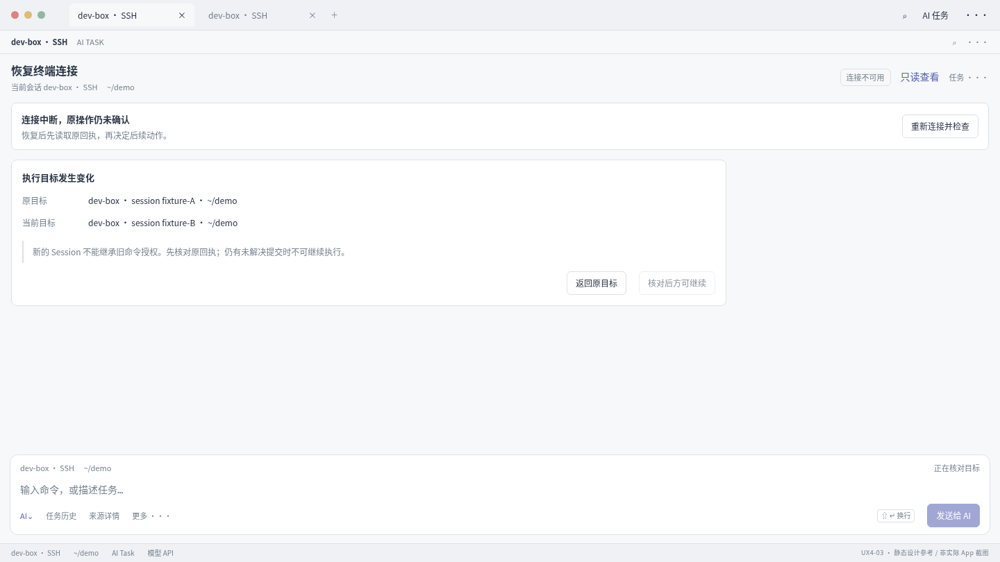

### UX4-04 · 人工接管后的真实 TUI 目标状态

对应：D4-R07/R08/R09。这是必须在实际App中重现的验收目标；接管不发Ctrl+C，退出后只提供手动返回Blocks。

[独立HTML](design/UX4-04.html)

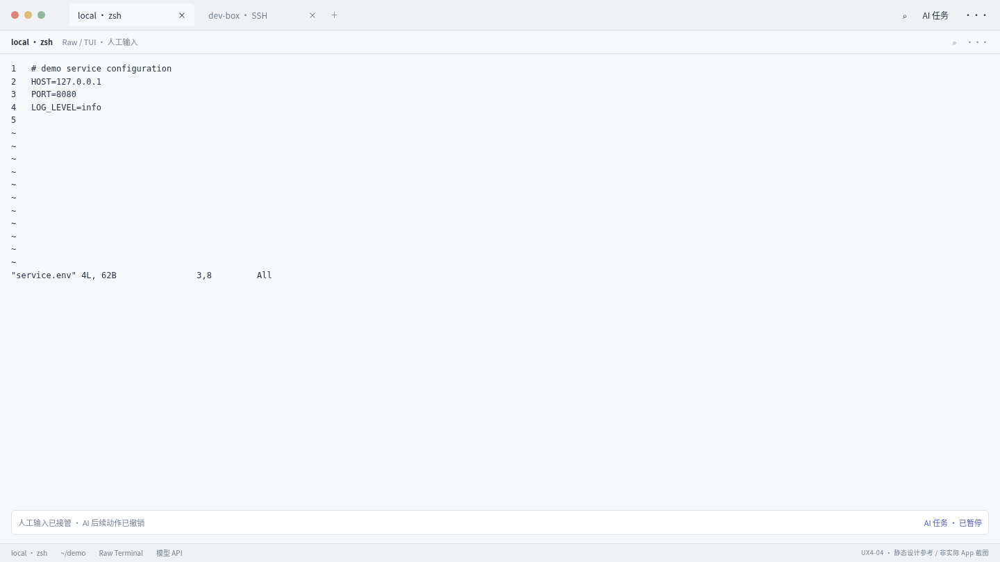
