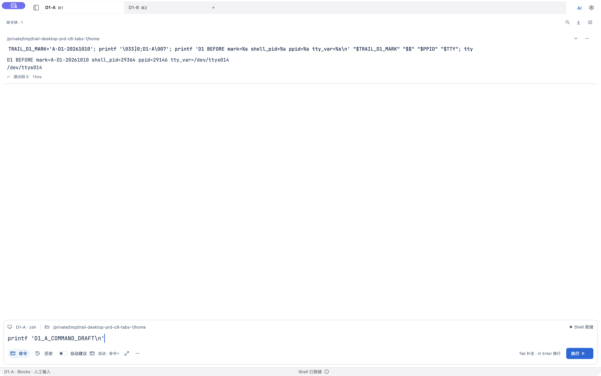
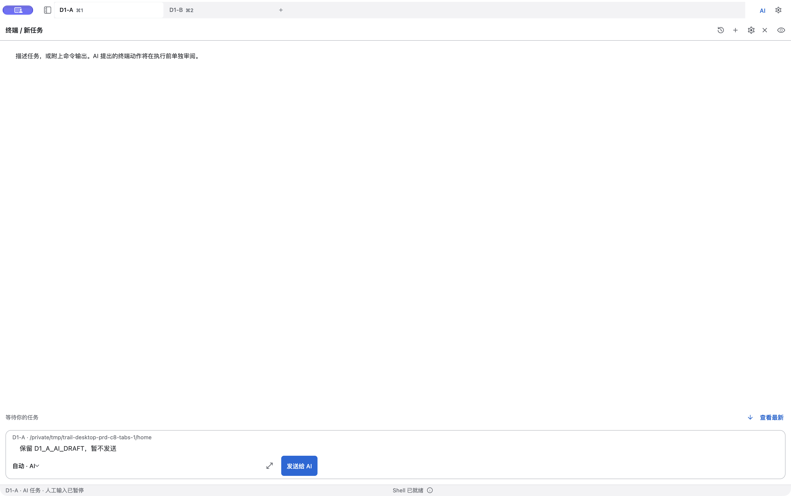

# D1 当前候选结果

阶段仍为 `in_progress`；本案以外的 D1 场景均 `not_run`。整份 PRD 当前登记 3/64 场景，仍为 `implemented_unverified`。

### D1-T01 · 桌面壳与任务入口

状态：**passed**。需求：D1-R01。实现候选：`19001573d9974c510e1e4cbcfeb01c94368ea157`（C8）；本次证据提交另行记录，不自引用。

实际运行 `native-c8-tabs-1`，2026-10-10 07:49:09–07:55:46 UTC；Mac16,7 / macOS 27.0.1 (26A434) / arm64 / Flutter 3.44.8 / Dart 3.12.2，debug 原生隔离 App。窗口 PID 29146 / window 28828，逻辑尺寸 1728×1084，原图 3456×2168，原生像素倍率 2×。文字倍率 1.0 是同一 SDK 与实际入口的源码推导，未做运行时采样。

**准备前提：** 两个 tab 初始均为 normal terminal，通过各自普通 context menu 明确切为 Blocks。F01 展示这个已选择的桌面偏好，不声称新安装默认 Blocks。使用独立开发数据、AI 配置和文件主密钥、本地 HOME/ZDOTDIR/XDG；没有导入私人 Profile/API/SSH 密钥。Development 的窗口位置偏好仍与该 bundle 共用，fixture 不构成操作系统安全沙箱。

操作与结果：

1. 用普通 UI 建立 D1-A、D1-B。分别执行一次 BEFORE 输出 marker、PID、PPID、TTY，在 Composer 留不同的未提交命令草稿。
2. 回 A 打开当前 pane 的 AI 任务，留未发送 AI 草稿；收起、返回、切 B 建立其独立 AI 草稿，再回 A。目标与两个会话各自的草稿保持。
3. 各自收起任务并显式“人工接管”，**先捕获原命令草稿**，再替换为 AFTER 执行一次。AFTER 只读取原 marker，没有重设；A/B 的 PID、PPID、TTY 和 marker 均保持。
4. 最后回 A，原 BEFORE/AFTER Block 仍在。由 runner `q` 正常退出，launcher exit 0。未配置模型、未点击发送；这来自操作记录，不是网络抓包零请求断言。

正式原图（原字节复制，未裁切、标注或重新绘制）：

F01 原始文件 `D1-T01-F01.png`，07:52:14.493044 UTC。采样时 App 为 active/frontmost。

F02 原始文件 `D1-T01-F02.png`，07:52:41.751729 UTC。采样时 App 窗口非前台，仍由精确 PID/window 捕获完整原窗口；不标为 foreground。

| 核对项 | 预期 | 实际证据与结论 |
| --- | --- | --- |
| 桌面与任务目标 | 单层全局顶栏；进入当前 pane 任务仍可辨认目标 | F01/F02 中目标 D1-A、cwd、Dock/任务与底栏可辨；局部 AI 标题不构成第二层全局导航。 |
| 会话与 Shell 连续性 | 进入/返回不重建 Shell | A 会话 1 / PID 29364 / `/dev/ttys014`，B 会话 2 / PID 32038 / `/dev/ttys016`；PPID 均 29146。BEFORE/AFTER 相同，AFTER 未重赋 marker 仍分别为 A-D1-20261010 / B-D1-20261010。 |
| 原命令草稿 | 接管后原草稿仍在，不能以后补输入冒充保留 | A/B takeover-draft 原图都早于替换为 AFTER；此前 BEFORE Block 保留。 |
| AI 草稿隔离 | 收起/返回与 tab 切换不串目标/草稿 | A 初始与返回原图一致，建立 B 草稿后 A 仍保持；B 返回原图与操作记录一致。没有虚构 B 首次草稿截图。 |
| 状态入口 | 折叠保持目标，明确接管回人工输入 | 操作转录和原图记录 AI 任务→只读观察→人工接管→Blocks 人工输入；Session/target 保持。 |

支撑原图均保留，不能只依赖两张代表图证明行为：

| 原图 | 用途 |
| --- | --- |
| [a-before](../evidence/D1/D1-T01/supporting/a-before.png) / [b-before](../evidence/D1/D1-T01/supporting/b-before.png) | 执行前 Shell 身份及 marker。 |
| [a-observer-probe](../evidence/D1/D1-T01/supporting/a-observer-probe.png) | 只读观察 UI；无 echo 仅作辅助，不作为写入阻断断言。 |
| [a-ai-restored](../evidence/D1/D1-T01/supporting/a-ai-restored.png) / [a-ai-after-b](../evidence/D1/D1-T01/supporting/a-ai-after-b.png) | A 返回及跨 tab 后 AI 草稿保留。 |
| [b-command-restored](../evidence/D1/D1-T01/supporting/b-command-restored.png) / [b-ai-restored](../evidence/D1/D1-T01/supporting/b-ai-restored.png) | B 独立命令/AI 草稿与目标。 |
| [a-takeover-draft](../evidence/D1/D1-T01/supporting/a-takeover-draft.png) / [b-takeover-draft](../evidence/D1/D1-T01/supporting/b-takeover-draft.png) | 替换 AFTER 前真实保留的原命令草稿。 |
| [a-after](../evidence/D1/D1-T01/supporting/a-after.png) / [b-after](../evidence/D1/D1-T01/supporting/b-after.png) / [a-final](../evidence/D1/D1-T01/supporting/a-final.png) | PID/TTY/marker 与原 Block 的完整往返闭环。 |

原始记录：[manual-run](../evidence/shared/C8-native-tabs-1/manual-run.json)、[操作转录](../evidence/shared/C8-native-tabs-1/operator-observations.log)、[launch 日志](../evidence/shared/C8-native-tabs-1/launch.log)、[独立逐图审阅](../evidence/shared/C8-native-tabs-1/independent-visual-review.log)。[归档核对](../evidence/shared/C8-native-tabs-1/case-assessment.json)列出全部 14 个原始 checkpoint JSON 的引用与离散进程采样；[索引](../evidence/shared/C8-native-tabs-1/archive-index.json)保存原字节哈希与来源。

原始 manual-run 的 `interaction_complete_pending_independent_review` 状态未被事后改写；后续逐图结论独立保存在 review/assessment，manifest 才登记本案 passed。

[环境](../evidence/shared/C8-native-tabs-1/environment.json)、[源码/锁文件/镜像输入](../evidence/shared/C8-native-tabs-1/source-input-hashes.json)、[二进制身份](../evidence/shared/C8-native-tabs-1/binary-input-hashes.json)、[字体倍率依据](../evidence/shared/C8-native-tabs-1/font-scale-source-basis.json)、[采集 helper 快照索引](../evidence/shared/C8-native-tabs-1/helper-snapshot-index.json)。源码输入是明确列出的复核范围，不宣称完整依赖闭包；helper 源码快照是归档时保存，不伪称运行前已有 hash 证明。

同候选自动 gate：[verify-10 日志](../evidence/shared/C8-gates/verify-10.log) / [metadata](../evidence/shared/C8-gates/verify-10-metadata.json)，exit 0，886 秒、首尾 clean；应用 3065 passed / 1 skip，原生 smoke 4、PTY 45、Composer 1、Keychain 1，Debug/Release/sign/Xcode 收尾通过。D1 的普通 UI 证据是本次独立运行，不借用旧 workspace 的截图或动作断言。

源码锚点（均为 C8）：`example/tool/desktop_prd_acceptance.dart:14` 普通 App 入口、`:26` 禁用文本模拟；`example/tool/desktop_prd_environment.dart:188` 生产启动装配与 fixture 注入；`tools/desktop_prd/run_manual.py:61` 启动参数；`example/lib/features/shell/shell_screen.dart:1263` 全局 chrome、`:1666` 底栏；`shell_screen_ai.dart:304` 折叠/打开任务、`:313` 明确人工接管；其余相关文件和 Git blob/hash 见源码输入记录。

限制：无录像，plan 明确 `video_required=false`；14 张图与转录不冒充连续录像/实时 AX。3 张图 active，11 张图 inactive，不能声称全程前台。数字 Session ID 源自事后逐字转录的 CUA 底栏 AX，非快捷键标签；Shell 输出与进程子树则为保留的原图/原始 JSON。进程检查是离散采样，只能说明采样中未见额外持久 Shell，不能否定所有瞬时进程。只读 probe 缺事件送达与同刻 foreground 证明，不登记强输入门禁结论。CUA 合成 OS 键鼠不等于物理输入认证；未验证 IME、VoiceOver、窗口拖动、混合 DPI、外接屏、其它 macOS 版本、真实模型/审批/SSH 或 iPhone。
