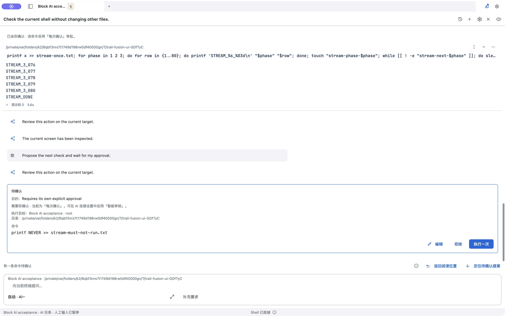
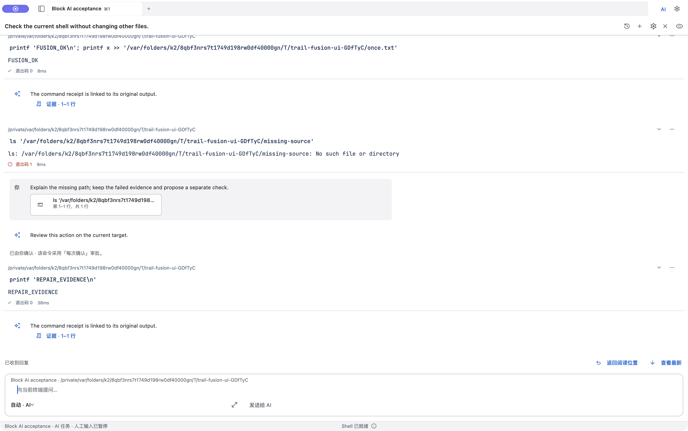

# D3 当前候选结果

阶段仍 in_progress；其余场景 not_run。

### D3-T05 · AI 内容与执行事实分层

状态：**passed**（原图、日志与 manifest 已归档）。需求 D3-R05。
候选 `19001573d9974c510e1e4cbcfeb01c94368ea157`；真实 Mac16,7 / macOS27.0.1 / Flutter3.44.8 / Dart3.12.2 / debug隔离App。
原窗口1728×1084逻辑像素，原图3456×2168，原生像素倍率2×。文字倍率1.0由本次SDK macOS embedder固定值与无override推导；未另取runtime日志，不作为字号缩放验收。

实际步骤：在隔离 Trail Development App 的同一真实本地 PTY/任务中检查说明、待审提案、FUSION/失败ls/REPAIR三项真实结果及摘要引用；打开原输出 Reader 并返回。

实际结果：原始失败保持 exit 1，修正产生独立 Block；AI 正文、待审卡、原生结果和总结角色分离。引用打开实际原输出且不重放。

[原生结果](../evidence/shared/C8-native-workspace-1/result.json)、[原生日志](../evidence/shared/C8-native-workspace-1/native-test.log)、[运行身份](../evidence/shared/C8-native-workspace-1/run-metadata.json)、[视觉复评](../evidence/shared/C8-native-workspace-1/visual-review.log)、[连续视频](../evidence/shared/C8-native-workspace-1/native-window.mp4)。

原始捕获：`native-window-060.png`；仅原字节复制，未裁切或标注。

原始捕获：`native-window-017.png`；仅原字节复制，未裁切或标注。

F02 的原始时间 07:17:47.625794Z 早于 F01 的 07:18:18.441622Z；两图分别证明引用与角色状态，文件编号不表示操作先后。

| 断言 | 预期 | 实际与证据 |
| --- | --- | --- |
| 原生失败与修正事实分离 | 失败事实不被修正结果覆盖 | failure_block_id=1791616662128-5 exit=1; correction_block_id=1791616664659-8; failure_preserved_after_correction=true（`C8-native-result`） |
| 来源引用往返 | 引用打开原始输出且不重复执行 | correction_reference_opened_and_returned=true；成功driver包含原输出、receipt/Block与往返后计数断言（`C8-native-result`） |
| 原图视觉与连续视频复评 | 角色、待审目标、实际结果与引用可辨；视频覆盖D06闭环 | 见独立视觉报告中五张原图和原视频的实际复评范围；不推断其他场景通过（`C8-visual-review`） |
| 待审提案没有执行 | 尚未批准的下一提案保持零执行 | streaming_timeline.new_proposal_not_executed=true；periodic060显示完整待确认卡和已完成原生结果（`C8-native-result`） |

源码：

- `example/integration_test/terminal_ai_workspace_acceptance_test.dart`
- `example/lib/features/ai/terminal_ai_controller.dart`
- `example/lib/features/ai/terminal_ai_runtime.dart`
- `example/lib/features/ai/terminal_ai_workspace.dart`
- `example/lib/features/shell/shell_screen_ai.dart`
- `example/lib/features/shell/shell_screen_ai_observer.dart`
- `packages/ianvs_terminal/lib/src/terminal/command_blocks_view.dart`
- `packages/ianvs_terminal/lib/src/terminal/command_block_reader.dart`

关键断言锚点：`terminal_ai_workspace_acceptance_test.dart:450` 真实失败入口，`:510` 附加上下文零发送，`:546` 诊断草稿零提前请求，`:558` 显式批准，`:584` receipt 对应 Block，`:598` Reader 原输出，`:606` 返回后 task/草稿/计数保持；`:1460` 原始结果写出。

限制：本地确定性HTTP fixture不证明真实模型服务/认证/质量；自动UI输入不证明物理键盘、中文输入法或VoiceOver；本次 workspace 仅支持 D3-T05 与 D4-T01 两案，不外推其他场景。D1-T01 另有独立普通 UI 证据，当前总计 3 passed／61 not_run。原始失败日志与旧候选身份保留。
