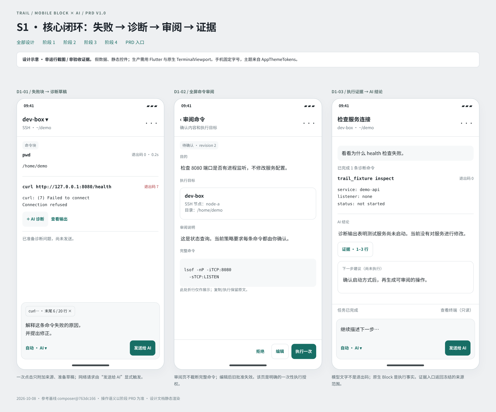
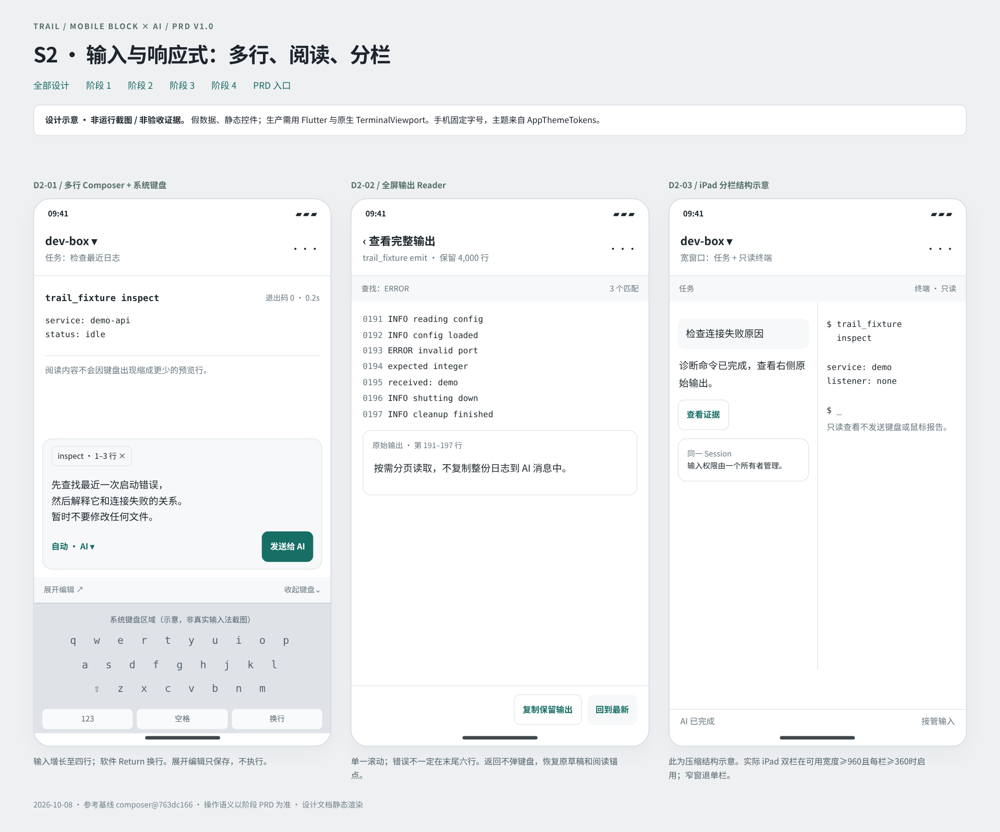
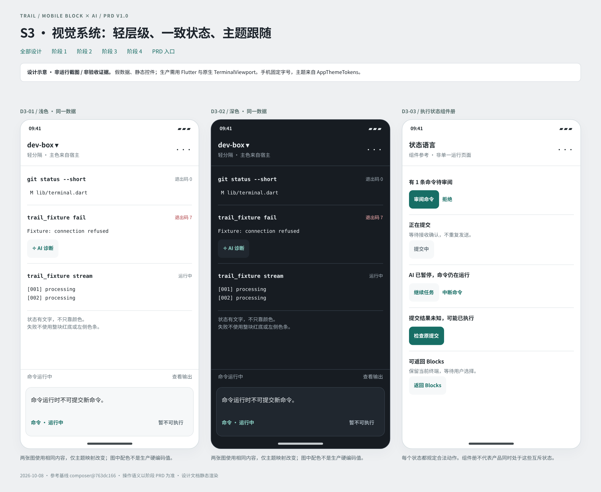
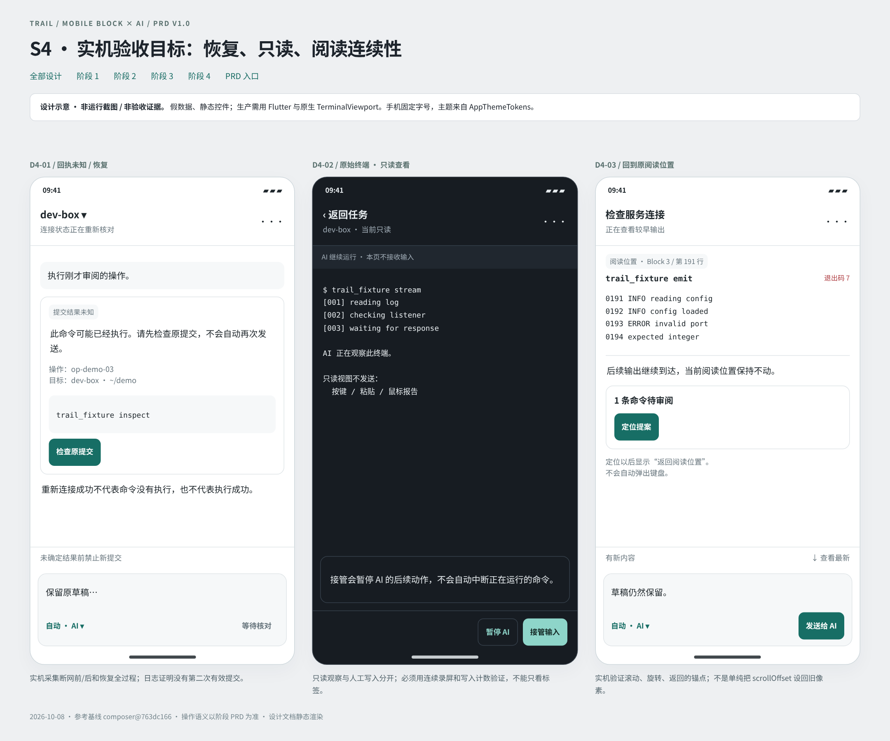

# 05 · 示例设计稿与逐屏说明

这些是**静态设计稿，不是实际 Flutter 运行截图，也不是验收证据**。PNG 由同目录 HTML 设计文档渲染，图中所有输出都是 fixture。可离线打开 [设计册](design/index.html)，查看全部阶段。实际产品需用 Flutter 控件、现有原生 TerminalViewport 和应用主题实现。

设计约束优先级：00 中的安全/数据合同 → 每阶段的功能与状态要求 → 本文具体布局/文案 → 例图的几何与配色。例图不授权新增没有功能的控件，也不要求照抄虚构主机和命令。图中的底部键盘块仅表示系统键盘占位，不能作为“真实键盘已验收”的证据。

## 全局规范

手机例稿使用固定字号、浅色/深色安静底色、命令等宽、轻分隔和圆角输入。重要动作有文字。失败不铺满红底、不加左侧色条。原生输出在样稿里用静态代码文字占位，但**生产实现必须继续使用 TerminalViewport**。

主机、Shell 状态、输入去向、任务状态各自表达，不能都塞进“已连接”一个词。统一主按钮的语义比统一所有按钮形状更重要。稿中画面尺寸是设计画布，不宣称对应真实 iPhone 17 的物理截图尺寸。

## 阶段一

| 设计 ID | 界面与关键结构 | 对应需求 / 用例 |
|---|---|---|
| D1-01 | 失败 Block：两行命令上限、退出码、六行以内预览、直接 AI 诊断；底部是“已准备、未发送”的上下文草稿 | S1-R01/R02；S1-T01/T02 |
| D1-02 | 全屏审阅：目的、执行目标、风险原因、完整命令；固定底部拒绝/编辑/执行一次 | S1-R04/R05；S1-T03/T04 |
| D1-03 | 任务结果：短计划、真实命令 Block、AI 总结与证据入口；底部清楚显示输入去向 | S1-R06/R08；S1-T05/T07 |

D1-01 的“AI 诊断”只准备草稿；D1-02 的“执行一次”才是写入授权入口。界面中的不同运行次数不得画成重复提交；执行事实与 AI 建议用不同层级。

## 阶段二

| 设计 ID | 界面与关键结构 | 对应需求 / 用例 |
|---|---|---|
| D2-01 | 系统键盘上方的多行编辑器：来源 Chip、1–4 行内容、自动意图、展开编辑、明确发送；键盘 Return 是换行 | S2-R01/R03/R05；S2-T01/T02/T03 |
| D2-02 | 全屏输出 Reader：命令、原始行范围、查询、原生输出、回到最新；返回不弹键盘 | S2-R08；S2-T07 |
| D2-03 | iPad 双栏：左任务、右只读 Terminal；目标与写入归属明确；窄窗退单栏 | S2-R11；S2-T11 |

横屏极短窗口没有额外独立稿：沿用 D2-01，按 S2-R04 缩为单排可达控件并提供全屏编辑；禁止简单等比例缩小整张手机图。

## 阶段三

| 设计 ID | 界面与关键结构 | 对应需求 / 用例 |
|---|---|---|
| D3-01 | 浅色同 fixture：成功、失败、运行中 Block 的轻量状态；主色跟随宿主 | S3-R01/R02；S3-T01 |
| D3-02 | 深色同 fixture：不改变内容和动作；正文、代码、次要信息层级一致 | S3-R01/R02；S3-T02 |
| D3-03 | 状态组合：待审批、提交中、暂停与结果未知；文字优先，不靠彩色圆点 | S3-R03/R05；S3-T03/T05 |

D3-03 是组件状态参考，不要求生产主页面同时展示互相排斥的状态。真实验收需逐个真实状态采图，不能整张组件图冒充完整 App。

## 阶段四

| 设计 ID | 界面与关键结构 | 对应需求 / 用例 |
|---|---|---|
| D4-01 | 提交结果未知：持续解释“可能已执行”；只提供检查原提交/只读查看，没有重跑按钮 | S1-R09、S4-R06/R10；S1-T08、S4-T05/T09 |
| D4-02 | 只读原始终端：明显只读状态、暂停/接管入口；原始输出保持可读 | S1-R07、S4-R08；S1-T06、S4-T07 |
| D4-03 | 回看旧内容：新内容/待审批提示不抢位置；可定位后返回阅读锚点 | S1-R08、S4-R04；S1-T07、S4-T03 |

S4 设计稿只是实机截图应覆盖哪些 UI 状态的示例，**不新增 QA 仪表盘，不画“全部测试通过”的假产品页**。

## 例稿与最终效果的差异说明

最终实现若调整边距、断点、按钮排布或图标，在 `results/Sx.md` 写出原因并附同环境 before/after。安全语义、关键动作、来源与只读边界不能通过“视觉优化”自行改变。

每阶段至少对照本文三张例稿的主要状态，并补 07 指定的非 happy-path 状态。已有样稿颜色不作硬编码指标；验收比较的是层级、可读性、操作可达性和行为，而不是抗锯齿的像素一致。

## 设计版本与后续原图

此包 v1.1 沿用上述 V1.0 静态参考，不把例图修改为实测画面。原始设计仍是 HTML/PNG，不包含本轮产品验收。具体完工截图按 [10 逐帧清单](10_SCREENSHOT_SHOTLIST.md) 提交；iPad 图是结构示意，实际分栏宽度按 S2 约束，不照抄手机形状。
