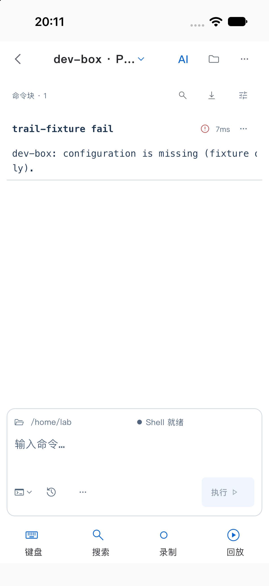

# 最终复核记录（验收未完成）

核对日期：2026-10-08。实现 C：`fe1556fc99af6ecca45caf7780604c9f8e541bd9`。当前结论为 **实现与完整仓库 verify 已通过，完整产品验收 partial**；这不是发布通过或 S4 evidence gate 通过声明。48 个 PRD 场景当前完整通过数仍为 0/48。

本次证据文档提交 E 仅含文档与证据；产品、测试 harness 和构建实现均继续绑定冻结 C，不重新加工原图或视频。

尚有明确未修复的 PRD-019（P3，open，core_flow=false）：12 张英文 AI widget After 图的单来源文案显示 `1 sources`，应为 `1 source`。主节点决定保留冻结 C 和原图，将此缺陷留在 issues 与 manifest.open_issues；不能宣称全部发现均已修复。

## 本轮真实发现与修复

| 问题 | 修复结果 | 已核对的验证 |
|---|---|---|
| 私有 zsh socket 阻塞普通输入 | session 既有循环持续排空 socket，提交仍走明确请求路径 | 无 UI polling 的真实 PTY 回归先红后绿；zsh 7、Composer 8、bridge 5、session 526 项通过 |
| 原 pane 关闭后剩余 split tab 无法关闭 | UI 按稳定 tab ID 找目标；原生关闭与清理仍作用于实际存活 pane | 2 项回归通过，确认存活 pane 的 native close 与资源释放，无额外写入 |
| Reader 控制区挤压输出、错误提示不可达 | 控制区受高度限制且独立滚动，保留可读输出空间 | 3 项失败复现；应用布局/observer 64 项及 canonical Reader 63 项回归通过 |
| 横屏键盘下 Composer 高度失真 | 保留上层实际高度，由 Composer 自身选择短布局 | 横屏深浅色场景在 64 项应用组合回归内通过 |
| 只读 observer 的硬件 Esc 失去焦点 | 显式观察才请求焦点，宽屏被动投影不抢焦点 | 3 项先失败后通过；Esc 清选区/返回 AI、任务与草稿保留、未接管零写入 |
| ACP 安装发现绕过环境配置边界 | 独立发现/child/login 读取函数；注入快照，路径覆盖保留，child env 不扩大 | ACP/架构/设置组合 63 项通过；最终 lint 清理后 22 项复核通过 |
| macOS 增量 Debug 打包签名未更新 | Xcode project 声明四个 framework + Data API 的真实输出，由现有 CodeSign 按依赖重签；无手动补签 | clean C 全量 verify 已通过两次 Debug、两次 Release 严格签名及最终原生 Xcode tests；永久 gate 保留重复构建 |

独立只读交叉复核未发现本轮 `poll_io` 的反向锁序、新线程生命周期或新增 PTY 写入问题；tab 关闭按钮、侧栏与快捷键的稳定 ID 传递一致。此结论只覆盖明确复核范围，不是“所有功能无缺陷”的保证。

## 验证状态与范围

冻结前诊断全量 example 265 文件首轮为 2747 通过、1 跳过、20 失败，不能以局部修复结果改写该次记录。相关失败随后修复并按上表复跑；另有 Composer golden 9 项复验、984 文件格式检查零变化、整仓静态分析无问题及 canonical/core 镜像检查通过。计数存在重叠，不能相加当作独立 PRD 场景数。

旧 C `649c77696074fe465e9b5015f87fa12197072b96` 的完整 verify 实际 exit 2：Rust、Go、Flutter 前置门槛均通过，example 全量 2776 通过、1 跳过；macOS smoke 两项失败来自同一个旧 `_expectSelectedTab` 断言遗漏实际已有 hasTapAction。只补 `hasTapAction: true`，保留其他全部状态要求后，macOS smoke 4、真实 PTY 45、Composer 1、Keychain 1 项通过。这个断言遗漏是测试合同问题，不记为新的产品缺陷；上述子项通过也不改变旧整轮失败记录。

后续 Debug 成品签名失败才是新确认的打包缺陷（PRD-018）。修复将 App.framework、FlutterMacOS.framework、ianvs_core.framework、objective_c.framework 及 Resources/ianvs-api 纳入外层 CodeSign 的实际输入；两次连续 Debug 构建与签名校验均通过，四个 framework 的 CDHash 及 Data API 资源 hash 与外层封存一致。没有手动补签、重新加工成品或修改 Flutter SDK。重复 Debug 已纳入永久 gate。

最终 C 的完整 make verify 已于 2026-10-08 15:00:37–15:13:48 UTC 通过，exit 0，开始和结束均为 clean `fe1556fc99af6ecca45caf7780604c9f8e541bd9`，macOS integration 未跳过。覆盖 Rust／Go／Flutter 前置门槛、macOS smoke 4、真实 PTY 45、Composer 1、Keychain 1、两次 Debug／两次 Release 严格签名，以及最终原生 Xcode TEST SUCCEEDED。原始完整日志 SHA-256 为 `85a3a13c11c8e9a8f077255b2a19587d77606ac75b8579446ab852c11e6d4d2d`，已与 receipt 核对；日志继续保留私有，不把此结果摘要或 hash 记录冒充公开完整 repo_verify/build 日志。

| 最终门槛 | 当前状态 |
|---|---|
| 精确 clean C 的完整 make verify | passed，exit 0；原始完整日志私有，仅记录范围和 hash，未提供公开完整日志 role |
| macOS 两次 Debug / 两次 Release / 原生 Xcode tests | passed，包含在最终 C 的完整 verify 中 |
| C 的正式 After runner | passed，42 widget + 7 原生 App 检查点；49 张原图与原视频按下述有限范围审阅完成 |
| Before/After 原图、sidecar、日志、连续视频的公开归档 | Before 101 + After 103 份原字节白名单文件已归档并同 hash 核验；主 manifest 结构／完整性校验通过 |
| C 的独立 iPhone 构建/安装 | profile 构建与严格签名／隔离 validated；installed=false、launched=false，精确设备未唯一可用，待 USB 恢复 |
| 真实模型 API 与完整设备验收 | not_run；不能以 deterministic fixture 替代 |
| evidence/manifest 结构／完整性 | passed；51 shared artifacts、49 After 截图、108 source hashes；48 项全部 not_run，无 shot_ids |
| 完整用例覆盖与 S4 evidence gate | 尚未满足；仅四项 S1 烟测子步骤 partial，不换算为用例 passed |

## 证据身份

PRD 编写基线保持 `763dc166bb1e56d6d50ed3379b57f366c9ca06b7`。已有 Before Widget 来自 B4 `bf41055f9bd884b95ba05ea54d3a918e701f1e33`（42 对），完整 App Before 来自 B6 `a2b49a9ca0d3eaef038fb1032fed8887de730816`（7 对 PNG/sidecar、未改动原始视频、公开 fixture 计数日志）。B6 是模拟器 + native SSH + deterministic model，不是实机、真实模型或系统 IME。

B4 的 42 份 widget sidecar 没有 captured_at；原字节保持不变，不以复制时间或推断时间补齐，仅作辅助 Before 比较，不进入仅接受 C After 的主 manifest。

B6 视频原始 SHA-256 为 `8f092acbae7c22a506e2a2660046b6a82b05ee95921c1696a53bdc4dbc68341a`，6,950,376 bytes，H.264 / 1206×2622，无音轨。容器及流标称 95.461667 秒，实际解码 393 帧；七个业务 checkpoint 依次位于原始画面 PTS 19.302、21.203、23.950、25.435、27.435、28.605、29.967 秒。约 30.185 秒已显示 Test finished，最后一个解码画面 PTS 为 71.435 秒黑屏；尾部 DTS/PTS 稀疏且不一致。因此保留“容器时长 + 原始 PTS”，不声明已核验 95 秒连续播放或将重采样时长当原始时长。

审阅者以 ffprobe 提取原始时间表，将全部 393 帧解码为辅助 JPEG，顺序检查 11 张带原始 PTS 的缩略图页，并放大 9 个关键画面；未在播放器连续播放，也未逐帧放大全部画面。在此范围内未发现真实账号、凭据、私人主机或系统通知，但细小短暂字符没有逐像素保证。为生成派生 JPEG 曾修正派生编码的单调 PTS；报告时点始终取原 MP4，原视频未重封装、未转码、hash 未变。派生图不能替代原图/视频。执行次数与零自动发送结论依赖 fixture 日志，不能仅从画面推断。

同 C 正式 After 已于 2026-10-08 15:17:25–15:19:04 UTC 完成。已读取原始 combined receipt，result=passed、widget_passed=true、actual_app_passed=true、source_tree_clean=true，42 widget 与 7 个原生 App 截图记录齐全；fixture 日志为诊断准备、tool 请求、待审批与完整审阅检查点、summary 请求、明确审批后原生结果及结束事件。原生失败 exit 2、修复 exit 0，独立最终计数为模型请求 2 次、修复执行 1 次。原始 receipt SHA-256 为 `ee5c76b07ecb4beabf6b0ee88e90b9f1a413f69d9cd9630ef2033030d5cede86`，原始清单 SHA-256 为 `6b3f75cb47f13146500c1084f394a2044b209fb8c9291b53242b0e6c8815759c`。采集平台为 iPhone 17 / iOS 27.0 模拟器；仍是 native SSH + deterministic model，非真实 API、真机或系统 IME。

主节点已人工查看全部 7 张原生 After PNG（本地审阅记录为 after-native-image-review.json），检查点与操作内容可读，审阅范围内未发现真实凭据或系统通知。但长终端输出存在水平视口截断，单图不足以证明完整输出可读。独立 reviewer 与主节点已确认 After 的 12 张中英文 widget 图中，fixture 草稿的 `🧭` 均显示缺字框；这是一项测试字体／特殊字符的证据缺口，不能推出真实 App 已通过 emoji 验证，也不在证据整理阶段修改 C 或原图。其余 widget 矩阵及视频的审阅方法和限制须单独保留。

独立 reviewer 已逐张查看全部 42 张 After widget 原图，未发现需要修改 C 的核心布局阻断，另记录 PRD-019 的英文单复数文案问题；此问题与 emoji 测试字体缺字限制分别记录。当前图像结论只针对这些 fixture 与检查点，不能推广到未运行的完整 PRD 路径、真实 API、IME 或设备矩阵。

After 原始连续视频的独立审阅记录为 after-video-review/REVIEW.md：H.264、1206×2622、6,863,955 bytes、393 个画面、无音轨，时长 15.053333 秒，SHA-256 为 `a8d28e0c0127ecb3a4aa60f390e8a1d11a39fdb2aea12a9c23b7ac0a1f9ff8d9`，原件字节未改。全部 393 帧在 11 页标注原始 PTS 的缩略图上顺序审看，并放大 9 个关键帧；不是播放器连续观看，也未逐帧放大全部画面。原始 PTS 从 0 到 15.04 秒、DTS 无倒退，七张 checkpoint 的状态和时点均匹配，未重现 Before 的尾部时序异常。派生 JPEG 只辅助审阅，不代替原视频。

审阅范围内未发现需打码的真实账号、凭据或系统通知，适合按本次模拟器／一次性 SSH／确定性模型范围公开；这不是逐像素隐私保证。4.218–4.842 秒 SSH 启动画面有重复 `dquote cmdsubst>` 提示，Before 也有，随后进入 Blocks 并完成流程；本次未定因，不据此宣称是新回归，也不宣称启动无杂讯。视频行为与事件日志一起支持烟测子步骤，不支持真实 API、真机、系统 IME 或全部 48 场景。

主节点已完成 Before 101 份、After 103 份原文件的精确白名单复制，并核验与原件 hash 一致；公开文件按原相对路径将 `/` 替换为 `--` 平铺，sidecar 原字节不变，其内部原路径仍指原始 capture 结构。公开索引位于 evidence/shared/review-fe1556fc99af/index.json，仅是整理 metadata，不是原始 receipt。S1-T01/02/03/05 只复用真实烟测子步骤并注明缺完整场景证据；所有 48 项仍为 not_run，不填 shot_ids。视频 captured_at 明确使用 runner 在 15:18:47.800927 UTC 观察到录制就绪的时间，不能当首帧编码时间；原始事件日志采集时间使用各事件真实 recorded_at。人工视频审阅单独记录，不回写或改造原始 receipt。

生成的主 manifest 已通过正式 validate_evidence 的 structure-only 与 repo-root 核验：51 个 shared artifacts、49 张 After 截图、108 个 C 源文件 hash、48 个 not_run。此检查核验结构／文件完整性与源码对应，不认证全部视觉、行为或设备要求，也不满足 S4 的全通过 gate；私有完整 verify 日志没有冒充公开 repo_verify/build role。

组件诊断图、旧 C 的图或 Before 不能重新命名为本 C 的验收图；Before 独立归档，不进入只接受 C After 的主 manifest。不得公开 private 日志、fixture 配置、设备完整标识或含本机账号路径的 receipt；必要环境使用匿名 ID。未取得的图/录像不插占位链接。所有原图/视频保持原字节，人工观察和完整场景证明另行记录。

同 C 的物理 profile 正常 App 已构建，严格预检记录 validated=true、Keychain 隔离校验通过，App bundle SHA-256 为 `fa86448ba6f7f7bf3b9bee5d4a8da208524dac1034cf025a44c0ad699b8aad99`。因确认过的有线 iPhone 未唯一可用，安装和启动均为 false，acceptance_passed=false；这是已验证的待安装成品，不是设备运行证据。

## 仍缺的硬件与真实环境项

- 精确目标 iPhone 当前未唯一可用，先等待 USB 连接恢复，无需调整 Wi-Fi；随后安装上述已校验成品，确认设备上的版本身份，再由用户配置专用真实 API 完成 SSH/模型/明确审批闭环。
- 系统中文 IME、emoji、候选与 undo，真实键盘出现/收起；输入中、审阅中和阅读中的横竖屏、触控及安全区观察。
- VoiceOver 连续完成流程；真实外接键盘与 iPad 同任务双栏、切换和恢复。当前无真实 iPad 证据，iOS 17 运行环境仍缺。
- 断网、锁屏/前后台/进程重启、真实 TUI/密码接管、长输出保留/复制、错误注入与重复审批的设备行为和连续证据。
- 真机 profile 性能样本、热状态/刷新率/内存记录及 release smoke；模拟器 debug、单元 benchmark 不能替代。
- 最终 C 的 macOS 真实 API/本地 ACP 场景、升级回滚与独立数据边界，以及公开原始证据/源码/构建的完整对应。

完成这些工作后再逐场景推进状态。manifest 没有 partial 枚举：部分执行写入 notes/observed_result，未完整执行维持 not_run，实际失败用 failed，明确设备阻塞用 blocked；仅满足全部步骤、等级、原图、日志、必要连续视频和人工观察的场景才可 passed。本提交 E 仅含文档与证据；如后续修改产品或 harness，应冻结新 C 并重验受影响范围。

## 已归档原件与审阅记录

[原件索引及 SHA-256](../evidence/shared/review-fe1556fc99af/index.json) 包含 Before 101、After 103 个原文件。公开文件采用平铺名称，原始 capture 相对路径保留在索引中；所有 PNG、sidecar、日志和 MP4 均保留原字节。Before 42 张 widget 的原 sidecar 没有 captured_at，仅作为辅助对照，未补造时间或纳入 C 的 After 清单。

[Before 42 图审阅](../evidence/shared/review-fe1556fc99af/before-widget-review.json)、[After 42 图审阅](../evidence/shared/review-fe1556fc99af/after-widget-review.json)、[After 7 张 App 图审阅](../evidence/shared/review-fe1556fc99af/native-image-review.json) 与 [After 视频审阅](../evidence/shared/review-fe1556fc99af/after-video-review.json) 是另行编写的审阅 metadata，不是原始 capture receipt。

[仓库 verify 结果摘要](../evidence/shared/review-fe1556fc99af/repo-verify-summary.json) 明确完整日志未公开，不能替代 S4 的完整日志要求。[原始 After 模拟器录像](../evidence/shared/after-fe1556fc99af/after-continuous.mp4) 和 [原始 fixture 事件](../evidence/shared/after-fe1556fc99af/fixture--events.jsonl) 仅证明记录所述的部分 smoke 流程。

失败 Block 的 Before 与 After 原图如下；After 的 AI 诊断直达入口可见，完整用例状态仍见 S1 报告。

