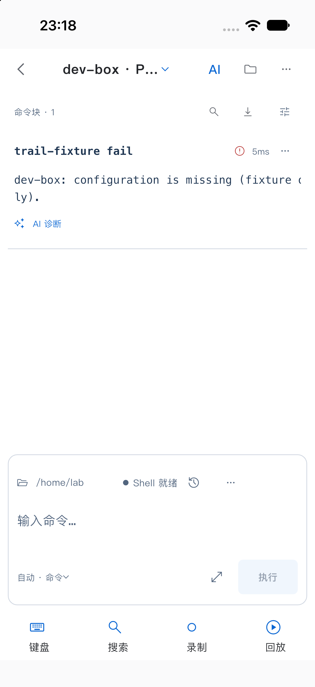
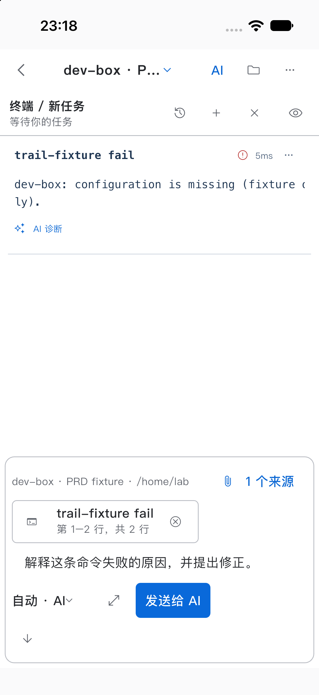
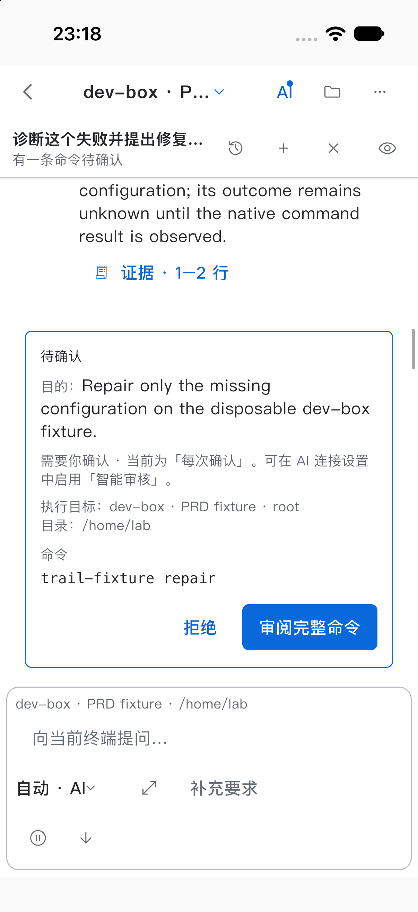
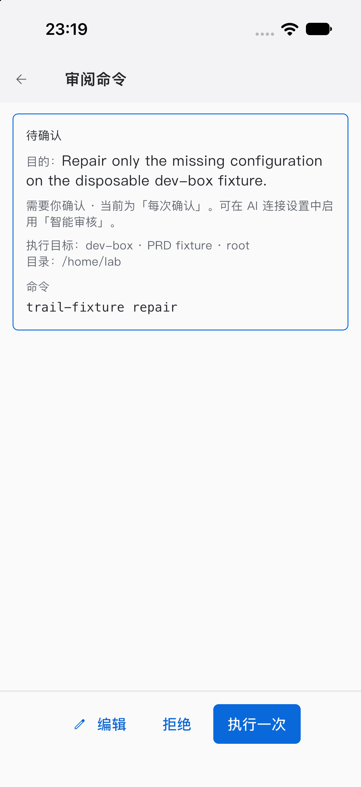
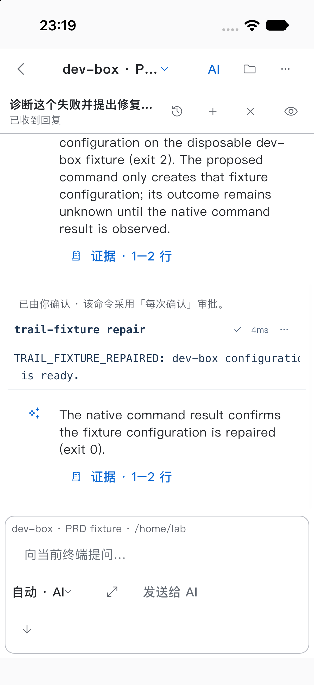

# S1 实施与验收记录

状态：in_progress。实现 C 已冻结为 `fe1556fc99af6ecca45caf7780604c9f8e541bd9`。以下区分实现回归、部分模拟器烟测与完整 PRD 验收；本阶段没有完整用例通过声明。

## 本轮变更

已实现发送时冻结草稿/来源、异步归属检查、来源删除后保留 AI 意图、手机只显示 API 设置、失败 Block 直接诊断、只读终端与明确接管。输入撤销覆盖键盘、焦点、鼠标、剪贴板、OSC 5522 和 native OSC 72 拖放；旧输入代际不会因接管而重新获得写权限。完整 Review、原生提交回执和 Reader 继续复用现有路径。

## 实现入口

- [example/lib/features/ai/terminal_ai_controller.dart](../../../../example/lib/features/ai/terminal_ai_controller.dart)
- [example/lib/features/ai/terminal_ai_observer.dart](../../../../example/lib/features/ai/terminal_ai_observer.dart)
- [example/lib/features/shell/shell_screen_ai.dart](../../../../example/lib/features/shell/shell_screen_ai.dart)
- [example/lib/features/shell/shell_screen_ai_observer.dart](../../../../example/lib/features/shell/shell_screen_ai_observer.dart)
- [example/lib/features/terminal/terminal_input_controller.dart](../../../../example/lib/features/terminal/terminal_input_controller.dart)

## 需求与场景映射

| 用例 | 需求 | 最低证据 | 当前结论 |
|---|---|---|---|
| S1-T01 | S1-R01 / S1-R02 | app_simulator | not_run：已有部分 native smoke 证据，完整场景未完成 |
| S1-T02 | S1-R02 / S1-R03 | app_simulator | not_run：已有部分 native smoke 证据，完整场景未完成 |
| S1-T03 | S1-R04 | app_simulator | not_run：已有部分 native smoke 证据，完整场景未完成 |
| S1-T04 | S1-R04 / S1-R05 | app_simulator | not_run：完整场景及规定证据尚未齐备 |
| S1-T05 | S1-R05 / S1-R06 | app_simulator + 连续录屏 | not_run：已有部分 native smoke 证据，完整场景未完成 |
| S1-T06 | S1-R07 | app_simulator + 连续录屏 | not_run：完整场景及规定证据尚未齐备 |
| S1-T07 | S1-R08 | app_simulator + 连续录屏 | not_run：完整场景及规定证据尚未齐备 |
| S1-T08 | S1-R09 | app_simulator | not_run：完整场景及规定证据尚未齐备 |
| S1-T09 | S1-R10 | app_simulator | not_run：完整场景及规定证据尚未齐备 |
| S1-T10 | S1-R11 | app_simulator + 连续录屏 | not_run：完整场景及规定证据尚未齐备 |
| S1-T11 | S1-R12 | app_simulator | not_run：完整场景及规定证据尚未齐备 |
| S1-T12 | S1-R03 / S1-R06 / S1-R08 | app_simulator | not_run：完整场景及规定证据尚未齐备 |

## 已执行检查与限制

精确 clean C 的完整 `make verify` 已通过，覆盖仓库测试、静态检查、macOS 真实交互、重复 Debug／Release 构建及严格签名。完整日志仍私有；公开结果摘要不能替代 S4 所需的完整原始日志。

同 C 的正式 After 已采集 42 张 widget 原图和 7 张实际模拟器 App 原图、原始视频与 fixture 事件。App 烟测证明原生失败 exit 2、诊断准备不发送、明确审批后修复执行 1 次并得到 exit 0；模型为 deterministic fixture，不能替代真实 API 或系统 IME。Before 的 B4 组件图缺原始拍摄时间，仅作辅助对照。

完整用例尚未执行，48 项仍为 not_run。见 [状态](../STATUS.md)、[问题登记](issues.md)、[manifest](../evidence/manifest.json) 与 [最终复核](FINAL_REVIEW.md)。

## 逐场景实测

### S1-T01 · 失败块的直接 AI 入口

not_run（仅完成下列模拟器烟测子步骤）。

1. 原生执行 trail-fixture fail；捕获失败块。
2. 通过公开诊断操作打开诊断草稿并记录诊断准备事件。

partial：diagnosis_prepares_only 记录模型请求、修复执行计数及来源块均未改变。

仅复用本次原生 SSH／确定性模型烟测的实际子步骤；完整用例仍为 not_run。缺口：该事件未区分直接按钮与旧菜单分支；未完成本用例所有入口和展示验收。

[原始事件日志](../evidence/shared/after-fe1556fc99af/fixture--events.jsonl)

### S1-T02 · 上下文与诊断发送

not_run（仅完成下列模拟器烟测子步骤）。

1. 通过 Flutter EditableText 客户端填写诊断请求并显式发送。
2. 等待并捕获待审批提议。

partial：fixture 记录 tool 和 summary 两次模型请求；诊断附加阶段尚未发起请求。

仅复用本次原生 SSH／确定性模型烟测的实际子步骤；完整用例仍为 not_run。缺口：未覆盖完整来源内容核对、附件编辑／移除、异步发送快照边界及原生输入法。

[原始事件日志](../evidence/shared/after-fe1556fc99af/fixture--events.jsonl)

### S1-T03 · 命令审批完整审阅

not_run（仅完成下列模拟器烟测子步骤）。

1. 捕获紧凑提议。
2. 在公开完整审阅入口存在时打开该入口并捕获 proposal-full-review，随后显式审批。

partial：原始紧凑／完整审阅检查点和后续审批事件可供人工检查；不声明已核对所有命令字段。

仅复用本次原生 SSH／确定性模型烟测的实际子步骤；完整用例仍为 not_run。缺口：该 harness 对审阅入口的点击是条件分支；未完成完整命令、目标、revision、编辑失效和风险提示的逐项验收。

[原始事件日志](../evidence/shared/after-fe1556fc99af/fixture--events.jsonl)

### S1-T04 · 编辑使旧审批失效

not_run。未取得最终实现 C 对应的完整证据；不引用设计图或伪造截图路径。

### S1-T05 · 执行映射真实 Block

not_run（仅完成下列模拟器烟测子步骤）。

1. 显式审批 fixture 修复命令。
2. 等待原生 trail-fixture repair 成功块并读取独立执行计数，捕获执行结果。

partial：approved_native_result 记录 execution_delta=1、native_exit_code=0；独立最终计数为修复执行 1 次。

仅复用本次原生 SSH／确定性模型烟测的实际子步骤；完整用例仍为 not_run。缺口：仅单次审批成功烟测，未覆盖重复点击、unknown、回执延迟或完整 Block 身份映射验收；视频已按全帧缩略图及关键帧方法审阅，未连续播放。

[原始事件日志](../evidence/shared/after-fe1556fc99af/fixture--events.jsonl)

[原始模拟器录像](../evidence/shared/after-fe1556fc99af/after-continuous.mp4)

### S1-T06 · 只读观察与接管

not_run。未取得最终实现 C 对应的完整证据；不引用设计图或伪造截图路径。

### S1-T07 · 阅读旧输出时新内容到达

not_run。未取得最终实现 C 对应的完整证据；不引用设计图或伪造截图路径。

### S1-T08 · 未知回执禁止重发

not_run。未取得最终实现 C 对应的完整证据；不引用设计图或伪造截图路径。

### S1-T09 · 切换执行目标

not_run。未取得最终实现 C 对应的完整证据；不引用设计图或伪造截图路径。

### S1-T10 · TUI 回退与手动恢复

not_run。未取得最终实现 C 对应的完整证据；不引用设计图或伪造截图路径。

### S1-T11 · 无 AI 配置和请求失败

not_run。未取得最终实现 C 对应的完整证据；不引用设计图或伪造截图路径。

### S1-T12 · 普通 Shell 操作不退化

not_run。未取得最终实现 C 对应的完整证据；不引用设计图或伪造截图路径。
