# iOS UI 细节检查 · 2026-09-15

仅整理问题与截图标注，未修改产品 UI。共 14 条：6 项明确问题、8 项可选精简。

完整可交互标注：[打开 index.html](index.html)。红框是 HTML 叠加，不修改原始截图。

## 优先查看

01 标题偏移；04 名称与英文占位；05 桌面文案；07 默认连接名；10 英文错误条；12 键盘明暗不一致。

## 标注清单

### 01 · 页头标题左右偏移（明确问题）

连接首页的标题偏左；设置页则偏右。左右按钮数量不同，标题随剩余空间居中，页面之间视觉中心不一致。

最小方向：仅让标题以整屏中心对齐，保留按钮位置与点击区域。

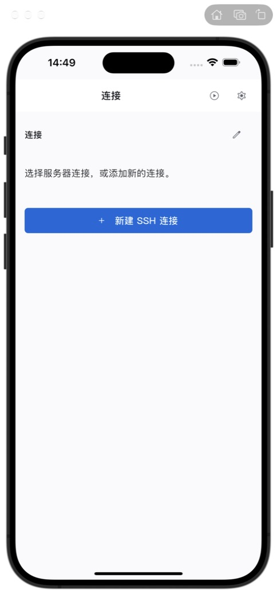

### 02 · 标题和字段名重复出现（可选精简）

“默认 Profile”在展开项标题与字段标签各出现一次；首页“连接”、外观页“外观”、预设展开后的“终端预设”也有类似重复。

最小方向：同一层级保留一处标题；确有分组意义的标题保留。不要把不同页面的标题一律删除。

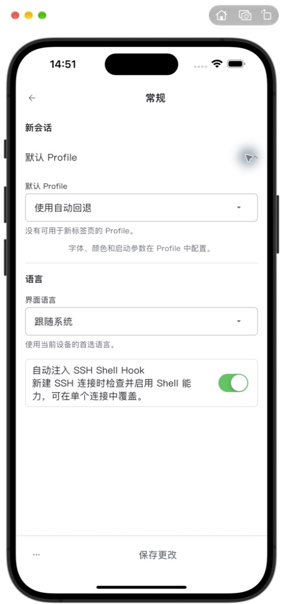

### 03 · 同步页反复解释本地数据（可选精简）

页头说明、下面的正文、选项副标题和卡片底部，都在重复解释“数据留在本机 / 同步可选”。单屏信息很多，但增量信息少。

最小方向：保留一条总说明；在同步服务选项中只解释它新增的行为；保存后的生效说明单独保留一次。

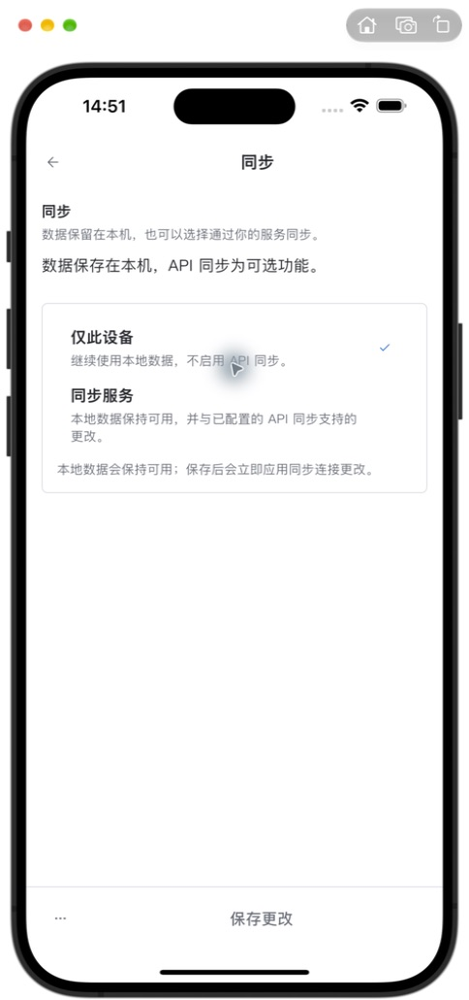

### 04 · 中文界面的名称和英文占位不统一（明确问题）

私钥空状态直接显示“No private key selected”。连接管理仍使用 Profile，而首页使用连接、保存后又称配置文件。回放入口进入后标题变为“回看”。启动同步页又使用“不使用数据服务并继续”，与设置中的“仅此设备”叫法不同。

最小方向：先统一面向 iOS 用户的术语；把私钥空状态改为“未选择私钥”。Profile 是否保留英文由你决定。

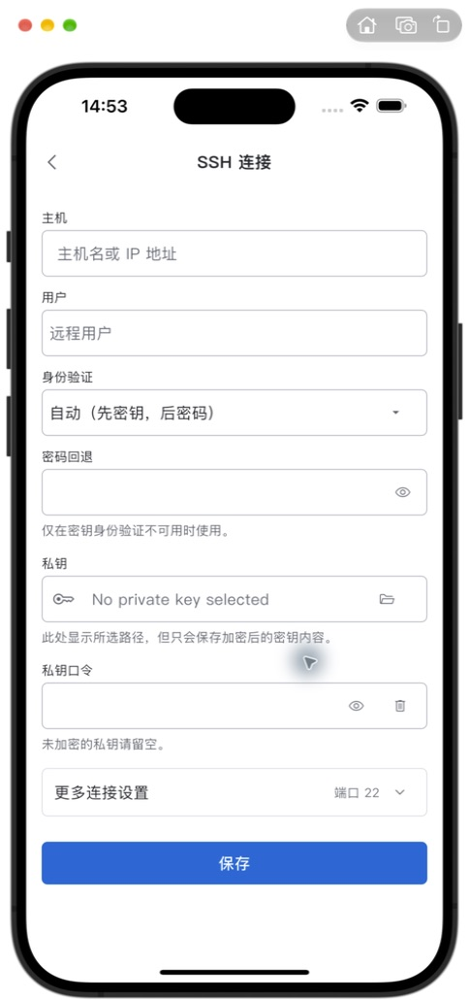

### 05 · iOS 说明仍混入桌面概念（明确问题）

安全页提到“Dock 提醒”；外观页提到“Shell 应用”“标签页和面板布局”，而同屏恢复开关说的是“连接”。这些文字与 iOS 当前导航语境不一致。

最小方向：只调整平台文案：使用实际 iOS 行为和“Trail / 会话 / 连接”等已统一的名称。保留权限风险与行为边界。

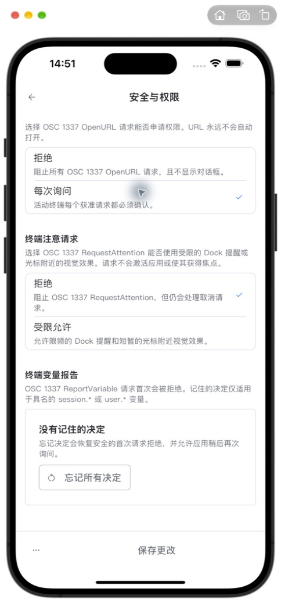

### 06 · SSH 高级说明占用较多纵向空间（可选精简）

SSH Agent、X11 的说明与标题使用接近的字号，关闭状态仍完整展示多行参数细节。与上方较小的字段帮助文字相比，层次偏重。

最小方向：先统一帮助文字字号和段间距；把只在开启后有用的参数说明放到展开状态，安全前提仍保留。

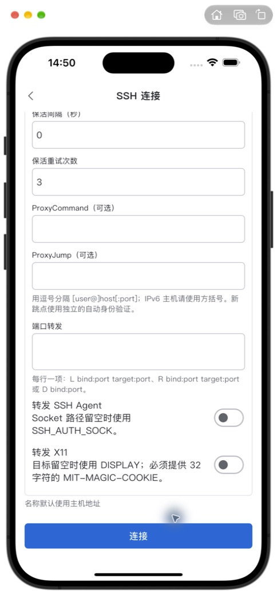

### 07 · 新连接保留了泛化默认名称（明确问题）

从“管理连接 → 新建”只填主机和用户后保存，列表名称成为“新建 SSH 配置文件”。名称字段藏在更多设置里，用户很容易直接保存这个临时式名称。

最小方向：无自定义名称时回退为主机或 user@host；已有用户自定义名称不变。

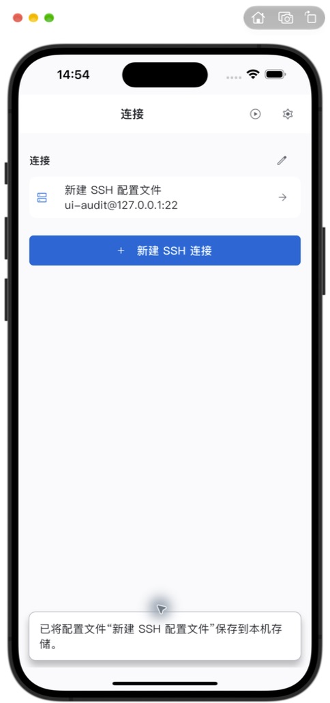

### 08 · 快捷键列表单行占高偏多（可选精简）

操作名与快捷键按钮被拆成上下两层，右侧又保留较大空白；“未分配”同时出现在副标题和按钮里。普通文字大小下，每屏能查看的操作数偏少。

最小方向：普通文字大小时尽量让名称与按键在一行，并保留足够点击区域；大字模式继续使用上下排列。去掉一处“未分配”。

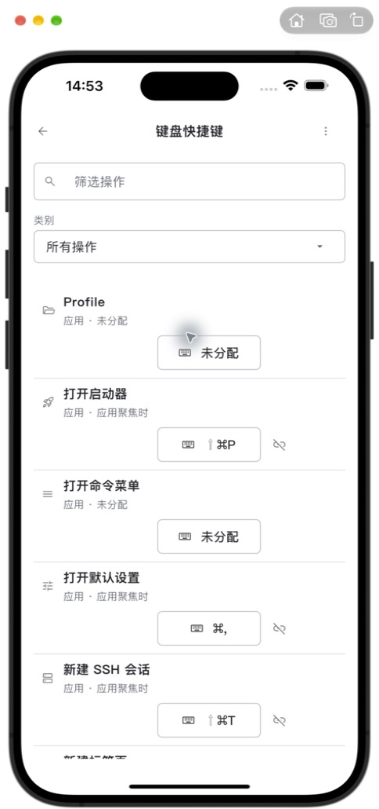

### 09 · 无 Profile 时预设区仍展示完整选择器（可选精简）

页面提示“请先创建 Profile”，但下面仍排列筛选框和全部配色卡。前提缺失时，这块区域的可操作性不够明确。这里未将其判定为功能失效。

最小方向：只在无 Profile 的空状态收敛展示：解释前提并提供明确下一步；有 Profile 时保留现有卡片。

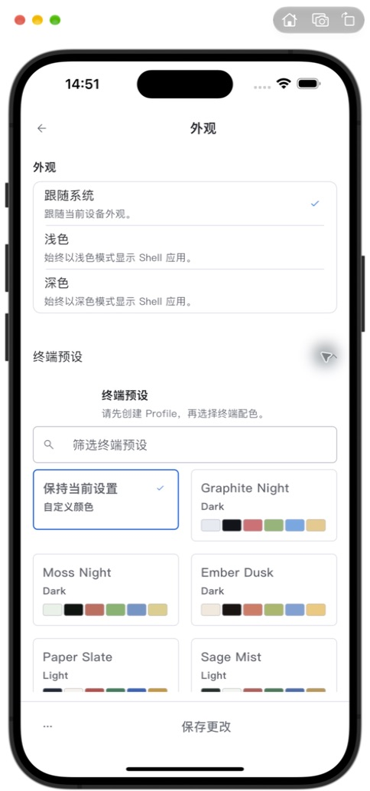

### 10 · 连接错误条直接暴露英文底层错误（明确问题）

本机端口拒绝连接后，顶部错误条显示完整英文 SSH 错误、exit code 和 os error，长名称与地址又拉长换行，把连接列表往下推。

最小方向：主文案用一两行中文说明失败原因；技术错误保留在可展开详情中。保持关闭入口。

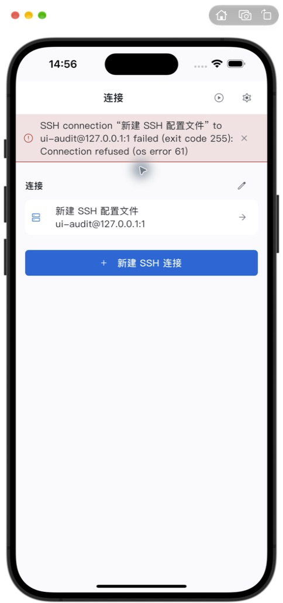

### 11 · 会话能力页重复同一句状态解释（可选精简）

多条能力都有“待确认”，并逐项重复“尚无初始化检查或实际事件可以确认这项能力”。状态相同时，这些重复文字显著增加滚动长度。

最小方向：把共同的待确认说明放在分组开头；各能力保留名称、状态和各自作用。真实异常原因仍逐项展示。

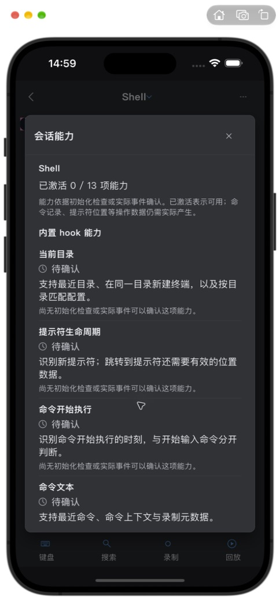

### 12 · 深色终端与表单使用不同键盘外观（明确问题）

同一深色测试运行中，SSH 表单使用深色系统键盘，终端输入却出现浅色键盘。终端 TextInputConfiguration 未显式提供 keyboardAppearance。

最小方向：终端输入连接跟随当前应用明暗主题；核对切换主题后重新获取焦点的键盘外观。只调整输入配置。

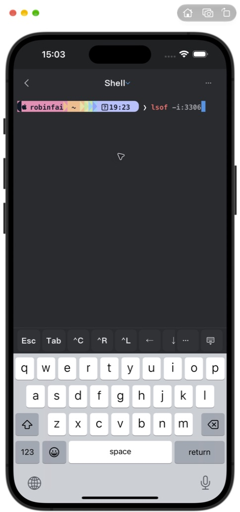

### 13 · 终端工具图标视觉重量偏轻（可选精简）

底部“键盘 / 搜索 / 录制 / 回放”的图标视觉上偏小，和页面大面积终端内容相比入口不够醒目。这里说的是图形大小，不是已证实的点击区域不足。

最小方向：只考虑略增图标可见尺寸，保留现有标签、四等分布局和点击区域；不建议直接删除这些标签。

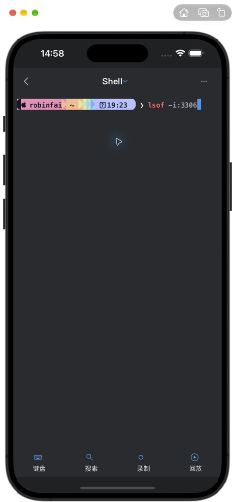

### 14 · 搜索选项用语过长（可选精简）

五条选项反复出现“子字符串 / 区分大小写 / 正则表达式”，普通搜索也要读较长术语。当前尺寸能容纳，属于理解成本问题。

最小方向：在不改变五种搜索语义的前提下缩短名称，例如“智能大小写”“匹配大小写”“忽略大小写”；正则选项明确保留“正则”。

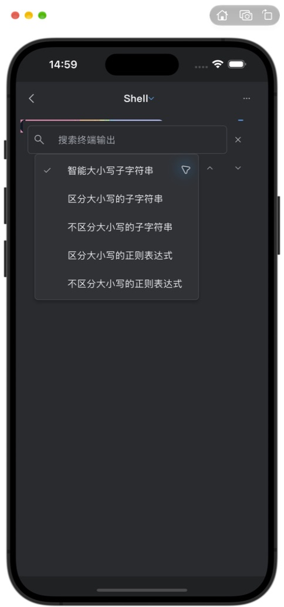

## 覆盖

| 步骤 | 页面 / 场景 | 状态 |
|---|---|---|
| 01 | 连接首页：空状态 / 非空 / 活动会话 | 可用；标题偏移、命名与重复文字待梳理 |
| 02 | SSH 新建与编辑：密码 / 自动认证 / 校验 | 可用；英文占位、默认名称待统一 |
| 03 | SSH 更多设置与长表单滚动 | 可滚动到底；说明文字层次可收敛 |
| 04 | 连接失败提示 | 显示完整错误；中文提示和长度待优化 |
| 05 | 管理连接：空列表 / 非空列表 / 更多菜单 | 操作可达；术语不一致 |
| 06 | 设置目录及常规 | 可用；标题中心和重复字段待梳理 |
| 07 | 外观、终端预设、画布边距 | 可用；无 Profile 状态和桌面文案待梳理 |
| 08 | 安全与权限：上下两屏 | 可滚动；平台文案待修正 |
| 09 | 同步：本地状态 / 未保存服务表单 | 可用；重复说明较多，未提交远程登录 |
| 10 | 外接键盘与快捷键录入弹窗 | 可用；列表密度可局部调整 |
| 11 | 重置菜单 | 已检查；未执行重置 |
| 12 | 回放库空状态 | 可用；“回放 / 回看”命名需统一 |
| 13 | 终端、搜索条与搜索模式菜单 | 测试会话下可展示；图标、选项文字可优化 |
| 14 | 会话切换 / 会话菜单 / 高级选项 | 间距整体稳定，未见重叠 |
| 15 | 会话能力说明 | 可滚动；相同状态说明重复 |
| 16 | 真实系统键盘：SSH / 终端 / 扩展按键 | 基础表单未被遮挡；键盘明暗不一致 |
| 17 | 深色、大字（XXXL）、横屏终端 | 已抽查；所见页面未见黄色溢出条或控件重叠 |
| 18 | 正式启动欢迎页 | 层次清晰，未见明显问题 |
| 19 | 正式启动同步表单 | 表单可达；未提交远程登录 |
| 20 | 正式入口开始使用 → 连接首页 | 已进入首页，与测试入口相同的标题偏移复现 |

## 限制

设备为 iPhone 16 Plus / iOS 18.4。主要页面使用现有正常导航测试入口；终端补查使用既有会话数据与正式移动控件。未验证真实 SSH 成功、SFTP、已有录制播放器、远程同步登录、iPad、其他 iPhone 尺寸、全部无障碍组合。不能把本轮当作全功能验收或无障碍认证。

本轮 loopback 测试连接已清理；已有两个配置保留。临时测试入口已移除。原有工程改动保留。