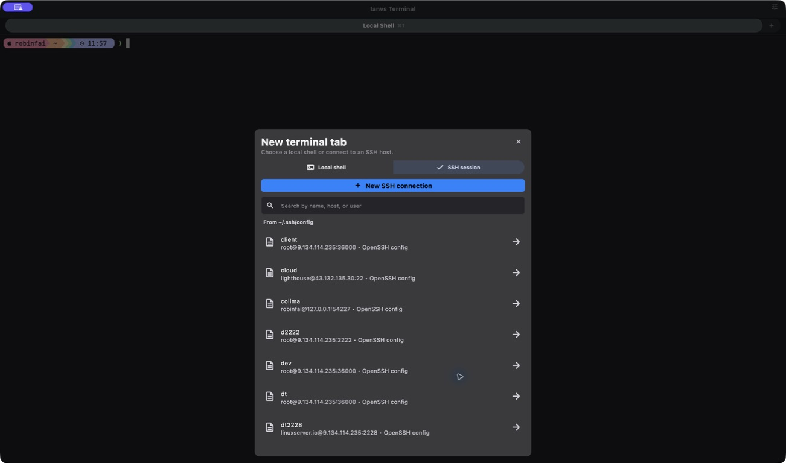
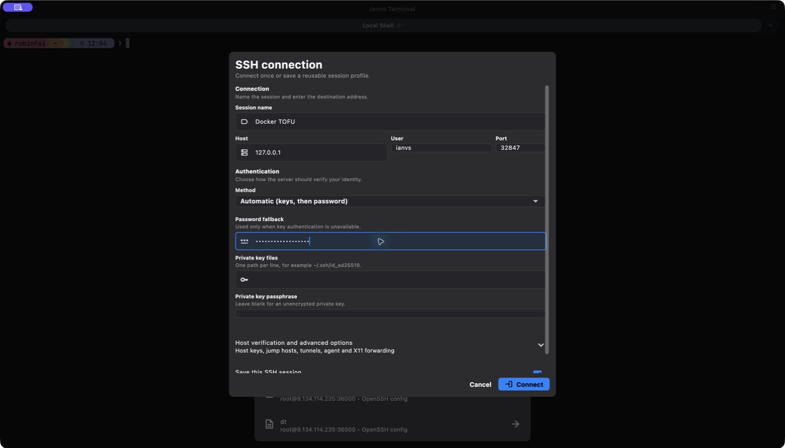
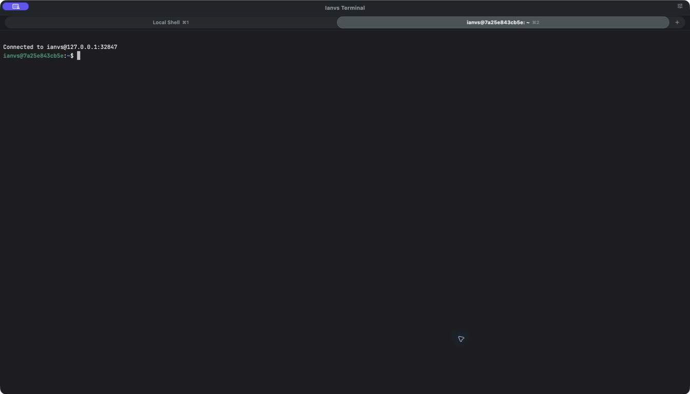
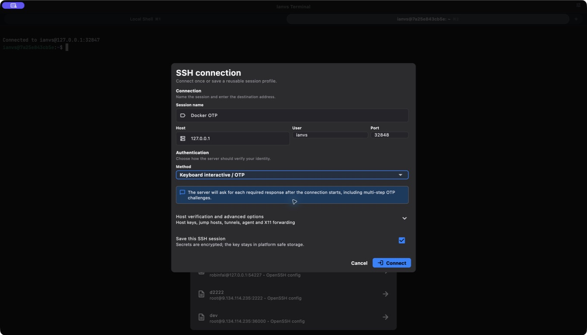
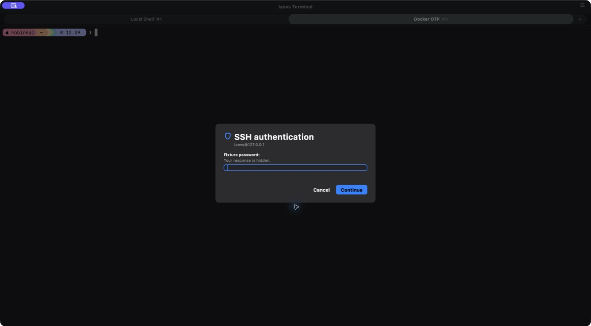
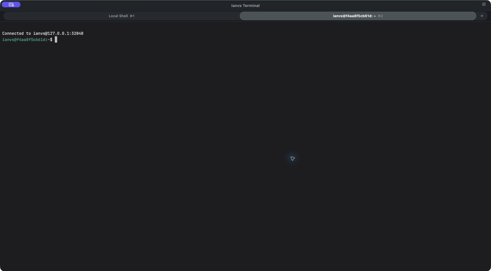
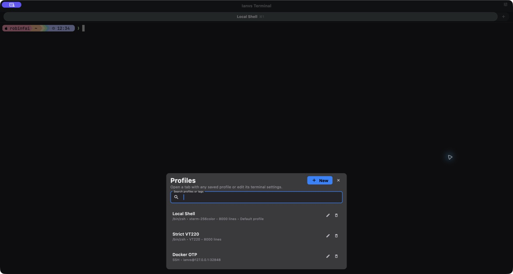
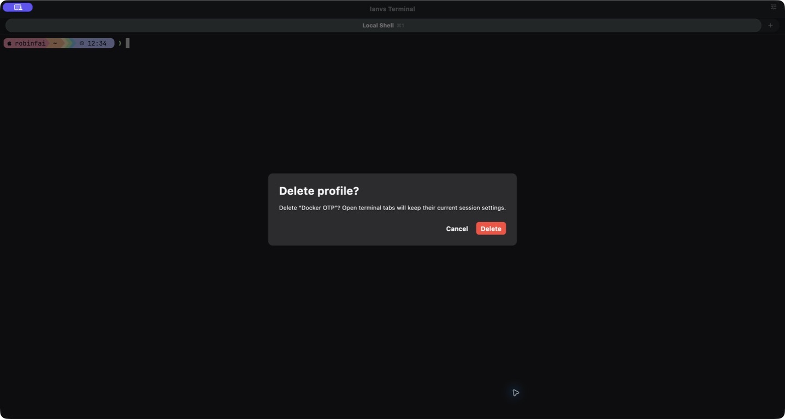

# SSH capability and interaction audit — 2026-08-08

## Verdict

The macOS SSH flow is healthy after six capture-and-fix rounds. A user can
find an imported or saved host, create a custom connection, choose credentials
without unrelated fields, save secrets to platform storage, accept a new host
with TOFU semantics, finish password or multi-round OTP authentication, and
safely remove a saved custom session.

The final pass found no remaining blocking, high-impact, or medium-impact UI
issue in the audited flow.

## Final flow

1. **Choose an SSH profile — healthy.** The local/SSH choice is explicit;
   imported profile names no longer repeat `(.ssh/config)`, the icon describes
   a configuration document, and long lists can be filtered by name, host, or
   user.

   

2. **Enter a custom connection — healthy.** The dialog has a stable desktop
   width, visible groups, explicit labels, persistent actions, a scrollbar, and
   no premature errors. Authentication fields change with the chosen method.
   New custom hosts use `Accept new hosts` (TOFU), while changed known keys are
   still rejected.

   

3. **Complete password login — healthy.** A custom profile connected to the
   disposable Docker OpenSSH password fixture and opened a live remote shell.

   

4. **Choose keyboard-interactive / OTP — healthy.** Password and private-key
   fields disappear, and the form explains that the server will ask for each
   response after connection starts.

   

5. **Answer server challenges — healthy.** The modal now exposes a clear
   `SSH authentication` title, destination, readable server prompt, hidden-input
   explanation, and named field in the macOS accessibility tree. The two server
   rounds are serialized rather than overlapping.

   

6. **Finish multi-round OTP login — healthy.** The first fixture-password round
   and second one-time-password round both completed, producing a live Docker
   remote shell.

   

7. **Manage and remove a saved SSH session — healthy.** Saved local and SSH
   profiles expose named edit and delete actions. Deletion requires an explicit
   confirmation that explains the effect on open tabs, uses a destructive red
   action, and announces success after the profile is removed.

   

   

## Findings resolved

- Replaced the narrow, dense custom dialog with a forced desktop width,
  section hierarchy, external labels, clearer hints, visible scrolling, and
  sticky actions.
- Added profile search and removed redundant imported-profile suffixes.
- Changed the imported-profile glyph from download to configuration document.
- Prevented authentication selection from triggering errors before the first
  connect attempt; invalid submission focuses the first relevant field.
- Made explicit password and private-key credentials required, and prevented
  hidden credentials from leaking into another authentication method.
- Added a dedicated keyboard-interactive explanation and a readable,
  accessibility-named challenge dialog.
- Changed new custom hosts from strict-first-use failure to TOFU `accept-new`.
- Added saved-profile deletion with accessible action names, an explicit
  destructive confirmation, and success feedback.

## Automated evidence

- Docker OpenSSH acceptance: password, PAM keyboard-interactive, two-round OTP,
  Ed25519 public key, two-hop ProxyJump, local/remote/dynamic forwarding, agent
  forwarding, and X11 forwarding all passed.
- Rust core: 319 tests passed; Clippy passed with warnings denied.
- Flutter SSH tests: 7 tests passed, covering selection/search, custom profiles,
  authentication-dependent fields, validation, and serialized prompt rounds.
- Flutter profile-sheet tests: 7 tests passed, including the saved-profile
  delete affordance and result contract.
- Dart analysis passed with fatal infos enabled.
- macOS debug and release builds passed without CocoaPods integration or a
  development-signing requirement.

## Evidence limits

- Visual evidence covers the macOS dark theme at the captured desktop sizes.
  It does not claim iOS, Android, Windows, Linux, light-theme, or every text-scale
  variant has been visually audited.
- The macOS accessibility tree and widget semantics were inspected, but this is
  not a full VoiceOver usability study or WCAG conformance certification.
- Early screenshots contain hostnames and addresses imported from the local
  `~/.ssh/config`; keep this review folder private unless those images are
  redacted.

All 29 chronological screenshots, including the rejected states that drove the
iterations, are stored beside this report.
