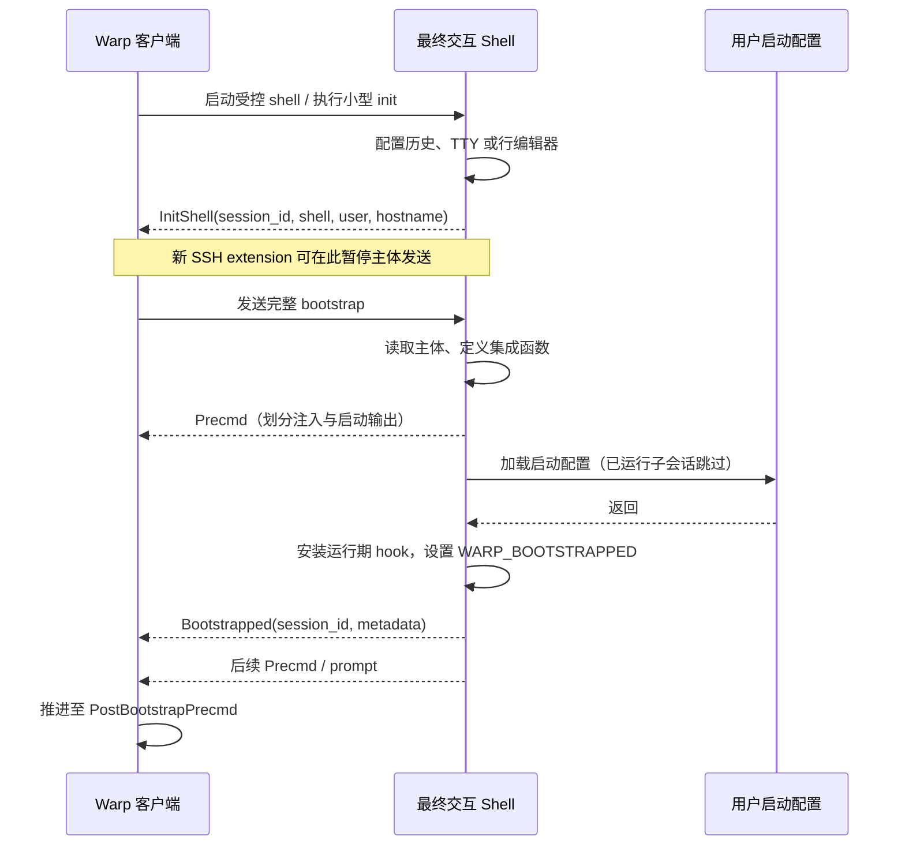
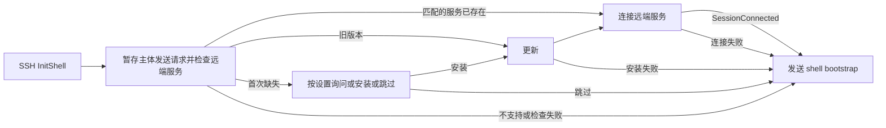

**Warp shell 注入时序与 IANVS 实现参考**

核对日期：2026-09-12。依据 Warp 官方公开源码，固定提交 [`a06279712f838d01295575b0dc0f14b7a34ba049`](https://github.com/warpdotdev/warp/tree/a06279712f838d01295575b0dc0f14b7a34ba049)。这是对该提交的静态梳理，不代表所有已发布 Warp 客户端都已包含这些路径，也未运行 Warp 的集成测试。

按本轮要求，以 Warp 的分阶段引导、事件回执、会话隔离和连接所有权管理作为后续实现参考。下文明确区分 Warp 已有行为与 IANVS 待实现契约；本次只增加参考文档，产品 SSH 行为仍以当前代码为准。

Warp 最值得参考的是：先让目标 shell 进入可控的引导环境，通过 `InitShell` 告诉客户端可以接收主体，再注入完整脚本，执行用户启动配置，安装运行期 hook，回报 `Bootstrapped`，最后由提示符事件完成状态推进。SFTP 不是这条 shell 注入链路的前提。[启动参数][s1]、[脚本发送控制器][s2]、[阶段模型][s3]

| 路径 | 引导入口 | 主体发送方式 | 需要特别注意 |
| --- | --- | --- | --- |
| 本地 Bash | `--rcfile` 配合进程替换执行小型 init 脚本 | 收到 `InitShell` 后经 PTY 写入 | 主体用 heredoc 读入变量后执行；不能仅凭这种写法保证任何平台都没有临时文件 |
| 本地 Zsh | `-g --no-rcs` 启动，客户端排入小型 init 命令 | 收到 `InitShell` 后经 PTY 写入 | `/etc/zshenv` 仍先执行；`-g` 预先启用忽略空格历史 |
| SSH 包装器 | 本地 `ssh()` 改写为带远端引导命令的 SSH | 远端回报 `SSH`、`InitShell`，客户端再发送主体 | Bash 用 rcfile 进程替换；Zsh 创建临时 `.zshenv` |
| Warpify 已运行子会话 | 在当前交互 shell 执行带 guard 的 init 命令 | 可先探测 shell，再走 `InitShell` 握手 | 已有 rc 文件不会再次加载；第一次 init 命令本身仍有历史风险 |
| 新 SSH extension | 在 SSH 包装器的 `InitShell` 后插入服务检查阶段 | 远端服务连接成功或明确降级后，才继续发送 shell 主体 | 服务安装在远端 home，具有持久化行为 |

表中源码入口：[本地启动][s1]、[Zsh init 排队][s4]、[SSH 包装器][s5]、[子会话入口][s6]、[SSH extension 状态机][s7]。本地 fish、PowerShell 和部分特殊环境优先使用临时脚本文件，完成后清理；WarpifiedRemote 不选择这条本地文件路径。[路径选择][s8]、[文件生命周期][s2]

下面是 Bash/Zsh 受控启动的主要时序；认证交互、用户启动配置输出与注入控制内容需要分别处理。

这里有两个容易混淆的 `Precmd`：主体中的提前回报用于切开注入内容和用户 rc 输出；`Bootstrapped` 之后的回报才让阶段进入 `PostBootstrapPrecmd`。不能把“收到任意一个 prompt 事件”直接当作完整引导成功。[Bash 提前回报][s9]、[阶段推进][s10]

Warp 的阶段是 `RestoreBlocks → WarpInput → ScriptExecution → Bootstrapped → PostBootstrapPrecmd`。`WarpInput` 隐藏，`ScriptExecution` 有内容时保留为可见启动输出；`is_bootstrapped` 与 `is_done` 的判定也不同。这是分阶段展示机制，不能扩大解释为“所有检查结束之前用户完全看不到会话”。[阶段定义][s3]、[可见性][s11]

用户配置与 hook 的顺序也值得保留。Bash 主体加载 `/etc/profile` 或系统 bashrc，再选择 `.bash_profile`、`.bash_login`、`.profile`；Zsh 显式加载用户 `.zshenv`、系统与用户 profile/rc/login 文件。子会话通过 `WARP_IS_SUBSHELL` 跳过这一步，避免重复执行。配置加载后再完成运行期 hook 注册，以减少配置重置 hook 数组的影响。[Bash 配置顺序][s12]、[Zsh 配置顺序][s13]

Warp 对已有集成的处理有三层，但没有等价于本项目 13 项能力的完整健康检查：

- 主体外层检查 `WARP_BOOTSTRAPPED`，已运行子会话的 init 命令也有这个 guard，防止重复注入。[主体 guard][s14]、[子会话 guard][s6]
- Bash 检查已有 bash-preexec 的安装痕迹，部分路径复用框架；其内嵌实现还尝试把既有 DEBUG trap 保留为 preexec 回调。Bash 的用户 `PROMPT_COMMAND` 有专门兼容处理，并非无条件覆盖后结束。[已有框架检测][s15]、[DEBUG trap 保留][s16]
- `Bootstrapped` 回报 shell、版本、路径、别名、函数、插件和启动配置耗时等元数据，供客户端完成 pending session；它不是各项 hook 实际执行成功的逐项证明。[回报内容][s17]、[会话完成][s18]

因此，存在一个环境变量只能表示某次安装留下了标记，不能证明当前进程的 hook 注册完整、协议版本兼容，或该标记属于本轮连接。IANVS 应在最终交互 shell 加载配置后做能力检查；已有兼容 hook 应重新握手并确认注册情况，再决定是否补装。单独 SSH exec 出来的探测进程不能替代这次检查。

之前讨论的历史问题，Warp 源码提供了具体例子：Bash init 先设置 `HISTCONTROL=ignorespace` 和 `HISTIGNORE`；本地 Zsh 启动时用 `-g`；Zsh 子会话 init 则先执行 `setopt hist_ignore_space`。脚本生成器裁剪空白时特意保留一个前导空格。这些都是在保护后续主体，不能消除已经作为交互输入被读取的第一条命令。[Bash init][s19]、[Zsh 子会话 init][s20]、[主体生成][s21]

尤其是 Zsh 子会话脚本注释明确承认最初的历史设置命令可能进入历史。实际生成的入口是包含 init 脚本的 guard + `eval` 命令，所以不能把历史保护设置成功理解为整个引导序列都从未进入历史。我们要求的“注入脚本不持久化”还必须覆盖这第一条命令、shell 的 heredoc/进程替换实现和异常退出；界面隐藏与文件不落盘是两项独立要求。

SSH 包装器的具体控制顺序如下。[完整实现][s5]

1. 解析 SSH 参数。`-T`、`-W`、参数错误、没有目标或带远端命令等路径交回普通 SSH；只有识别为交互连接才进入包装逻辑。
2. 生成非零随机远端 session ID。生成失败则回退普通 SSH。用 `ssh -G` 检查目标的 `RemoteCommand`；存在冲突时也回退。
3. 默认建立 Warp 自己的 ControlMaster。启用 `WARP_SSH_REUSE_CONTROL_MASTER=1` 时，解析用户 ControlPath，检查可接受的路径字符，并通过 `ssh -O check` 确认已有 master 存活；成功才以 `ControlMaster=no` 接入，并记录 `external_control_master=true`。
4. 认证成功执行远端命令，先回报 `SSH`，携带父 session ID、新远端 session ID、shell、ControlPath 和所有权。
5. Bash `exec` 到使用进程替换 rcfile 的交互 shell；Zsh 创建 `warptmp.*` 和 `.zshenv`，改变 `ZDOTDIR` 后 `exec`。目标 shell 再发送 `InitShell`。
6. 客户端登记远端 session ID，将其与后续 hook 关联，再进入主体发送流程。

Zsh 临时目录是在完整主体已经开始执行后、用户 rc 文件之前删除，并恢复 `ZDOTDIR`。这意味着正常结束会清理，但既不满足严格零落盘，也不能保证在主体到达前断线时完成清理。[创建文件][s5]、[清理位置][s13]

接收端有 session ID 校验：需要绑定会话的 hook 缺失 ID 或 ID 未登记时会被拒绝；`SourcedRcFileForWarp` 是例外，用于通知 rc 已执行。对 SSH，客户端先接受父会话关联的 `SSH` 消息，再登记非零远端 ID；子会话入口则在发送 init 之前登记客户端生成的 ID。该机制适合隔离误归属事件，不应被描述为抵御完全控制远端进程的安全边界。[校验][s22]、[SSH 登记][s18]、[子会话登记][s23]

**多级 SSH 的参考边界很明确。** Bash/Zsh 主体只在 `WARP_IS_LOCAL_SHELL_SESSION=1` 时安装 `ssh()`；源码明确把递归 SSH 包装列为未支持。因此不能把这一包装器当作已经实现 A→B→C 自动注入和文件面板跟随的现成方案。[Bash 条件][s24]、[Zsh 条件][s25]

Warp 另外支持在已运行子会话里触发 Warpify：已知 shell 直接发 shell 专用 init；未知 shell 先发 `InitSubshell` 探测，再发专用 init。子会话具备独立 session ID，活动会话取最近 `Precmd` 的 session ID。这可以参考用于上下文切换，但不自动建立跨主机的 ControlMaster 路由或新的文件 endpoint。[子会话入口][s6]、[事件处理][s26]、[活动会话][s27]

还有一条旧的 SSH 登录输出启发式：识别 `Last login:`、常见 prompt 字符，排除 password/passphrase 等提示，部分结果等待 3 秒复查。该提交的 `ReadyToWarpify` 处理只保留旧 tmux 方案的弃用提示，不能按旧文档把它解释为当前自动注入主路径。启发式本身也不足以证明 MFA、启动脚本或 TUI 已完成。[输出检测][s28]、[实际处理][s29]

新 SSH extension 的控制器则是一个可以直接参考结构的“先检查，再继续”实现：[状态机][s7]

异步检查/安装/连接结果会核对当前状态和 session ID，迟到的其他会话结果不会推进当前流程。连接或安装失败会释放暂存的 shell bootstrap，让基础终端继续初始化。服务检查/安装通过复用 SSH 连接进行；安装脚本经 stdin 送入 `bash -s`，不是靠 PTY 粘贴执行。[检查与恢复控制][s7]、[非 PTY 脚本通道][s30]

不过这条 extension 路径会在远端 home 安装服务，不能用于满足本项目的无脚本持久化要求。下载失败时存在本地下载再 `scp` 上传的分支；源码没有给 `scp` 传旧协议 `-O`，而 OpenSSH 9.0 起 scp 默认使用 SFTP，故不能把这个分支当作无 SFTP 的可靠回退。[安装回退][s31]、[scp 调用][s30]、[OpenSSH scp 手册](https://man.openbsd.org/scp)

关于异常退出，Warp 在子会话收到 `InitShell` 之后才隐藏原长命令块；未收到则保留输出。普通 bootstrap 失败提示计时为 7 秒，携带环境变量的子会话路径为 60 秒；计时回调会检查是否已完成/终止，并恢复隐藏输出。这是失败提示与恢复展示，不是完整回滚已执行脚本的机制。[隐藏时机][s26]、[超时与恢复][s32]

本项目按以下契约落地，名称为拟议接口，并非声称当前代码已实现：

| 维度 | 实现契约 | Warp 参考与需要补强的部分 |
| --- | --- | --- |
| 初始化阶段 | `transportConnected → bootstrapAwaiting → checking → installing（按需）→ ready/degraded` | 参考分阶段回执；增加最终 shell 中的已有能力检查和明确展示门槛 |
| 就绪消息 | 带 `contextId`、`epoch`、本轮 challenge、实际 shell 与协议版本；返回逐项检查结果 | 参考 session ID 与 `Bootstrapped`；不把单个 ready 事件转成全部能力 active |
| 能力证据 | 分开保存声明支持、实际注册检查、运行事件观察；保留现有 13 项逐事件激活语义 | 新会话即有检查结果；未执行命令时，命令结束/退出码仍可处于待观察 |
| 已有 hook | 先确认兼容协议和实际回调注册，再复用或补装；明确第三方 hook 共存策略 | 借鉴 guard、bash-preexec 和回调数组兼容，补上版本与健康检查 |
| 展示门槛 | 检查阶段结束且结果归属于当前 context 后才发布可交互；失败发布明确降级结果 | 认证交互正常展示；加载状态可见；用户 rc 输出保留；超时不等于不支持 |
| 注入通道 | 与 SFTP 分离；按 shell 选择可证明不持久化的入口；检查也不能泄漏脚本到历史 | 借鉴小型引导与主体分离，单独验证首条命令、heredoc、启动文件替换 shell 等边界 |
| 上下文生命周期 | 窗格、SSH transport、shell context 分开；进入/退出/exec 切换时绑定新 epoch 并重新确认 | 参考 session ID/活动 prompt；扩展为多层上下文树，避免父层证据污染子层 |
| 文件路由 | `FileEndpoint` 记录实际发起主机、连接句柄或 ControlPath、所有权和路由链 | 原生 SSH 复用现有 handle；远端 OpenSSH 在 socket 所在主机接入，传回独立非 PTY 流 |
| SFTP 面板 | 新操作跟随已确认的活动 endpoint；正在传输的操作固定原 endpoint | 缺少 SFTP 或复用失败只影响文件能力，不能把旧 endpoint 换个主机标签继续用 |
| master 生命周期 | 区分应用所有与借用；退出只释放自己的引用/资源 | 参考 `external_control_master`；多层退出时仍须保留被其他通道引用的连接 |

“显示前检查完成”应意味着每项能力已经得到可解释的检查结果（包括未知或失败原因），不要求自动执行用户命令来凑齐运行观察证据。某层 master 可用也不代表目标 SFTP 可用：仍需建立 channel 并验证 SFTP 握手、服务端会话配额及 stdout 是否干净。

与当前仓库的对接位置：

- [`native/core/src/ssh.rs`](../../native/core/src/ssh.rs) 的 `prepare_remote_shell_integration` 目前仍是独立 exec 探测后 SFTP 上传 `/tmp`；`prepare` 路径在 PTY exec/request_shell 后返回。需要以会话内 bootstrap 协调器替换上传流程，并引入结果回执，不能继续把 transport 建立视为检查完成。
- [`native/core/src/pty.rs`](../../native/core/src/pty.rs) 中的本地 shell installer 应复用能力主体，但须把安装检查、运行 hook、启动配置加载拆开；尤其处理 Bash DEBUG trap 共存。
- [`native/core/src/session/protocol_callbacks.rs`](../../native/core/src/session/protocol_callbacks.rs) 承接类型化 bootstrap/context 消息；[`session_controller.dart`](../../example/lib/features/sessions/session_controller.dart) 和 [`session_state.dart`](../../example/lib/features/sessions/session_state.dart) 承接当前 context 的检查结果与运行观察。
- [`shell_integration_capabilities.dart`](../../example/lib/features/sessions/shell_integration_capabilities.dart) 与 [`shell_capabilities_dialog.dart`](../../example/lib/features/sessions/shell_capabilities_dialog.dart) 保留现有逐项激活逻辑，扩展显示当前上下文、检查阶段、检查依据和降级原因。

实现验收继续使用已有 [SSH 边界实验](ssh-boundary-lab-20260912/README.md)，并补上真实产品会话创建与 UI 验收。必须覆盖：无 SFTP；只读 home/tmp；初始历史过滤关闭；已有兼容/部分/过期 hook；DEBUG trap；rc 内 exec 换 shell；迟到或重复 ready；MFA/ForceCommand；多层进入与退回；SFTP endpoint 切换时已有传输继续；借用 master 的所有权与异常清理。实验原型已通过的场景不等于这些产品接线已完成。

[s1]: https://github.com/warpdotdev/warp/blob/a06279712f838d01295575b0dc0f14b7a34ba049/crates/warp_terminal/src/local_tty/shell.rs#L617
[s2]: https://github.com/warpdotdev/warp/blob/a06279712f838d01295575b0dc0f14b7a34ba049/app/src/terminal/writeable_pty/pty_controller.rs#L325
[s3]: https://github.com/warpdotdev/warp/blob/a06279712f838d01295575b0dc0f14b7a34ba049/app/src/terminal/model/bootstrap.rs#L4
[s4]: https://github.com/warpdotdev/warp/blob/a06279712f838d01295575b0dc0f14b7a34ba049/app/src/terminal/local_tty/terminal_manager.rs#L784
[s5]: https://github.com/warpdotdev/warp/blob/a06279712f838d01295575b0dc0f14b7a34ba049/app/assets/bundled/bootstrap/bash_body.sh#L1207
[s6]: https://github.com/warpdotdev/warp/blob/a06279712f838d01295575b0dc0f14b7a34ba049/app/src/terminal/bootstrap.rs#L94
[s7]: https://github.com/warpdotdev/warp/blob/a06279712f838d01295575b0dc0f14b7a34ba049/app/src/terminal/writeable_pty/remote_server_controller.rs#L32
[s8]: https://github.com/warpdotdev/warp/blob/a06279712f838d01295575b0dc0f14b7a34ba049/app/src/terminal/bootstrap.rs#L54
[s9]: https://github.com/warpdotdev/warp/blob/a06279712f838d01295575b0dc0f14b7a34ba049/app/assets/bundled/bootstrap/bash_body.sh#L1371
[s10]: https://github.com/warpdotdev/warp/blob/a06279712f838d01295575b0dc0f14b7a34ba049/app/src/terminal/model/blocks.rs#L3300
[s11]: https://github.com/warpdotdev/warp/blob/a06279712f838d01295575b0dc0f14b7a34ba049/app/src/terminal/model/block.rs#L566
[s12]: https://github.com/warpdotdev/warp/blob/a06279712f838d01295575b0dc0f14b7a34ba049/app/assets/bundled/bootstrap/bash_body.sh#L1390
[s13]: https://github.com/warpdotdev/warp/blob/a06279712f838d01295575b0dc0f14b7a34ba049/app/assets/bundled/bootstrap/zsh_body.sh#L1251
[s14]: https://github.com/warpdotdev/warp/blob/a06279712f838d01295575b0dc0f14b7a34ba049/app/assets/bundled/bootstrap/bash_body.sh#L7
[s15]: https://github.com/warpdotdev/warp/blob/a06279712f838d01295575b0dc0f14b7a34ba049/app/assets/bundled/bootstrap/bash_body.sh#L1439
[s16]: https://github.com/warpdotdev/warp/blob/a06279712f838d01295575b0dc0f14b7a34ba049/app/assets/bundled/bootstrap/bash.sh#L327
[s17]: https://github.com/warpdotdev/warp/blob/a06279712f838d01295575b0dc0f14b7a34ba049/app/assets/bundled/bootstrap/bash_body.sh#L1635
[s18]: https://github.com/warpdotdev/warp/blob/a06279712f838d01295575b0dc0f14b7a34ba049/app/src/terminal/model/terminal_model.rs#L3060
[s19]: https://github.com/warpdotdev/warp/blob/a06279712f838d01295575b0dc0f14b7a34ba049/app/assets/bundled/bootstrap/bash_init_shell.sh#L3
[s20]: https://github.com/warpdotdev/warp/blob/a06279712f838d01295575b0dc0f14b7a34ba049/app/assets/bundled/bootstrap/zsh_init_subshell.sh#L1
[s21]: https://github.com/warpdotdev/warp/blob/a06279712f838d01295575b0dc0f14b7a34ba049/crates/warp_terminal/src/bootstrap.rs#L104
[s22]: https://github.com/warpdotdev/warp/blob/a06279712f838d01295575b0dc0f14b7a34ba049/crates/warp_terminal/src/model/ansi/mod.rs#L555
[s23]: https://github.com/warpdotdev/warp/blob/a06279712f838d01295575b0dc0f14b7a34ba049/app/src/terminal/view.rs#L15406
[s24]: https://github.com/warpdotdev/warp/blob/a06279712f838d01295575b0dc0f14b7a34ba049/app/assets/bundled/bootstrap/bash_body.sh#L1167
[s25]: https://github.com/warpdotdev/warp/blob/a06279712f838d01295575b0dc0f14b7a34ba049/app/assets/bundled/bootstrap/zsh_body.sh#L1020
[s26]: https://github.com/warpdotdev/warp/blob/a06279712f838d01295575b0dc0f14b7a34ba049/app/src/terminal/view.rs#L13005
[s27]: https://github.com/warpdotdev/warp/blob/a06279712f838d01295575b0dc0f14b7a34ba049/app/src/terminal/model_events.rs#L87
[s28]: https://github.com/warpdotdev/warp/blob/a06279712f838d01295575b0dc0f14b7a34ba049/app/src/terminal/ssh/util.rs#L38
[s29]: https://github.com/warpdotdev/warp/blob/a06279712f838d01295575b0dc0f14b7a34ba049/app/src/terminal/view.rs#L26520
[s30]: https://github.com/warpdotdev/warp/blob/a06279712f838d01295575b0dc0f14b7a34ba049/crates/remote_server/src/ssh.rs#L153
[s31]: https://github.com/warpdotdev/warp/blob/a06279712f838d01295575b0dc0f14b7a34ba049/app/src/remote_server/ssh_transport/installation/scp_fallback.rs#L28
[s32]: https://github.com/warpdotdev/warp/blob/a06279712f838d01295575b0dc0f14b7a34ba049/app/src/terminal/view.rs#L16378
